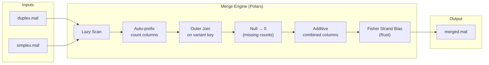

# `gbcms merge`

Merge per-BAM-type genotyped MAFs (e.g., duplex, simplex) into a single output
MAF with type-prefixed count columns.

!!! info "Polars Batch Engine"
    This command uses [Polars](https://www.pola.rs/) for lazy-evaluated,
    memory-efficient joins and aggregation. It operates on the **complete file**
    (batch mode), unlike the streaming per-variant counting in `gbcms dna`/`rna`.

---

## Quick Start

```bash
# Merge duplex + simplex MAFs with combined columns
gbcms merge \
    --input duplex:sample1-duplex.maf \
    --input simplex:sample1-simplex.maf \
    --output sample1.merged.maf

# Merge 3 BAM types, no combined columns
gbcms merge \
    --input duplex:sample1-duplex.maf \
    --input simplex:sample1-simplex.maf \
    --input standard:sample1-unfiltered.maf \
    --output sample1.merged.maf \
    --no-combined
```

---

## Arguments

### Required

| Flag | Type | Description |
|:-----|:-----|:------------|
| `--input` | `TYPE:PATH` | BAM type label and path to its genotyped MAF. Repeat for each input (minimum 2). Labels become column prefixes. |
| `--output` | `PATH` | Output path for the merged MAF. |

### Optional

| Flag | Default | Description |
|:-----|:--------|:------------|
| `--no-combined` | `false` | Skip computing `simplex_duplex_*` combined columns. |
| `--legacy-naming` | `false` | Use `t_{metric}_{type}` column naming for `genotype_variants` compatibility. |

---

## How It Works



### Step-by-Step

1. **Scan** — Each input MAF is lazily scanned with all columns as strings
2. **Prefix Detection** — Columns are checked for existing type prefixes; unprefixed gbcms columns are renamed (e.g., `ref_count` → `duplex_ref_count`)
3. **Outer Join** — Progressive full outer join on the 5-column variant key: `Chromosome`, `Start_Position`, `End_Position`, `Reference_Allele`, `Tumor_Seq_Allele2`
4. **Null Fill** — Missing counts → `"0"`, missing meta → `""`
5. **Combined Columns** — If both `simplex` and `duplex` are present and `--no-combined` is not set:
    - **Phase 1**: Additive sums (12 columns: read + fragment + strand counts)
    - **Phase 2a**: Derived totals (`total_count`, `total_count_fragment`)
    - **Phase 2b**: Derived VAFs (`vaf`, `vaf_fragment`)
    - **Phase 3**: Fisher's exact test for strand bias (read + fragment level, via Rust)
6. **Write** — Materialized DataFrame written as tab-separated MAF

---

## Combined Columns

When both `simplex` and `duplex` inputs are present, 20 combined `simplex_duplex_*`
columns are computed (assuming all strand-level counts are present in the input):

| Phase | Column | Formula |
|:------|:-------|:--------|
| Sum | `simplex_duplex_ref_count` | `simplex_ref_count + duplex_ref_count` |
| Sum | `simplex_duplex_alt_count` | `simplex_alt_count + duplex_alt_count` |
| Sum | `simplex_duplex_ref_count_forward` | Additive |
| Sum | `simplex_duplex_ref_count_reverse` | Additive |
| Sum | `simplex_duplex_alt_count_forward` | Additive |
| Sum | `simplex_duplex_alt_count_reverse` | Additive |
| Sum | `simplex_duplex_ref_count_fragment` | Additive |
| Sum | `simplex_duplex_alt_count_fragment` | Additive |
| Sum | `simplex_duplex_ref_count_fragment_forward` | Additive |
| Sum | `simplex_duplex_ref_count_fragment_reverse` | Additive |
| Sum | `simplex_duplex_alt_count_fragment_forward` | Additive |
| Sum | `simplex_duplex_alt_count_fragment_reverse` | Additive |
| Derived | `simplex_duplex_total_count` | `ref + alt` |
| Derived | `simplex_duplex_total_count_fragment` | `ref_fragment + alt_fragment` |
| Derived | `simplex_duplex_vaf` | `alt / total` (0 when total=0) |
| Derived | `simplex_duplex_vaf_fragment` | `alt_frag / total_frag` |
| Fisher | `simplex_duplex_strand_bias_p_value` | Fisher 2×2 (read strand) |
| Fisher | `simplex_duplex_strand_bias_odds_ratio` | Fisher 2×2 (read strand) |
| Fisher | `simplex_duplex_fragment_strand_bias_p_value` | Fisher 2×2 (fragment strand) |
| Fisher | `simplex_duplex_fragment_strand_bias_odds_ratio` | Fisher 2×2 (fragment strand) |

!!! note "Schema-Aware"
    If the input MAFs do not contain strand-level columns (e.g., from an older
    gbcms version), only the available columns are summed. Missing metrics are
    logged at INFO level and skipped — the pipeline does not fail.

---

## Nextflow Integration

When running via the Nextflow pipeline, enable merge with:

```bash
nextflow run main.nf \
    --input samplesheet.csv \
    --variants mutations.maf \
    --fasta reference.fa \
    --format maf \
    --merge_counts \
    -profile slurm
```

The samplesheet should include a `bam_type` column:

```csv
sample,bam,bai,suffix,bam_type
sample1,sample1.duplex.bam,,-duplex,duplex
sample1,sample1.simplex.bam,,-simplex,simplex
```

When `bam_type` is set, the DNA module automatically derives `--column-prefix`
from the type label, so counts are pre-prefixed in the per-BAM MAF output.

---

## Related

- [Output Formats](../reference/output-formats.md) — Column schema reference
- [Architecture](../reference/architecture.md) — System design
- [gbcms dna](dna.md) — Per-BAM DNA counting
