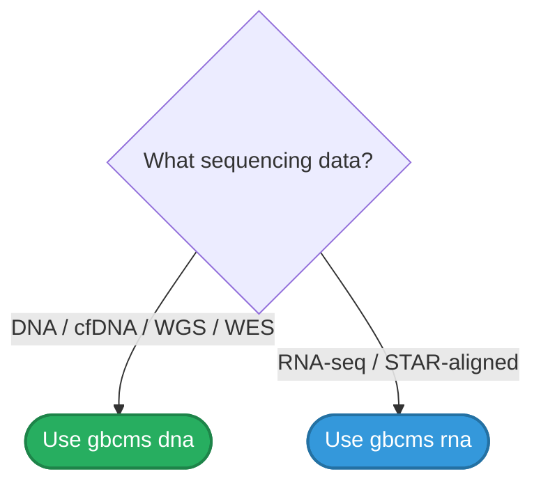
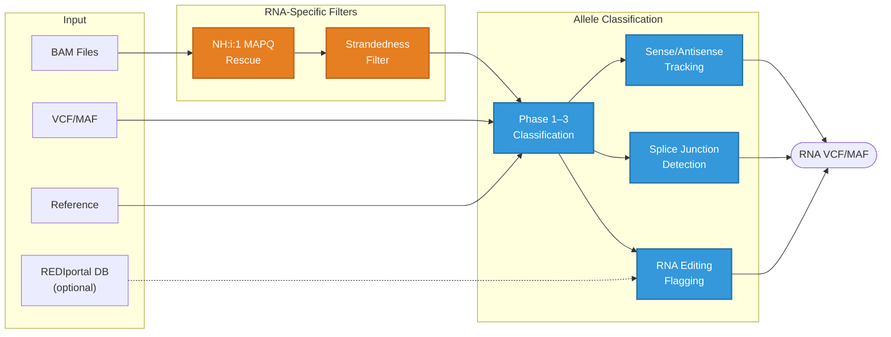
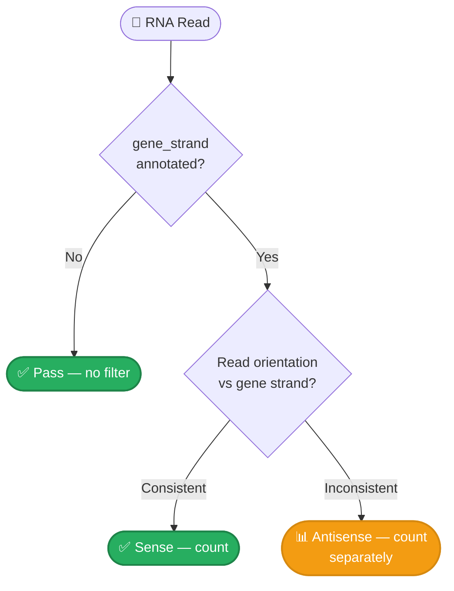
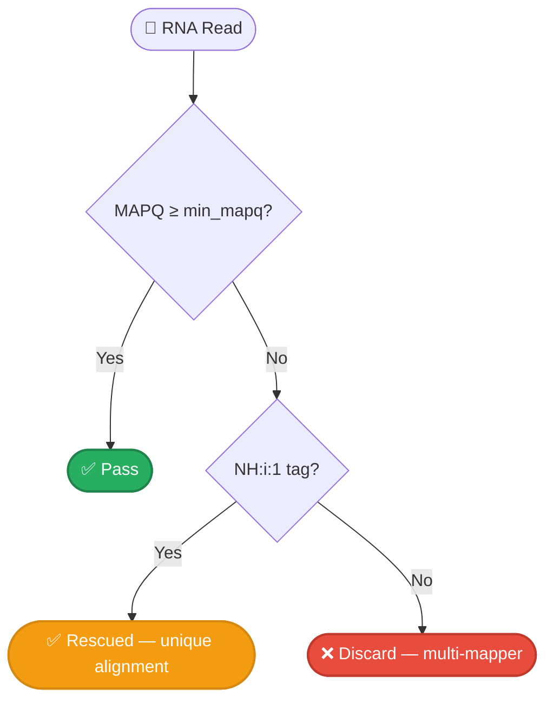

# gbcms rna

Count alleles in RNA-seq BAMs with transcriptome-aware filtering.

RNA mode extends the core DNA counting engine with filters and metrics specific to RNA-seq data: STAR-aware MAPQ rescue, dUTP strandedness filtering, splice junction tracking, and A-to-I RNA editing site flagging.

## When to Use



| Scenario | Command |
|:---------|:--------|
| cfDNA (ACCESS, IMPACT) | `gbcms dna` |
| WGS / WES / Panel | `gbcms dna` |
| STAR + dUTP RNA-seq | `gbcms rna` |
| Unstranded RNA-seq | `gbcms rna --no-strandedness` |

## Synopsis

```bash
gbcms rna [OPTIONS] --variants <FILE> --bam <NAME:PATH>... --fasta <FILE>
```

## RNA Pipeline Overview



---

## Required Arguments

!!! info "Shared Arguments"
    RNA mode shares all [required arguments](dna.md#required-arguments), [output options](dna.md#output-options), [filtering options](dna.md#filtering-options), [BAQ options](dna.md#baq-options), [UMI options](dna.md#umi-options), and [debugging options](dna.md#debugging-options) with DNA mode. See the [`gbcms dna` reference](dna.md) for full descriptions.

| Option | Description |
|:-------|:------------|
| `--variants`, `-v` | VCF or MAF file |
| `--bam`, `-b` | BAM file(s) |
| `--fasta`, `-f` | Reference FASTA (with .fai index) |
| `--output-dir`, `-o` | Output directory |

---

## RNA-Specific Options

These options are **only available** on `gbcms rna`, not on `gbcms dna`.

### Strandedness Filtering

| Option | Default | Description |
|:-------|:--------|:------------|
| `--enforce-strandedness/--no-strandedness` | `true` | Filter reads by dUTP strand orientation relative to gene strand |

!!! info "Biological Context: dUTP Stranded Libraries"
    In dUTP-stranded RNA-seq, the second strand (synthesized with dUTP) is degraded, so sequenced reads reflect the **antisense** strand of the original mRNA. The strandedness filter uses the variant's `gene_strand` annotation (from the input MAF) to determine whether each read's orientation is consistent with the expected transcript direction.

    **Disable** with `--no-strandedness` for unstranded RNA-seq libraries where read orientation is random.



### RNA Editing Database

| Option | Default | Description |
|:-------|:--------|:------------|
| `--rna-editing-db` | _(none)_ | Path to REDIportal TABLE1 file of known A-to-I RNA editing sites (`.gz` supported) |

!!! info "Biological Context: A-to-I RNA Editing"
    ADAR (Adenosine Deaminase Acting on RNA) enzymes convert adenosine to inosine in double-stranded RNA regions. Inosine is read as guanosine by the sequencing machinery, creating apparent **A→G variants** that are biological RNA modifications — not somatic mutations. Flagging these sites prevents false-positive variant calls.

    The REDIportal database catalogs >16 million known human A-to-I editing sites from multiple tissues and conditions.

!!! tip "Obtaining REDIportal"
    Download from [REDIportal](http://srv00.recas.ba.infn.it/atlas/):
    ```bash
    # Download TABLE1 format (tab-separated, 1-based coordinates)
    wget http://srv00.recas.ba.infn.it/atlas/download/TABLE1_hg38.txt.gz
    ```
    The file is loaded once at startup and stored as a hash set for O(1) lookup per variant.

---

## Quality Thresholds

RNA mode uses different defaults to accommodate RNA-seq aligner behavior:

| Option | DNA Default | RNA Default | Rationale |
|:-------|:------------|:------------|:----------|
| `--min-mapq` | 20 | **1** | STAR assigns MAPQ 255 to unique, 0–3 to multi-mappers. Low MAPQ threshold with NH:i:1 rescue captures novel splice junctions. |
| `--min-baseq` | 20 | 20 | Same |
| `--fragment-qual-threshold` | 10 | 10 | Same |

---

## RNA Read Filters

RNA mode extends the standard [read filter cascade](../reference/read-filters.md) with two additional checks:

### NH:i:1 MAPQ Rescue

STAR assigns MAPQ=0 to reads that map to multiple loci. However, reads with `NH:i:1` (Number of Hits = 1) are uniquely mapped despite low MAPQ — they were assigned low scores because STAR hadn't observed the splice junction before.



!!! info "Why MAPQ=1 Default?"
    Setting `--min-mapq 1` together with NH rescue ensures:

    - **Uniquely mapped** reads (MAPQ=255): ✅ always pass
    - **Novel junction** reads (MAPQ=0, NH=1): ✅ rescued
    - **True multi-mappers** (MAPQ=0, NH>1): ❌ filtered

### Filter Defaults

RNA mode uses **stricter filter defaults** than DNA mode to reduce noise from the higher error rates and alignment artifacts typical of RNA-seq:

| Filter | DNA Default | RNA Default |
|:-------|:------------|:------------|
| `--filter-secondary` | off | **on** |
| `--filter-supplementary` | off | **on** |
| `--filter-qc-failed` | off | **on** |

---

## Alignment Backend

RNA mode defaults to **PairHMM** with **relaxed gap penalties** to tolerate reverse transcriptase (RT) stutter artifacts:

| Option | DNA Default | RNA Default | Rationale |
|:-------|:------------|:------------|:----------|
| `--alignment-backend` | `pairhmm` | `pairhmm` | Same |
| `--gap-open-prob` | `1e-4` | **`5e-3`** | RT introduces more gap artifacts than DNA polymerase |
| `--gap-extend-prob` | `0.1` | **`0.25`** | RT stutter extends gaps more frequently |

!!! info "Biological Context: RT Stutter"
    Reverse transcriptase (used in cDNA synthesis) has lower fidelity than DNA polymerases and frequently introduces insertions/deletions at homopolymer runs and microsatellite regions. The relaxed gap penalties prevent these artifacts from being classified as ALT-supporting reads.

---

## RNA-Specific Output Columns

??? info "RNA-Specific Output Columns (click to expand)"

    When running in RNA mode, additional columns capture transcriptome-specific metrics. These columns are **absent** from DNA mode output.

    ### MAF Columns (5 additional)

    | Column | Type | Description |
    |:-------|:-----|:------------|
    | `rna_sense_depth` | u32 | Reads aligning to the gene **sense** strand |
    | `rna_antisense_depth` | u32 | Reads aligning to the gene **antisense** strand |
    | `rna_sense_strand_alt_count` | u32 | ALT-classified reads on the sense strand |
    | `rna_editing_site_overlap` | bool | Variant overlaps a known A→I editing site from `--rna-editing-db` |
    | `rna_splice_spanning_count` | u32 | ALT-classified reads containing splice junctions (CIGAR `N` operations) spanning the variant |

    ### VCF INFO Fields (5 additional)

    | Field | Type | Description |
    |:------|:-----|:------------|
    | `SEN` | Integer | Sense strand depth |
    | `ANT` | Integer | Antisense strand depth |
    | `ASEN` | Integer | ALT sense strand count |
    | `RED` | Integer | RNA editing site overlap (0 or 1) |
    | `SPL` | Integer | Splice-spanning ALT read count |

    ### VCF FORMAT Fields (4 additional)

    Per-sample fields added to the FORMAT column:

    | Field | Type | Description |
    |:------|:-----|:------------|
    | `SEN` | Integer | Per-sample sense depth |
    | `ANT` | Integer | Per-sample antisense depth |
    | `ASEN` | Integer | Per-sample ALT sense count |
    | `SPL` | Integer | Per-sample splice-spanning count |

---

## Examples

=== "Basic RNA"

    ```bash
    gbcms rna \
        --variants mutations.vcf \
        --bam rna_sample:star_aligned.bam \ # (1)!
        --fasta reference.fa \
        --output-dir results/
    ```

    1. STAR-aligned BAMs should have the `NH` tag for multi-mapping rescue.

=== "With Editing DB"

    ```bash
    gbcms rna \
        --variants mutations.maf \
        --bam tumor_rna:aligned.bam \
        --fasta hg38.fa \
        --rna-editing-db TABLE1_hg38.txt.gz \ # (1)!
        --format maf \
        --output-dir results/
    ```

    1.  REDIportal TABLE1 format. Download from [REDIportal](http://srv00.recas.ba.infn.it/atlas/).

=== "Unstranded Library"

    ```bash
    gbcms rna \
        --variants mutations.vcf \
        --bam unstranded:aligned.bam \
        --fasta reference.fa \
        --no-strandedness \ # (1)!
        --output-dir results/
    ```

    1.  Disables dUTP strand filtering for unstranded RNA-seq protocols.

=== "With UMI Tags"

    ```bash
    gbcms rna \
        --variants mutations.vcf \
        --bam rna_sample:umi_tagged.bam \
        --fasta reference.fa \
        --umi-tag RX \
        --output-dir results/
    ```

---

## Differences from DNA Mode

| Feature | `gbcms dna` | `gbcms rna` |
|:--------|:------------|:------------|
| **MAPQ default** | 20 | 1 (with NH rescue) |
| **Gap-open probability** | 1e-4 | 5e-3 (RT tolerance) |
| **Gap-extend probability** | 0.1 | 0.25 (RT tolerance) |
| **Secondary filter** | off | **on** |
| **Supplementary filter** | off | **on** |
| **QC-failed filter** | off | **on** |
| **Strandedness filter** | N/A | enabled (dUTP) |
| **RNA editing flagging** | N/A | optional (`--rna-editing-db`) |
| **Output columns** | Standard (DP, RD, AD, etc.) | Standard **+ 5 RNA columns** |
| **mFSD analysis** | ✅ available | ❌ not available |

!!! note "No mFSD in RNA Mode"
    Mutant Fragment Size Distribution analysis is specific to cfDNA and is not available in RNA mode. The `--mfsd` and `--mfsd-parquet` options are only present on `gbcms dna`.

---

## Related

- [gbcms dna](dna.md) — DNA/cfDNA counting
- [Quick Start](../getting-started/quickstart.md) — Common patterns
- [Read Filters](../reference/read-filters.md) — Filter cascade details
- [Counting & Metrics](../reference/counting-metrics.md) — Output column reference
- [Allele Classification](../reference/allele-classification.md) — How each variant type is counted
