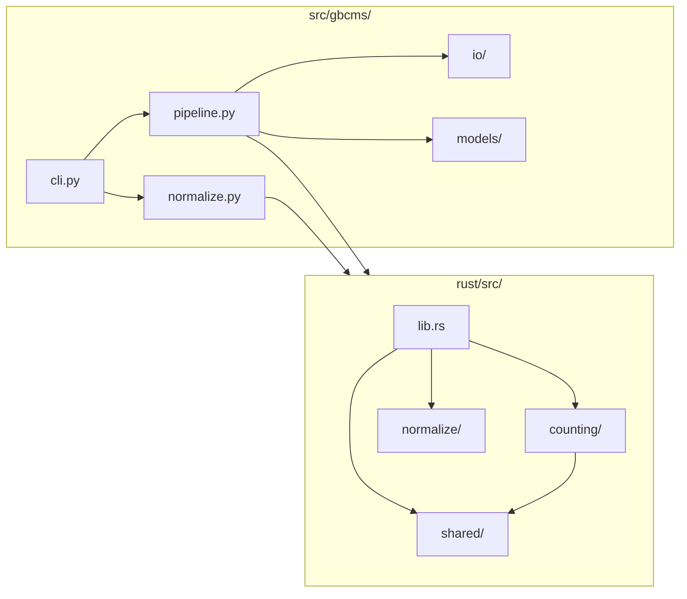
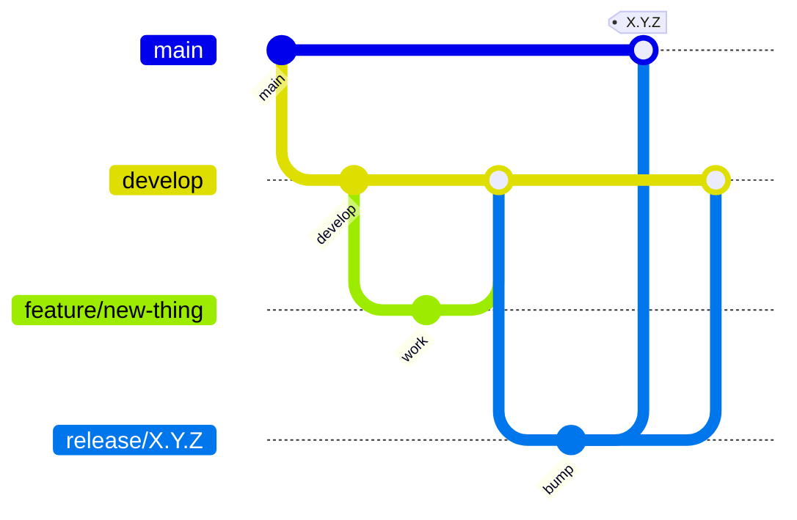

# Developer Guide

Guide for contributing to gbcms.

---

## Setup

=== "Modern Linux (Ubuntu 22.04+, RHEL 9+)"
    ```bash
    # Clone
    git clone https://github.com/msk-access/gbcms.git
    cd gbcms
    
    # Virtual environment
    python -m venv .venv
    source .venv/bin/activate
    
    # Install Rust (if not installed)
    curl --proto '=https' --tlsv1.2 -sSf https://sh.rustup.rs | sh
    
    # Install (builds Rust extension)
    maturin develop --release
    
    # Verify
    gbcms --version
    ```

=== "Legacy Linux (RHEL 8 / HPC)"
    ```bash
    # Clone
    git clone https://github.com/msk-access/gbcms.git
    cd gbcms
    
    # Create conda environment with build dependencies
    # Note: clangdev (not clang) provides headers needed by bindgen
    conda create -n gbcms-dev python=3.11 clangdev rust -c conda-forge
    conda activate gbcms-dev
    
    # Set libclang path for the Rust build
    export LIBCLANG_PATH=$CONDA_PREFIX/lib
    
    # Install maturin and build
    pip install maturin
    maturin develop --release
    
    # Verify
    gbcms --version
    ```

=== "macOS"
    ```bash
    # Clone
    git clone https://github.com/msk-access/gbcms.git
    cd gbcms
    
    # Install Rust (if not installed)
    curl --proto '=https' --tlsv1.2 -sSf https://sh.rustup.rs | sh
    
    # Virtual environment
    python -m venv .venv
    source .venv/bin/activate
    
    # Install (builds Rust extension)
    maturin develop --release
    
    # Verify
    gbcms --version
    ```

---

## Project Structure



---

## Build Commands

```bash
# Development (fast)
maturin develop

# Release (optimized)
maturin develop --release

# Build wheel
maturin build --release --out dist
```

---

## Regression Testing

### Python Integration Tests (pytest)

The primary test suite covers CIGAR parsing, windowed indel detection,
SNP/MNP/insertion/deletion/complex variant classification, shifted indel handling,
and CLI validation:

```bash
pytest -v                                    # Full suite
pytest tests/test_shifted_indels.py -v      # Windowed + shifted indel-specific
pytest tests/test_variant_checks.py -v      # Core allele-classification
```

### Rust Unit Tests (cargo test)

Normalization engine tests — left-alignment, repeat detection, adaptive padding,
homopolymer decomposition:

```bash
cd rust && cargo test
```

### BAM Slice Regression Suite

For changes to counting logic (`counting/engine.rs`, `counting/variant_checks.rs`),
run against the BAM slice test set (54 BAM slices × 2 MAFs — see `~/Downloads/bam_slice_v2_8_0/`):

```bash
# Rebuild first
pip install -e . --no-build-isolation

# Run on indels MAF
gbcms dna \
    --variants filtered_indels_io.maf \
    --bam-list bam_list.txt \
    --fasta ref.fa \
    --format maf \
    --output-dir /tmp/regression_out/

# Diff against baseline
python scripts/concordance.py /tmp/regression_baseline/ /tmp/regression_out/
```

Key invariants to check:

| Check | Expected |
|:------|:---------|
| `ref_count + alt_count ≤ total_count` | Must hold for every row (INVARIANT) |
| Δalt for own-sample covered variants | 0 vs sign-out `t_alt` (except known MAF annotation issues) |
| Non-own-sample ref_count changes | ≤1 count (non-determinism from parallel windowed scan) |

### Variant-Type-Specific Investigation

When debugging specific variant types, use targeted BAM slices:

| Variant Type | Key Examples | What to Check |
|:-------------|:-------------|:--------------|
| Del+SNV (complex) | SOX9 `GC→T`, ABL1 `AG→T` | Routes to `check_complex`, not `check_deletion`; alt > 0 |
| Large deletion, REF=0 | NF2 ~100bp DEL | M-block REF fallback in `check_complex`; ref > 0 |
| Shifted large deletion | TP53 `GACCGTGCAAGT→-` | `has_nearby_length_match` Phase 3; alt matches sign-out |
| MNP/DNP | TERT (5bp), BRCA2 (2bp) | ALT recovery vs sign-out |
| Shifted insertion | JAK1 `65306997` | Multi-allelic isolation, windowed INS scan |

---

## Code Standards

### Python

| Standard | Requirement |
|:---------|:------------|
| Type hints | All public functions |
| Docstrings | Google style |
| Exports | `__all__` in every module |
| Logging | Use `logging`, not `print()` |
| Config | Pydantic models |

#### CLI Validation Standards

New CLI options must follow this four-layer validation order:

1. **Parse-time** (Typer): Use `Enum` for constrained choices, `min=`/`max=` for numeric ranges. Typer rejects invalid values before any Python code runs.
2. **Pre-model** (cli.py command body): File extension checks, cross-option semantics (e.g. `--preserve-barcode` + non-MAF input), charset validation. Log at `ERROR` and raise `typer.Exit(code=1)`.
3. **Model-time** (Pydantic): Business-logic constraints in `models/core.py` via `Field(ge=..., le=...)` and `@field_validator`.
4. **No silent skips**: Missing inputs must fail-fast or require an explicit opt-out (e.g. `--lenient-bam`). `WARNING`-level silent skips are unacceptable for missing required inputs.

The module-level docstring in `cli.py` documents this order and must be kept in sync when adding new options.

### Rust

| Standard | Requirement |
|:---------|:------------|
| Docs | `///` on public items |
| Errors | `anyhow::Result` |
| Logging | `log` crate |

---

## Git Workflow (git-flow)



| Branch | Purpose |
|:-------|:--------|
| `main` | Production releases |
| `develop` | Integration |
| `feature/*` | New features |
| `release/*` | Release candidates |
| `hotfix/*` | Production fixes |

---

## Pre-Commit Checklist

Before committing, verify all checks pass:

- [ ] `ruff check src/ tests/` — Python linting
- [ ] `black --check src/ tests/` — Python formatting
- [ ] `mypy src/` — Type checking (no errors)
- [ ] `cd rust && cargo clippy --all-targets -- -D warnings` — Rust linting (strict, warnings-as-errors)
- [ ] `cd rust && cargo test` — Rust unit tests
- [ ] `pytest -v` — Python/integration tests
- [ ] Type hints complete on all new public functions
- [ ] Docstrings added (Google style for Python; `///` on public Rust items)
- [ ] No dead code (removed, not commented out)
- [ ] No silent failures: missing inputs must fail-fast or require explicit opt-out

To run all Python checks in one pass:

```bash
ruff check src/ tests/ && \
black --check src/ tests/ && \
mypy src/ && \
pytest -v
```

To run all Rust checks:

```bash
cd rust && cargo clippy --all-targets -- -D warnings && cargo test
```

---

## Environment Variables

| Variable | Default | Description |
|:---------|:--------|:------------|
| `GBCMS_LOG_LEVEL` | INFO | Logging level |
| `RUST_LOG` | — | Rust logging |

```bash
GBCMS_LOG_LEVEL=DEBUG RUST_LOG=debug gbcms dna ...
```

---

## Generating a PDF

The docs include a combined print page (via `mkdocs-print-site-plugin`) that can be printed to PDF directly from Chrome — no extra tools required.

**Steps:**

1. Start the docs server:
   ```bash
   mkdocs serve
   ```

2. Open **`http://127.0.0.1:8000/gbcms/print_page/`** in Google Chrome and wait ~10s for Mermaid diagrams to render.

3. Open the DevTools console (`F12` → Console tab) and paste:
   ```js
   document.querySelectorAll(
     '.md-sidebar,.md-header,.md-footer,.md-tabs,.md-source-file'
   ).forEach(e => e.remove());
   document.querySelectorAll('.md-content').forEach(e => {
     e.style.maxWidth = '100%'; e.style.padding = '0 1cm';
   });
   ```

4. Press `Cmd+P` → **Save as PDF** (A4, default margins, ✅ background graphics).

!!! tip "Automated PDF"
    For a headless/automated version, see `~/Downloads/gbcms-pdf-generator/` (local archive, not in repo) — generates `site/documentation.pdf` via `node generate_pdf.mjs`.
