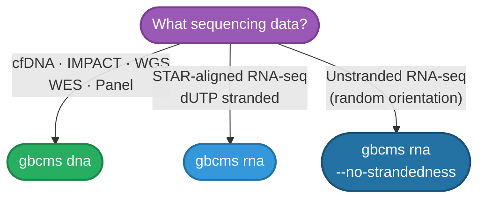

# Choose Your Mode

gbcms supports two sequencing contexts. Pick the one that matches your data — the rest of the setup follows from there.

=== "gbcms dna — DNA / cfDNA"

    **Use for:** cfDNA (MSK-ACCESS, IMPACT), WGS, WES, targeted gene panels

    **Key capabilities:**

    - Windowed indel detection with 3-layer safeguards (±5bp, adaptively extended in repeats)
    - Mutant Fragment Size Distribution (`--mfsd`) for short-fragment enrichment analysis
    - UMI-aware fragment deduplication (`--umi-tag`)
    - Multi-allelic sibling exclusion to prevent REF inflation at complex loci

    **Defaults:** MAPQ 20 · base quality 20 · duplicates filtered · PairHMM standard gap penalties

    → [Quick Start](quickstart.md) | [Full CLI Reference](../cli/dna.md)

=== "gbcms rna — RNA-seq"

    **Use for:** STAR-aligned RNA-seq (dUTP stranded or unstranded)

    **Key capabilities:**

    - NH:i:1 MAPQ rescue for novel splice junction reads
    - dUTP strandedness filtering (disable with `--no-strandedness` for unstranded libraries)
    - A-to-I RNA editing site flagging via REDIportal (`--rna-editing-db`)
    - Splice junction tracking (`rna_splice_spanning_count`)

    **Defaults:** MAPQ 1 · base quality 20 · secondary/supplementary/QC-failed reads filtered · PairHMM relaxed RT gap penalties

    → [Quick Start](quickstart.md) | [Full CLI Reference](../cli/rna.md)

---

## Prerequisites

| Requirement | DNA | RNA |
|:------------|:---:|:---:|
| Python 3.10+ | ✅ | ✅ |
| BAM file with `.bai` index | ✅ | ✅ |
| Reference FASTA with `.fai` index | ✅ | ✅ |
| VCF or MAF with variant positions | ✅ | ✅ |
| STAR-aligned BAM (NH tag) | — | ✅ |
| Gene strand annotation in MAF (`gene_strand` column) | — | Recommended |
| REDIportal TABLE1 file | — | Optional |

!!! tip "BAM Index"
    If your BAM lacks an index: `samtools index sample.bam`

!!! tip "FASTA Index"
    If your FASTA lacks an index: `samtools faidx reference.fa`

---

## Related

- [Installation](installation.md) — Install via PyPI, Docker, or from source
- [Quick Start](quickstart.md) — Run your first counting job (DNA and RNA examples)
- [CLI Reference — DNA](../cli/dna.md) — Full option reference for `gbcms dna`
- [Nextflow Pipeline](../nextflow/index.md) — For processing many samples in parallel on HPC
