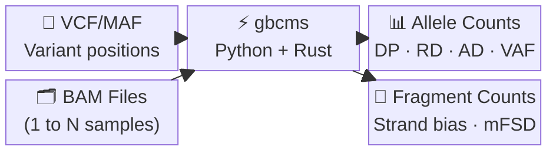
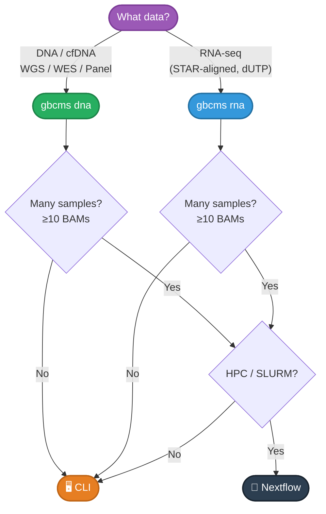

# gbcms

> **Get Base Counts Multi-Sample** — High-performance variant counting from BAM files

[](https://pypi.org/project/gbcms/)
[](https://pypi.org/project/gbcms/)
[](https://github.com/msk-access/gbcms/blob/main/LICENSE)

## What It Does

GBCMS extracts **allele counts** and **variant metrics** at specified positions in BAM files:



## Visual Overview

<figure markdown="span">
  { loading=lazy width="100%" }
  <figcaption>gbcms end-to-end pipeline — click to enlarge</figcaption>
</figure>

### Detailed Overview (PDF)

{ type=application/pdf style="min-height:75vh;width:100%" }

### Key Metrics

| Metric | Formula | Description |
|:-------|:--------|:------------|
| **VAF** | `AD / (RD + AD)` | Variant Allele Frequency |
| **Strand Bias** | Fisher's exact test | Detect sequencing artifacts |
| **Fragment Counts** | Deduplicated pairs | PCR-aware counting |

---

## Quick Start

```bash
# Install
pip install gbcms

# DNA/cfDNA counting
gbcms dna --variants variants.vcf --bam sample.bam --fasta ref.fa --output-dir results/

# RNA-seq counting
gbcms rna --variants variants.vcf --bam rna:aligned.bam --fasta ref.fa --output-dir results/
```

**→ [Full Installation Guide](getting-started/installation.md)** | **→ [CLI Examples](getting-started/quickstart.md)**

---

## Choose Your Workflow



| Workflow | Best For | Guide |
|:---------|:---------|:------|
| **CLI** | 1-10 samples, local/single server | [Quick Start](getting-started/quickstart.md) |
| **Nextflow** | 10+ samples, HPC/SLURM | [Nextflow Guide](nextflow/index.md) |

---

## Architecture

Python/Rust hybrid for maximum performance:

See **[Architecture Reference →](reference/architecture.md)** for full diagrams covering system layers, data flow, genomic binning, coordinate system, config hierarchy, and end-to-end sequence.

**→ [Technical Details](reference/architecture.md)** | **→ [How It Works](reference/allele-classification.md)**

---

## Documentation

| Section | Description |
|:--------|:------------|
| [Getting Started](getting-started/index.md) | Installation and first run |
| [CLI Reference](cli/index.md) | Command-line usage |
| [Nextflow Pipeline](nextflow/index.md) | HPC workflow |
| [How It Works](reference/architecture.md) | Architecture, algorithms, and formats |
| [Development](development/developer-guide.md) | Contributing guide |
