# Allele Classification

How gbcms classifies each read as supporting the **reference** allele, the **alternate** allele, or **neither**.

!!! tip "Detailed Visual Reference (PDF)"
    { type=application/pdf style="min-height:75vh;width:100%" }

## Dispatch

After passing [read filters](read-filters.md), each read is dispatched to a **type-specific** allele checker based on the variant's **allele lengths** (`ref_len` × `alt_len`), not on the `variant_type` string. This makes dispatch robust against inconsistent upstream type labels:

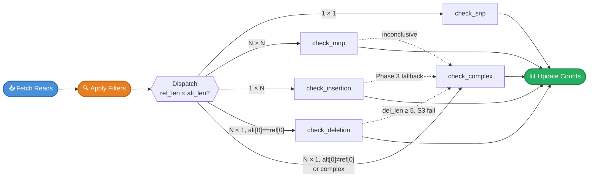

!!! info "Allele-Length and Anchor-Base Routing"
    Dispatch uses `ref_allele.len()` and `alt_allele.len()` as the primary selector. For `N×1` variants (deletion format), it additionally checks whether the anchor base substitutes (`alt_allele[0] ≠ ref_allele[0]`):

    - **Pure deletion** (`alt[0] == ref[0]`) → `check_deletion` — e.g., `AC→A` where anchor A is preserved
    - **Complex Del+SNV** (`alt[0] ≠ ref[0]`) → `check_complex` — e.g., `GC→T` where anchor G also substitutes to T

    This distinction is critical: `check_deletion`'s CIGAR safeguards cannot correctly classify reads that simultaneously carry the anchor substitution. `check_complex` handles these via Phase 3 SW haplotype alignment.

    `check_deletion` also falls back to `check_complex` for large deletions (≥5bp) where S3 sequence validation fails due to BWA left-alignment shifting the anchor position (see [Deletion — Windowed Safeguards](#windowed-scan-safeguards-1)).

---

## SNP (Single Nucleotide Polymorphism)

A single base substitution — the simplest and most common variant type.

| Property | Value |
|:---------|:------|
| Detection | `len(REF) == 1 && len(ALT) == 1` |
| Position | 0-based index of the substituted base |
| Quality check | Base quality at the position must meet `--min-baseq` |

### Algorithm

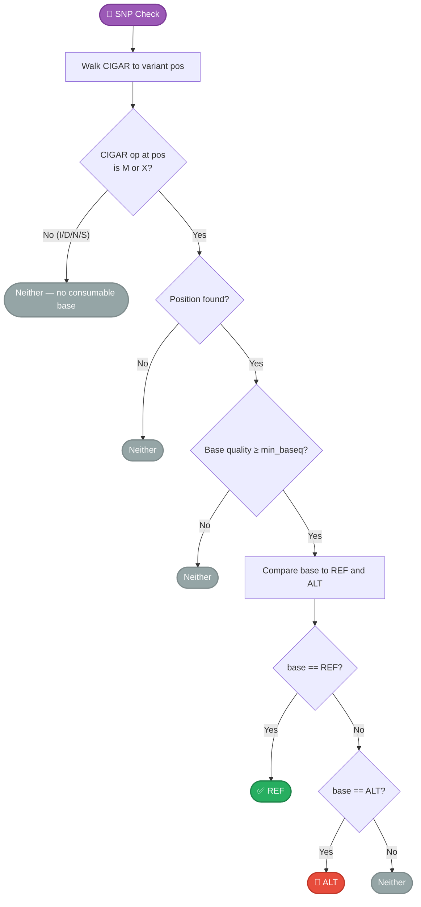

### Visual Example

```
Variant: chr1:100 C→T (SNP)

Reference: 5'─ ...G  A  T  C  G  A  T  C  G  A... ─3'
                          98 99 100 101
                               ▲
                           variant pos

Read 1:    5'─ ...G  A  T [T] G  A  T  C... ─3'   → ALT ✅
                               ↑
                          base=T matches ALT

Read 2:    5'─ ...G  A  T [C] G  A  T  C... ─3'   → REF ✅
                               ↑
                          base=C matches REF

Read 3:    5'─ ...G  A  T [A] G  A  T  C... ─3'   → Neither
                               ↑
                          base=A ≠ REF or ALT
```

---

## Insertion

Bases inserted after an **anchor** position. The anchor is the last reference base before the inserted sequence.

| Property | Value |
|:---------|:------|
| Detection | `len(REF) == 1 && len(ALT) > 1` |
| Position | 0-based index of the **anchor** base |
| Quality check | Quality-masked sequence comparison |

### Algorithm

The insertion check uses a **single CIGAR walk** with four detection strategies:

#### Part A — CIGAR-Based Strict Detection

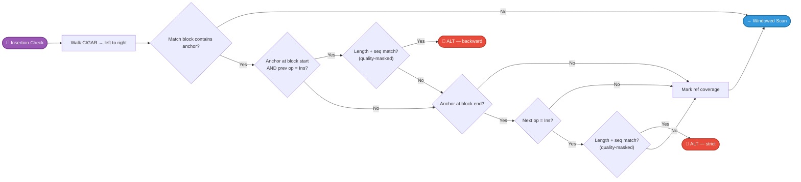

#### Part B — Windowed Scan + S1/S2/S3 Safeguards

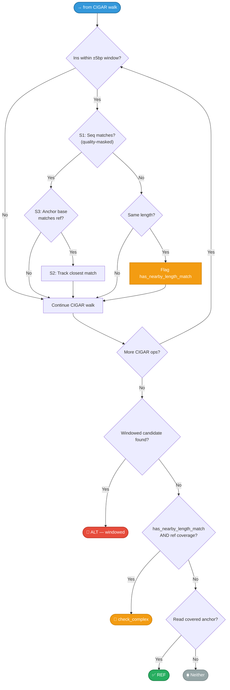

### Windowed Scan Safeguards

Three layers of validation prevent false-positive windowed matches:

| Safeguard | Check | Purpose |
|:----------|:------|:--------|
| **S1** | Inserted sequence matches expected ALT bases (quality-masked) | Prevents matching unrelated insertions |
| **S2** | Closest match wins (minimum distance from anchor) | When multiple candidates exist, picks the most likely |
| **S3** | Reference base at shifted anchor matches original anchor base | Ensures the shifted position is biologically equivalent |

!!! note "Phase 3 Haplotype Fallback (has_nearby_length_match)"
    When the windowed scan finds an insertion that matches in **length** but not **sequence** (e.g., aligner represents the biological event with shifted bases in a repeat), the engine flags `has_nearby_length_match` and falls back to `check_complex` for **Phase 3 WFA+PairHMM arbitration**. This ensures ambiguous cases are resolved by haplotype comparison rather than strict sequence matching.

### Visual Example

```
Variant: chr1:100 A→ATG (insertion of TG after anchor A)

Reference:     5'─ ...C  G  A ── C  G  T  A... ─3'
                          99 100  101 102
                               ▲
                          anchor pos

Read 1 (ALT, strict):  CIGAR = 5M 2I 5M
               5'─ ...C  G  A [T  G] C  G  T  A... ─3'
                               └──┘
                          inserted bases at anchor → ALT ✅ (strict)

Read 2 (ALT, windowed): CIGAR = 7M 2I 3M
               5'─ ...C  G  A  C  G [T  G] T  A... ─3'
                                          └──┘
                    insertion shifted +2bp, same seq → ALT ✅ (windowed)

Read 3 (REF):  CIGAR = 10M
               5'─ ...C  G  A  C  G  T  A... ─3'
                               ↑
                          no insertion after anchor → REF ✅
```

---

## Deletion

Bases deleted after an **anchor** position. Mirrors insertion but looks for `Del` CIGAR operations.

| Property | Value |
|:---------|:------|
| Detection | `len(REF) > 1 && len(ALT) == 1` AND `alt[0] == ref[0]` (pure deletion) |
| Position | 0-based index of the **anchor** base |
| Quality check | Quality-masked ref-context comparison |

!!! warning "Complex Del+SNV: Routed to `check_complex`"
    When `len(REF) > 1 && len(ALT) == 1` but the anchor base **also substitutes** (`alt[0] ≠ ref[0]`), the variant is a **complex Del+SNV** and is routed directly to `check_complex` — not `check_deletion`. This handles variants such as:

    - **SOX9** `GC→T`: anchor G substitutes to T, C is deleted. D(1) reads classified as ALT via Phase 3 SW.
    - **ABL1** `AG→T`: anchor A substitutes to T, G is deleted.

    `check_deletion`'s CIGAR safeguards compare anchor bases assuming the anchor is preserved. For these variants, the anchor changes — feeding them to `check_deletion` would incorrectly classify all DEL reads as REF (alt=0).

### Algorithm

Same single-walk strategy as insertion, with four additional features:

1. **Reciprocal overlap matching** — For large deletions (≥50bp), if the CIGAR shows a deletion at the anchor but with a different length, gbcms accepts it if the reciprocal overlap is ≥50% (SV-caller standard, used by SURVIVOR):

    ```
    reciprocal_overlap = min(expected, found) / max(expected, found)
    Accept if expected_del ≥ 50bp AND reciprocal_overlap ≥ 0.50
    ```

2. **Interior REF guard** — For large deletions (≥50bp), reads that start *inside* the deleted region are classified as REF directly, without falling back to Smith-Waterman. This prevents overcounting caused by the SW aligner's bias toward shorter ALT haplotypes.

3. **Left-alignment Phase 3 fallback** — For large deletions (≥5bp) where the windowed scan finds a matching-length Del but S3 sequence validation fails (BWA left-alignment shifted the anchor further left than the CIGAR `D` position), the engine flags `has_nearby_length_match` and routes to `check_complex` for Phase 3 arbitration. Short deletions (<5bp) with failed S3 remain CIGAR-definitive REF — they are almost certainly unrelated spurious deletions, not left-alignment artifacts. See [Case 3 in the Complex Indels guide](complex-indels.md#case-3-tp53-12bp-left-alignment-shifted-deletion).

4. **Haplotype fallback** — When no CIGAR match is found and the read doesn't cover the anchor, falls back to `check_complex` for haplotype-based comparison.

#### Part A — CIGAR-Based Strict + Reciprocal-Overlap Detection

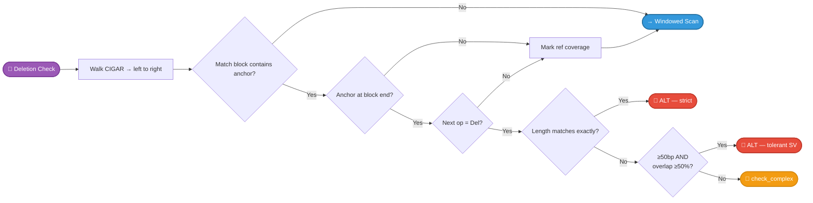

#### Part B — Windowed Scan + S1/S2/S3 Safeguards

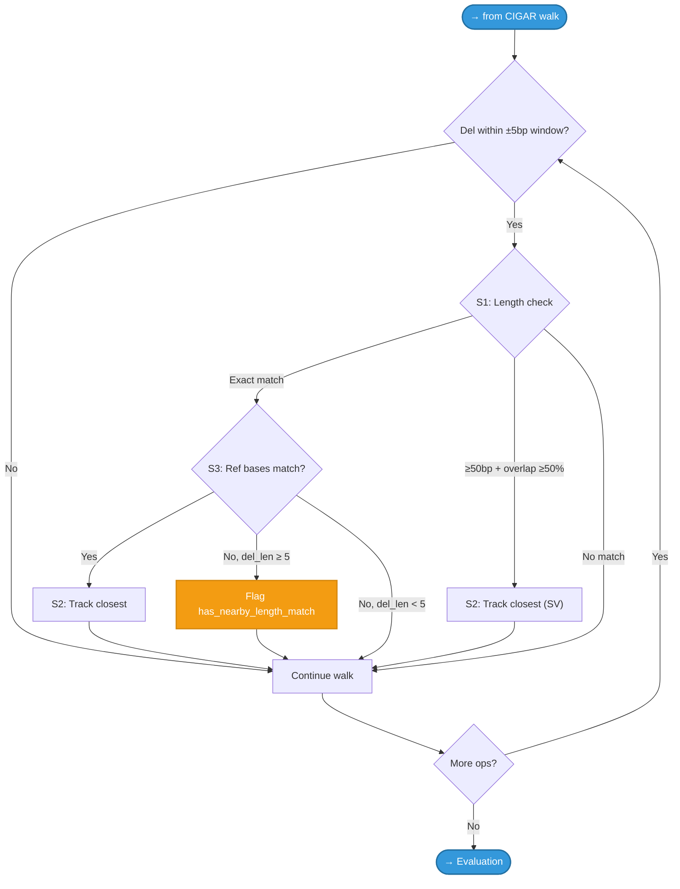

#### Part C — Evaluation + Interior REF Guard

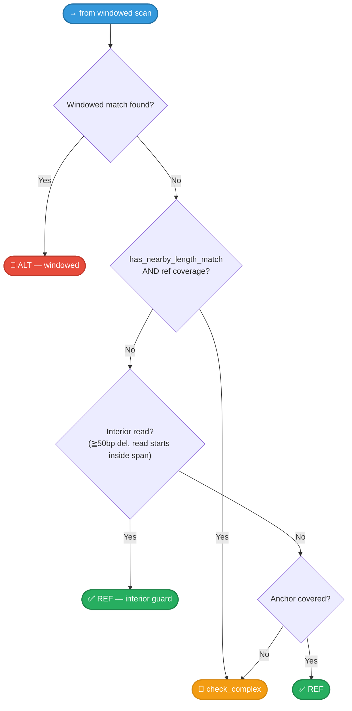

### Windowed Scan Safeguards {#windowed-scan-safeguards-1}

Three layers of validation prevent false-positive windowed matches:

| Safeguard | Check | Purpose |
|:----------|:------|:--------|
| **S1** | Deleted length matches expected `ref_len − 1` (or reciprocal overlap ≥50% for large dels) | Prevents matching wrong-length deletions |
| **S2** | Closest match wins (minimum distance from anchor) | When multiple candidates exist, picks the most likely |
| **S3** | Reference bases at the shifted deletion position match expected deleted sequence | Verifies the shifted Del is biologically the same event |
| **del_len ≥ 5 guard** | Only flag `has_nearby_length_match` for Dels ≥5bp that fail S3 | Short (1–4bp) Dels failing S3 are almost certainly spurious noise — CIGAR remains definitive. Longer Dels can fail S3 due to BWA left-alignment shifting the anchor away from the actual CIGAR `D` position |

!!! note "has_nearby_length_match Phase 3 Fallback"
    When the windowed scan finds a deletion that matches in **length** (≥5bp) but S3 sequence validation fails (BWA left-alignment shifted the anchor further left than where the CIGAR `D` appears), the engine flags `has_nearby_length_match` and falls back to `check_complex` for Phase 3 SW haplotype arbitration.

    Example: **TP53 `GACCGTGCAAGT→-` (12bp)** — left-alignment moves the anchor 3bp left of the actual `D(12)` position in reads. S3 compares the wrong reference slice and fails. Phase 3 correctly classifies these as ALT.

    Short deletions (1–4bp) failing S3 use CIGAR-definitive REF: a 1bp Del in the wrong reference context is almost certainly an unrelated noise deletion, not a left-alignment artifact.

!!! warning "Interior REF Guard"
    For deletions >50bp, reads that fall **entirely within** the deleted region would be incorrectly classified as ALT by Smith-Waterman (because the short ALT haplotype aligns better than the long REF haplotype). The interior REF guard catches these reads early and classifies them as REF before they reach Phase 3.

### Visual Example

```
Variant: chr1:100 ACG→A (deletion of CG after anchor A)

Reference:     5'─ ...T  G  A  C  G  T  A  C... ─3'
                          99 100 101 102
                               ▲
                          anchor pos

Read 1 (ALT, strict):  CIGAR = 5M 2D 5M
               5'─ ...T  G  A  ──  ──  T  A  C... ─3'
                               └─────┘
                          2bp deletion at anchor → ALT ✅ (strict)

Read 2 (ALT, windowed): CIGAR = 7M 2D 3M
               5'─ ...T  G  A  C  G  T  ──  ──  A  C... ─3'
                                              └─────┘
                  deletion shifted +2bp, same length, ref matches → ALT ✅ (windowed)

Read 3 (REF):  CIGAR = 12M
               5'─ ...T  G  A  C  G  T  A  C... ─3'
                               ↑
                          no deletion after anchor → REF ✅
```

---

## MNP (Multi-Nucleotide Polymorphism)

Multiple adjacent bases substituted simultaneously.

| Property | Value |
|:---------|:------|
| Detection | `len(REF) == len(ALT) && len(REF) > 1` |
| Position | 0-based index of the first substituted base |
| Quality check | **Minimum** base quality across the MNP block must meet `--min-baseq` |

### Algorithm

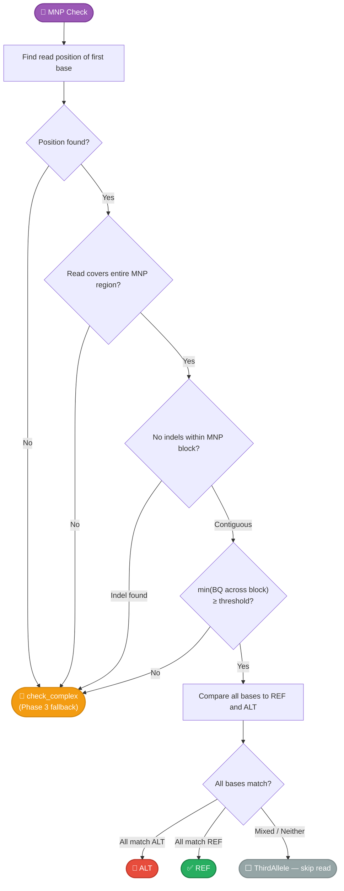

!!! info "Min-BQ-Across-Block Strategy"
    MNP quality is assessed using the **minimum** base quality across the entire MNP block, matching C++ GBCMS `baseCountDNP` behavior. If `min(BQ) < threshold`, the read is skipped entirely — it contributes to neither REF, ALT, nor DP. This replaces the previous per-base rejection which routed low-quality reads to Phase 3 Smith-Waterman, where MNP haplotypes (differing at only 2-3 of ~20 positions) generated ties ~95% of the time, causing catastrophic ALT loss.

!!! warning "Phase 3 Fallback Conditions"
    `check_complex` is invoked for both **structural** issues and **quality** issues:

    - Read position not found in CIGAR walk
    - Read doesn't cover the entire MNP region
    - Indel detected within the MNP block (contiguity check)
    - **Low quality**: `min(BQ across block) < threshold` — Phase 2 masked comparison can still classify using only reliable bases

    The first three indicate a complex variant misannotated as an MNP; the last leverages quality-masking to rescue low-quality reads that strict MNP matching would discard.

### Contiguity Check

The contiguity check is performed **first** (before quality or sequence comparison) as a fail-fast for structural issues. gbcms compares the read positions of the first and last MNP base — if the distance doesn't equal `len - 1`, an indel exists within the block and the read is routed to `check_complex` for haplotype-based resolution.


---

## Complex (Indel + Substitution)

Variants where REF and ALT differ in both sequence **and** length. Also used for **complex Del+SNV** variants dispatched from the `N×1` path when the anchor base substitutes. Uses a sophisticated **three-phase** algorithm with quality-aware matching and Smith-Waterman fallback.

| Property | Value |
|:---------|:------|
| Detection | Fallback for all other combinations; also `N×1` with `alt[0] ≠ ref[0]` |
| Position | 0-based index of the first reference base |
| Quality check | Masked comparison — bases below `--min-baseq` are masked |

!!! note "REF Fallback for Large Deletion-Direction Variants"
    When `check_complex` is invoked for a deletion-direction variant (`ref_len > alt_len`) and `is_worth_realignment()` returns `false` (the read has a clean M-only CIGAR with no indels in the variant window), Phase 3 SW is skipped. Instead, gbcms checks whether **any M-block covers the anchor position**. If yes, the read is classified as **REF**.

    Without this fallback, REF reads for large deletions (e.g., **NF2 ~100bp DEL**) would be misclassified as 'neither' — clean REF reads naturally have no CIGAR evidence warranting realignment, so skipping Phase 3 without a REF fallback silently drops all REF counts.

    See [Case 2 in the Complex Indels guide](complex-indels.md#case-2-nf2-large-deletion-ref-reads-invisible) for the full worked example.

#### Phase Overview

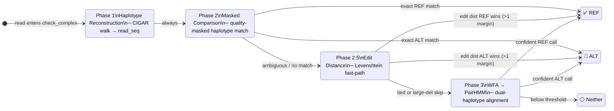

#### Phase 1 + 2 Detail

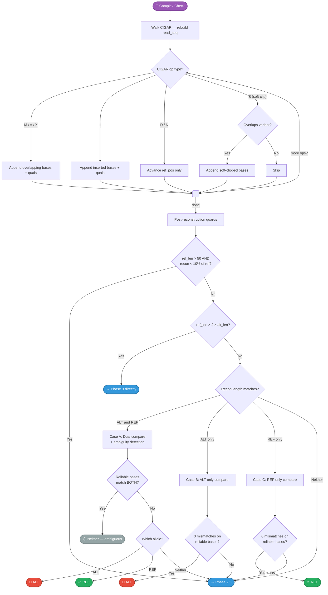

#### Phase 2.5 Detail — Edit Distance Fast-Path

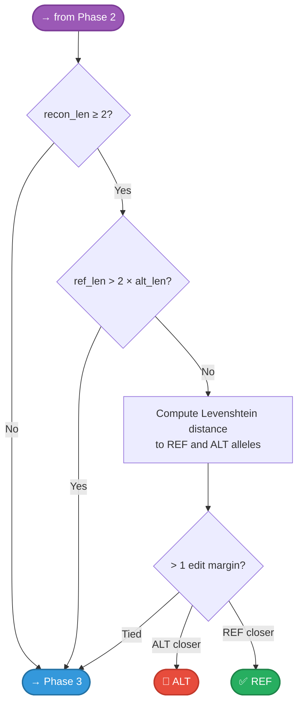

#### Phase 3 Detail — WFA → PairHMM (see [Alignment Fallback](#phase-3-alignment-fallback))

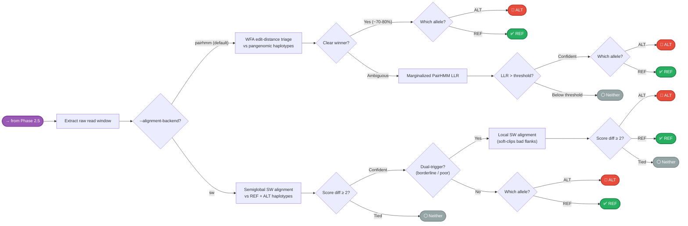


### Phase 1: Haplotype Reconstruction

Walks the CIGAR to rebuild what the read shows for the genomic region `[pos, pos + ref_len)`. Each CIGAR operation contributes differently:

| CIGAR Op | Action | Example |
|:---------|:-------|:--------|
| M / = / X | Append overlapping bases and qualities | Standard aligned bases |
| I | Append inserted bases if `ref_pos` is within variant region | Captures insertions |
| D / N | Advance `ref_pos` without appending | Deletions skip |
| S | Append if `ref_pos` overlaps variant window | Recovers soft-clipped evidence |
| H / P | No action | Hard clips have no sequence |

### Phase 2: Masked Comparison

Instead of exact matching, bases with quality below `--min-baseq` are **masked out** — they cannot vote for either allele. Three cases based on reconstructed sequence length:

| Case | Condition | Behavior |
|:-----|:----------|:---------|
| **A** | `recon == alt == ref` length | Dual compare + ambiguity detection |
| **B** | `recon == alt` length only | ALT-only masked compare |
| **C** | `recon == ref` length only | REF-only masked compare |

!!! important "Ambiguity Detection (Case A)"
    When reliable bases match **both** REF and ALT (possible when they differ only at masked positions), the read is discarded rather than guessed. This prevents false calls at positions where low-quality bases happen to match one allele.

!!! warning "Large-REF Guard"
    For variants with REF >50bp, if the reconstruction is <10% of the REF length (e.g., 1bp recon for a 1024bp deletion), Phase 2 is skipped entirely. A tiny reconstruction would trivially match a short ALT allele, causing overcounting. Phase 3 SW handles these correctly.

### Phase 2.5: Edit Distance

When Phase 2's strict length comparison fails (Case A/B/C don't match), gbcms measures the **Levenshtein edit distance** between the reconstruction and each allele. This catches cases where the reconstruction is off by 1-2 bases due to an incomplete variant definition:

| Parameter | Value | Rationale |
|:----------|:------|:----------|
| Margin | >1 edit | Prevents noise on very short strings |
| Min recon length | 2 bases | Single-base reconstructions are too short for reliable edit distance |

!!! note "Phase 2.5 is Supplementary"
    Phase 2.5 helps edge cases with longer reconstructions. For variants like EPHA7 where the strict reconstruction is only 1bp (`"C"`), the `recon_len >= 2` guard skips Phase 2.5 entirely — the fix comes from Phase 3's local fallback instead.

### Phase 3: Alignment Fallback

When Phase 2 and Phase 2.5 both fail, the engine expands to the full `ref_context` window and performs **dual-haplotype alignment** against both REF and ALT haplotypes.

**Default backend: `pairhmm` (two-stage WFA + PairHMM)**

1. **Pangenomic haplotype matrix** — build `REF_hap` and `ALT_hap` extended with flanking context
2. **WFA fast-path triage** (`wfa2lib-rs`) — edit-distance alignment resolves ~70-80% of reads instantly at O(s²) cost; if the edit-distance gap between REF and ALT is unambiguous, the read is classified immediately
3. **Marginalized PairHMM** (escalated only when WFA is ambiguous) — integrates per-base quality probabilities into alignment scoring, producing a Log-Likelihood Ratio (LLR) confidence score; default threshold 2.3 ≈ ln(10)

**Alternative backend: `sw`**

Runs Smith-Waterman directly on every Phase 3 read (no WFA pre-filter):

1. **Build haplotypes**: `REF_hap = left_ctx + REF + right_ctx`, `ALT_hap = left_ctx + ALT + right_ctx`
2. **Mask**: Replace low-quality bases with `N` (scores 0 against any base)
3. **Align**: Semiglobal alignment — read (query) is fully consumed, haplotype (text) has free overhangs
4. **Score**: ALT wins if `alt_score ≥ ref_score + 2`; REF wins if `ref_score ≥ alt_score + 2`
5. **Dual-trigger check**: For indel/complex variants, if the semiglobal result is low-confidence, retry with local alignment

| Parameter | `pairhmm` | `sw` |
|:----------|:----------|:-----|
| Fast-path | WFA edit-distance (~70-80% resolved) | None (every read goes to full alignment) |
| Confidence score | LLR (quality-weighted) | Score margin ≥ 2 |
| Tunable gap probs | Yes (`--gap-open-prob` etc.) | Fixed affine: open −5, extend −1 |
| Default threshold | `--llr-threshold 2.3` | Margin ≥ 2 |

!!! note "When to use `sw`"
    Use `--alignment-backend sw` only if you need exact reproducibility with gbcms <3.0.0. The `pairhmm` default is faster (WFA pre-filter) and more accurate in low-quality or repeat-dense regions (quality-weighted LLR scoring).

#### Dual-Trigger Local Fallback

For **complex variants** (both alleles > 1bp with different lengths), semiglobal alignment can produce confident but incorrect calls when the MAF/VCF definition is incomplete (e.g., a complex variant missing an adjacent SNV). The ALT haplotype then has a "frameshifted flank" — right-context bases that don't match the biological read. Semiglobal forces gap penalties through this invalid flank.

> [!NOTE]
> The dual-trigger only applies to **complex** variants (e.g., `TCC→CT`, `ATGA→CATG`), not to pure insertions or deletions. Pure indels are well-handled by semiglobal alignment, and applying local fallback would risk false positives in homopolymer regions.

Two conditions detect low-confidence semiglobal results:

| Trigger | Condition | Purpose |
|:--------|:----------|:--------|
| **Borderline** | `abs(alt_score - ref_score) ≤ margin + 1` | Score difference barely decisive |
| **Poor quality** | `max(scores) < read_len / 2` | Both haplotypes heavily penalized |

When **either** trigger fires, the engine retries with **local alignment** (`Aligner::local()`), which soft-clips the bad flank and finds the best matching substring without penalizing overhangs on either side.

!!! tip "Performance: Aligner Reuse"
    SW aligners are created **once per variant** in `count_single_variant()` and reused for all reads. The `bio::alignment::pairwise::Aligner` reuses internal DP buffers, avoiding repeated heap allocation.

!!! note "Raw Read Window Extraction"
    Phase 3 uses `extract_raw_read_window()` instead of CIGAR-projected extraction. For complex variants (e.g., `TCC→CT` represented as `DEL+INS` in CIGAR), CIGAR projection produces a hybrid sequence matching neither haplotype. Raw extraction returns the contiguous read bases that SW can correctly classify.

#### Ambiguous Tie — Unbiased VAF Preservation

For small Complex and MNP variants, biological reads heavily affected by surrounding genetic polymorphism can result in 50% partial matches against the Alternate array. Mathematically, this scores an exact numerical **tie** between the `REF` and `ALT` haplotypes (`alt_score = 11, ref_score = 11`). 

These ambiguous reads are routed to **neither** (`is_ref = false, is_alt = false`). They still contribute to physical Total Depth (`DP`) via the anchor overlap gate, but do **not** inflate `RD` or `AD`. This preserves an unbiased `VAF = AD / (RD + AD)` — critical for low-VAF cfDNA detection where even small RD inflation can push a variant below the clinical Limit of Detection.

---

## Multi-Allelic Behavior

When multiple variants have overlapping REF spans at the same locus, reads carrying one variant's ALT allele could be incorrectly counted as REF for another variant. The engine addresses this with a two-phase approach:

### Phase 1: Annotation

During normalization, `assign_multi_allelic_groups()` identifies overlapping variants using a **sweep-line algorithm** over sorted `(chrom, pos)` coordinates. Variants whose REF spans intersect receive a shared `multi_allelic_group` ID, and their `validation_status` is appended with `_MULTI_ALLELIC` (e.g., `PASS_MULTI_ALLELIC`).

### Phase 2: Sibling ALT Exclusion

During counting, reads classified as **REF** for a variant are additionally checked against all **sibling variants** in the same group. For each sibling, the full `check_allele_with_qual()` pipeline (including CIGAR reconstruction and SW alignment) determines if the read actually carries the sibling's ALT allele. If so, the read is **excluded from REF** for the current variant.

!!! important "This prevents systematic REF inflation at multi-allelic loci, preserving unbiased VAF estimation."

---

## Dynamic SW Gap Penalties

Phase 3's Smith-Waterman aligners use **adaptive affine gap penalties** tuned by the local repeat context:

| Context | `gap_extend` | Rationale |
|:--------|:------------|:----------|
| Stable DNA (`repeat_span < 10bp`) | -1 | Standard penalty — prevents spurious gap extension |
| Tandem repeat (`repeat_span ≥ 10bp`) | 0 (free) | Absorbs polymerase slippage noise — prevents undercounting in MSI regions |

The `repeat_span` is computed during normalization using `find_tandem_repeat()` and stored on the `Variant` struct. `gap_open` remains fixed at -5 in all cases.

!!! tip "MSI-High Tumors"
    In microsatellite-unstable tumors, insertions/deletions within long homopolymer or dinucleotide repeats are common. The free gap extension ensures these slippage-like variants get correctly classified rather than artificially rejected by high gap penalties.

---

## Limitations

1. **Windowed scan range** — Indels shifted beyond the context padding from their expected position won't be detected by the CIGAR-based check. Phase 3 SW can catch some of these via `ref_context`, but only if the read shows evidence (indels/clips) near the variant. [Adaptive context padding](variant-normalization.md#adaptive-context-padding) (enabled by default) utilizes a multi-anchor footprint sweep to dramatically widen the padded detection bounds natively for INDEL clusters.

2. **Score margin ≥ 2** — The SW margin is fixed at 2 points to prevent ambiguous calls. Reads failing to achieve definitive spacing are routed to **neither** — they contribute to `DP` but not to `RD` or `AD`, preserving unbiased VAF.

3. **Soft-clip recovery** — Phase 1 includes soft-clipped bases that overlap the variant window, but only when `ref_pos` is within the variant region. Soft clips at the edge of reads far from the variant are not considered.

4. **MNP strict matching** — MNP strict matching is all-or-nothing, but inconclusive reads fall back to the complex variant classification chain (Phase 2 → 2.5 → 3). The fallback rescues reads with low-quality bases or partial matches that strict matching would reject.

5. **Incomplete variant definitions** — When the MAF/VCF represents a complex event incompletely (e.g., `TCC→CT` omitting an adjacent SNV), reads may carry a different CIGAR signature than expected. The dual-trigger local fallback in Phase 3 mitigates this by soft-clipping "frameshifted flanks" caused by the definition mismatch.

---

## Related

- [Variant Normalization](variant-normalization.md) — How variants are prepared before classification
- [Read Filters](read-filters.md) — Which reads reach the allele checker
- [Counting & Metrics](counting-metrics.md) — How classifications become counts
- [Glossary](glossary.md) — Term definitions
