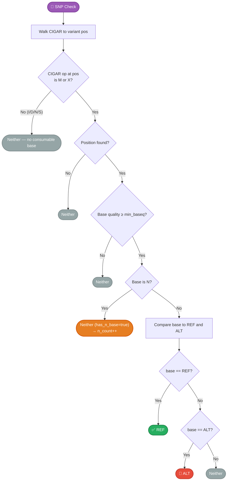
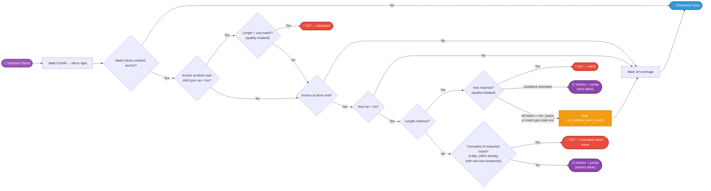
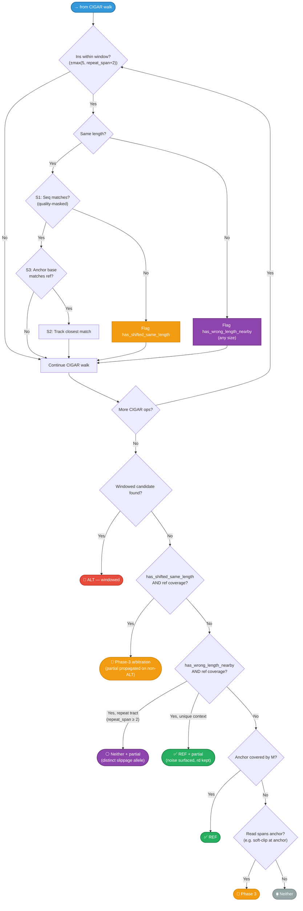
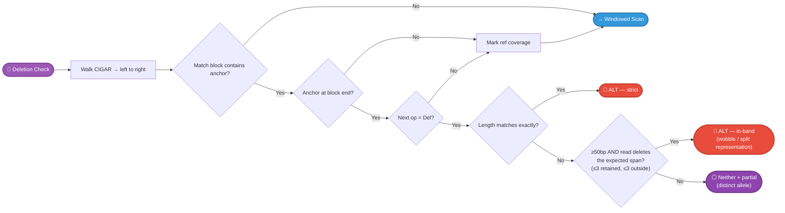
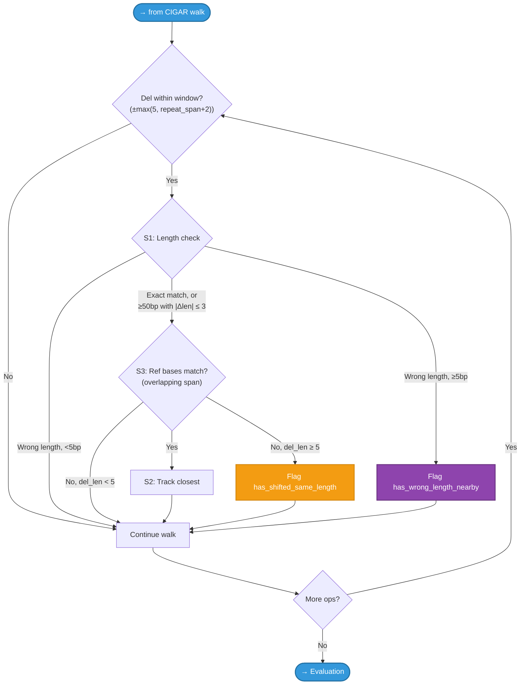
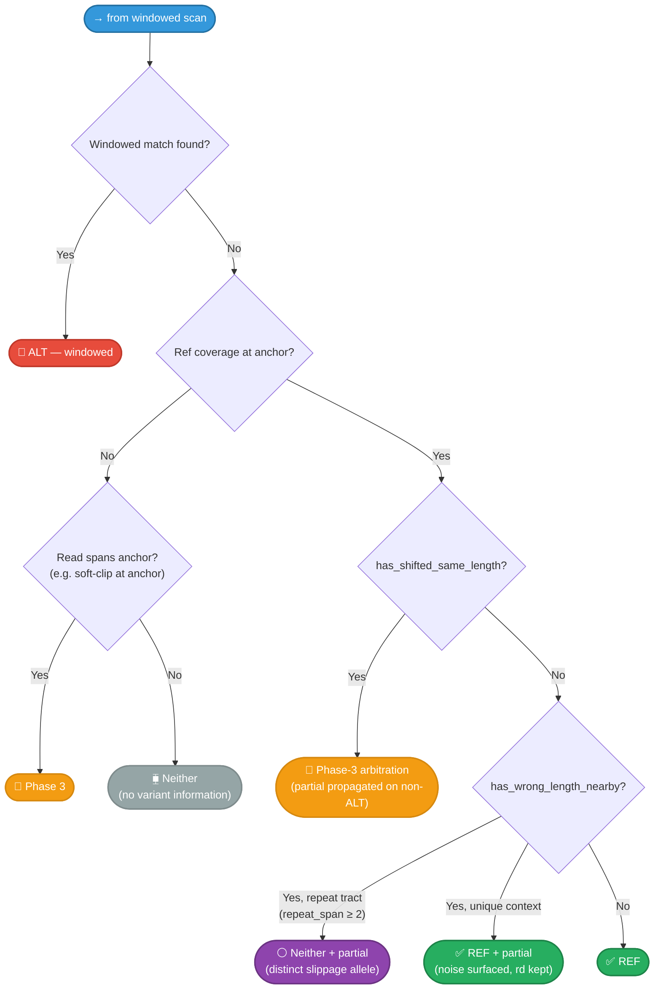
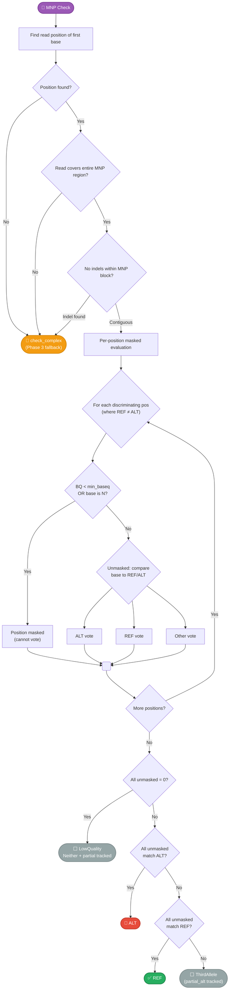
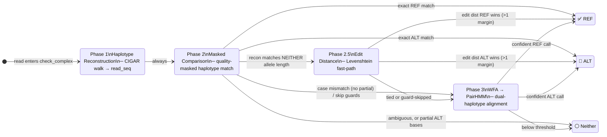
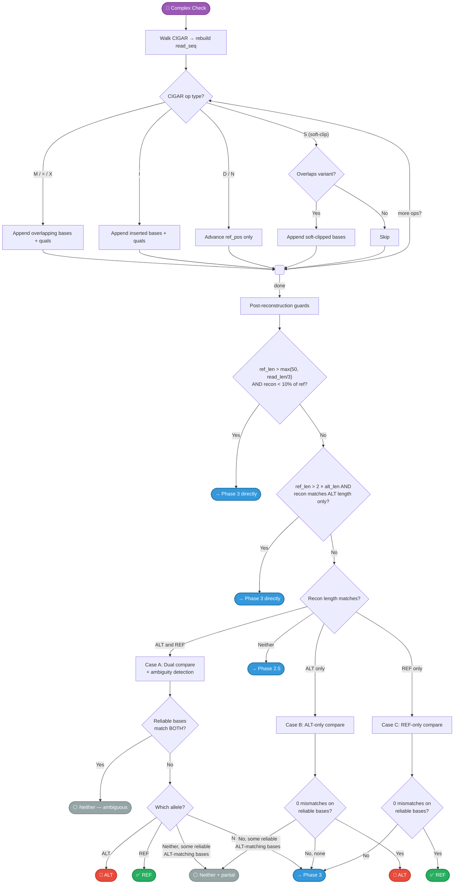
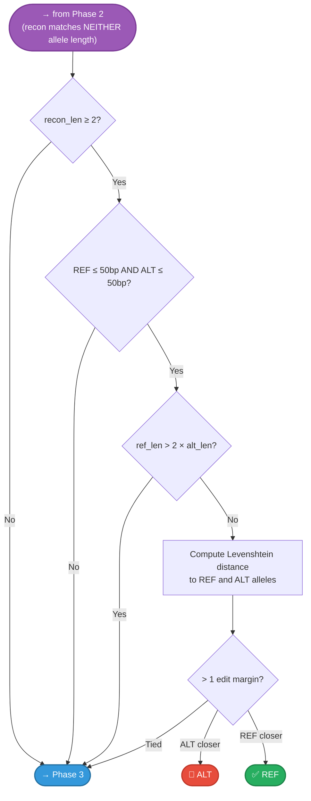

# Allele Classification

How gbcms classifies each read as supporting the **reference** allele, the **alternate** allele, or **neither**.

!!! tip "Detailed Visual Reference (PDF)"
    { type=application/pdf style="min-height:75vh;width:100%" }

## Dispatch

After passing [read filters](read-filters.md), each read is dispatched to a **type-specific** allele checker based on the variant's **allele lengths** (`ref_len` × `alt_len`), not on the `variant_type` string. This makes dispatch robust against inconsistent upstream type labels:


!!! info "Allele-Length and Anchor-Base Routing"
    Dispatch uses `ref_allele.len()` and `alt_allele.len()` as the primary selector. For `N×1` variants (deletion format), it additionally checks whether the anchor base substitutes (`alt_allele[0] ≠ ref_allele[0]`):

    - **Pure deletion** (`alt[0] == ref[0]`) → `check_deletion` — e.g., `AC→A` where anchor A is preserved
    - **Complex Del+SNV** (`alt[0] ≠ ref[0]`) → `check_complex` — e.g., `GC→T` where anchor G also substitutes to T

    This distinction is critical: `check_deletion`'s CIGAR safeguards cannot correctly classify reads that simultaneously carry the anchor substitution. `check_complex` handles these via Phase 3 haplotype alignment (WFA+PairHMM under the default backend).

    `check_deletion` also falls back to `check_complex` for large deletions (≥5bp) where S3 sequence validation fails due to BWA left-alignment shifting the anchor position (see [Deletion — Windowed Safeguards](#windowed-scan-safeguards-1)).

---

## SNP (Single Nucleotide Polymorphism)

A single base substitution — the simplest and most common variant type.

| Property | Value |
|:---------|:------|
| Detection | `len(REF) == 1 && len(ALT) == 1` |
| Position | 0-based index of the substituted base |
| Quality check | Base quality at the position must meet `--min-baseq` |

### Algorithm



!!! info "N-Base Guard (Defense-in-Depth)"
    N bases (e.g., from duplex collapsing via fgbio) are explicitly checked **after** the BQ gate and treated as uninformative — they are classified as neither REF nor ALT and signal `has_n_base=true`, causing the engine to increment `n_count` (NAD in VCF). This is defense-in-depth: fgbio assigns BQ ≈ 2 to duplex-masked positions (caught by the BQ gate), but raw BAMs may have arbitrary BQ for N bases.

### Visual Example

```
Variant: chr1:100 C→T (SNP)

Reference: 5'─ ...G  A  T  C  G  A  T  C  G  A... ─3'
                          98 99 100 101
                               ▲
                           variant pos

Read 1:    5'─ ...G  A  T [T] G  A  T  C... ─3'   → ALT ✅
                               ↑
                          base=T matches ALT

Read 2:    5'─ ...G  A  T [C] G  A  T  C... ─3'   → REF ✅
                               ↑
                          base=C matches REF

Read 3:    5'─ ...G  A  T [A] G  A  T  C... ─3'   → Neither
                               ↑
                          base=A ≠ REF or ALT
```

---

## Insertion

Bases inserted after an **anchor** position. The anchor is the last reference base before the inserted sequence.

| Property | Value |
|:---------|:------|
| Detection | `len(REF) == 1 && len(ALT) > 1` |
| Position | 0-based index of the **anchor** base |
| Quality check | Quality-masked sequence comparison |

### Algorithm

The insertion check uses a **single CIGAR walk** with four detection strategies:

#### Part A — CIGAR-Based Strict Detection



!!! important "Wrong-Length and Wrong-Sequence Insertions at the Anchor"
    An I op at the exact anchor that does **not** verify against the expected insert is never
    silently REF and never the queried ALT:

    - **Wrong length, truncation of the expected insert** — sequencers lose bases from long
      insertions, so reads carry shorter I ops whose bases match a slice of the expected
      insert. Gates: observed ≥4bp and strictly shorter than expected, ≥90% identity to the
      best-matching window, and **both** sequences non-low-complexity (in a repeat tract every
      wrong-length insert matches trivially, and there different lengths are distinct slippage
      alleles). Passing all gates → **ALT** (same event).
    - **Wrong length, anything else** — a **distinct allele** in the same tract (the +A vs +AA
      slippage ladder) → neither + `partial_alt`. Phase 3 must not arbitrate: its haplotype
      window is length-blind inside repeat tracts.
    - **Right length, confident base mismatch** (mismatches on ≥`--min-baseq` bases) — a
      same-length **third allele** → neither + `partial_alt`. Phase 3 must not arbitrate here
      either: alignment scoring promotes a wrong-sequence insert to ALT because it still beats
      the gapped REF alignment.
    - **Right length, unverifiable bases** (every inserted base below `--min-baseq`, or the
      insert runs past the read end) — flag `has_shifted_same_length` for post-walk **Phase-3
      arbitration** (BQ-aware), honoring the cross-backend quality contract; partial evidence
      is propagated when Phase 3 does not confirm ALT.

    See [Wrong-Length Pure Indels](#wrong-length-pure-indels-partial_alt) for the full rule and
    its validation.

#### Part B — Windowed Scan + S1/S2/S3 Safeguards



### Windowed Scan Safeguards

Three layers of validation prevent false-positive windowed matches:

| Safeguard | Check | Purpose |
|:----------|:------|:--------|
| **S1** | Inserted sequence matches expected ALT bases (quality-masked) | Prevents matching unrelated insertions |
| **S2** | Closest match wins (minimum distance from anchor) | When multiple candidates exist, picks the most likely |
| **S3** | Reference base at shifted anchor matches original anchor base | Ensures the shifted position is biologically equivalent |

!!! note "Two Windowed Flags with Different Outcomes"
    - **`has_shifted_same_length`** — the windowed scan found an insertion of the **right
      length** whose bases failed the sequence check (an aligner may represent the same event
      with shifted bases in a repeat). Resolved by **Phase-3 arbitration** (WFA+PairHMM under
      the default backend); `partial_alt` evidence is propagated when Phase 3 does not confirm
      ALT.
    - **`has_wrong_length_nearby`** — the windowed scan found an insertion of the **wrong
      length** (flagged at any size, so REF can never silently absorb it). Resolved without
      Phase 3: inside a repeat tract (`repeat_span ≥ 2`) it is a distinct slippage allele →
      neither + `partial_alt`; in unique context the anchor-covering M is definitive REF and
      the stray insertion is surfaced as `partial_alt` alongside `rd`.

### Visual Example

```
Variant: chr1:100 G→GTG (insertion of TG after anchor G, inside a TG repeat)

Reference:     5'─ ...A  T  G  T  G  T  G  C... ─3'
                          99 100 101 102 103 104 105
                              ▲
                          anchor pos (repeat context — shifted placements stay equivalent)

Read 1 (ALT, strict):  CIGAR = 5M 2I 5M
               5'─ ...A  T  G [T  G] T  G  T  G  C... ─3'
                               └──┘
                          inserted bases at anchor → ALT ✅ (strict)

Read 2 (ALT, windowed): CIGAR = 7M 2I 3M
               5'─ ...A  T  G  T  G [T  G] T  G  C... ─3'
                                         └──┘
                    insertion shifted +2bp (one repeat unit): S1 seq matches,
                    S3 shifted anchor (pos 102 = G) matches original anchor G → ALT ✅ (windowed)

Read 3 (REF):  CIGAR = 10M
               5'─ ...A  T  G  T  G  T  G  C... ─3'
                              ↑
                          no insertion after anchor → REF ✅
```

---

## Deletion

Bases deleted after an **anchor** position. Mirrors insertion but looks for `Del` CIGAR operations.

| Property | Value |
|:---------|:------|
| Detection | `len(REF) > 1 && len(ALT) == 1` AND `alt[0] == ref[0]` (pure deletion) |
| Position | 0-based index of the **anchor** base |
| Quality check | Quality-masked ref-context comparison |

!!! warning "Complex Del+SNV: Routed to `check_complex`"
    When `len(REF) > 1 && len(ALT) == 1` but the anchor base **also substitutes** (`alt[0] ≠ ref[0]`), the variant is a **complex Del+SNV** and is routed directly to `check_complex` — not `check_deletion`. This handles variants such as:

    - **SOX9** `GC→T`: anchor G substitutes to T, C is deleted. D(1) reads classified as ALT via Phase 3 haplotype alignment.
    - **ABL1** `AG→T`: anchor A substitutes to T, G is deleted.

    `check_deletion`'s CIGAR safeguards compare anchor bases assuming the anchor is preserved. For these variants, the anchor changes — feeding them to `check_deletion` would incorrectly classify all DEL reads as REF (alt=0).

### Algorithm

Same single-walk strategy as insertion, with four additional features:

1. **Placement-aware large-deletion band** — For large deletions (≥50bp), a wrong-length D at
   the anchor still counts as the annotated event when the read deletes essentially the whole
   expected span: at most 3 expected-span bases retained, and at most 3 bases deleted/inserted
   outside the span (within the scan region). This accepts single-op breakpoint wobble AND
   split representations (`D(60)+2M+D(40)` for a ~100bp deletion) in pure CIGAR space, while
   rejecting net-matching but *displaced* deletions whose M ops across the span prove the event
   is absent. The 50bp threshold is an **artifact-size prior**: slippage/stutter/alignment
   artifacts are small, so an observed ≥50bp D op is essentially always a real deletion in that
   molecule — the band only decides *which* event it belongs to. (Validated pure large
   deletions, 12–539bp, all align as a single exact-length D at the anchor, so the ≤3bp slop is
   insurance, not an observed need.)

2. **Wrong-length rule** — A wrong-length D at the anchor that fails the band is a **distinct
   allele** in the same tract → neither + `partial_alt`, never Phase 3. See
   [Wrong-Length Pure Indels](#wrong-length-pure-indels-partial_alt).

3. **Left-alignment Phase 3 fallback** — For deletions ≥5bp where the windowed scan finds a
   matching-length (or in-band) Del but S3 sequence validation fails (BWA left-alignment
   shifted the anchor further left than the CIGAR `D` position), the engine flags
   `has_shifted_same_length` and routes to Phase-3 arbitration. Short deletions (<5bp) with
   failed S3 remain CIGAR-definitive REF — they are almost certainly unrelated spurious
   deletions, not left-alignment artifacts. See [Case 3 in the Complex Indels guide](complex-indels.md#case-3-tp53-12bp-left-alignment-shifted-deletion).

4. **Haplotype fallback** — When no CIGAR match is found and the read doesn't cover the anchor
   with a Match op (e.g., a soft-clip at the anchor), falls back to Phase 3 for
   haplotype-based comparison — but only when the read actually spans the anchor position.
   Reads mapping entirely inside a large deleted span carry no information about the variant
   and are classified neither.

#### Part A — CIGAR-Based Strict + Band Detection



#### Part B — Windowed Scan + S1/S2/S3 Safeguards



#### Part C — Evaluation



### Windowed Scan Safeguards {#windowed-scan-safeguards-1}

Three layers of validation prevent false-positive windowed matches:

| Safeguard | Check | Purpose |
|:----------|:------|:--------|
| **S1** | Deleted length matches expected `ref_len − 1` exactly, or is within the ≥50bp ±3bp band | Wrong-length deletions never match; ≥5bp ones flag `has_wrong_length_nearby` (distinct-allele candidates), <5bp ones are alignment noise (CIGAR-definitive) |
| **S2** | Closest match wins (minimum distance from anchor) | When multiple candidates exist, picks the most likely |
| **S3** | Reference bases at the shifted deletion position match expected deleted sequence (overlapping span for in-band lengths) | Verifies the shifted Del is biologically the same event |
| **del_len ≥ 5 guard** | Only flag `has_shifted_same_length` for Dels ≥5bp that fail S3 | Short (1–4bp) Dels failing S3 are almost certainly spurious noise — CIGAR remains definitive. Longer Dels can fail S3 due to BWA left-alignment shifting the anchor away from the actual CIGAR `D` position |

!!! note "has_shifted_same_length Phase 3 Fallback"
    When the windowed scan finds a deletion that matches in **length** (≥5bp) but S3 sequence validation fails (BWA left-alignment shifted the anchor further left than where the CIGAR `D` appears), the engine flags `has_shifted_same_length` and routes to Phase-3 haplotype arbitration (WFA+PairHMM under the default backend), propagating `partial_alt` evidence when Phase 3 does not confirm ALT.

    Example: **TP53 `GACCGTGCAAGT→-` (12bp)** — left-alignment moves the anchor 3bp left of the actual `D(12)` position in reads. S3 compares the wrong reference slice and fails. Phase 3 correctly classifies these as ALT.

    Short deletions (1–4bp) failing S3 use CIGAR-definitive REF: a 1bp Del in the wrong reference context is almost certainly an unrelated noise deletion, not a left-alignment artifact.

!!! warning "No Interior REF for Large Deletions"
    Reads that map **entirely within** a large deleted span never see the anchor junction and carry no information about whether the deletion is present. They are classified **neither** — an earlier interior-REF shortcut was removed because it massively inflated `rd` (claiming thousands of interior reads as REF evidence for a ~1kb deletion). Only reads spanning the anchor position contribute to any count.

### Visual Example

```
Variant: chr1:100 GTG→G (deletion of TG after anchor G, inside a TG repeat)

Reference:     5'─ ...A  T  G  T  G  T  G  C... ─3'
                          99 100 101 102 103 104 105
                              ▲
                          anchor pos (repeat context — shifted placements stay equivalent)

Read 1 (ALT, strict):  CIGAR = 5M 2D 5M
               5'─ ...A  T  G  ──  ──  T  G  C... ─3'
                               └─────┘
                          2bp deletion at anchor → ALT ✅ (strict)

Read 2 (ALT, windowed): CIGAR = 7M 2D 3M
               5'─ ...A  T  G  T  G  ──  ──  C... ─3'
                                        └─────┘
                  deletion shifted +2bp (one repeat unit): S1 length matches,
                  S3 ref bases at shifted position (TG) match expected TG → ALT ✅ (windowed)

Read 3 (REF):  CIGAR = 12M
               5'─ ...A  T  G  T  G  T  G  C... ─3'
                              ↑
                          no deletion after anchor → REF ✅
```

---

## Wrong-Length Pure Indels (partial_alt) { #wrong-length-pure-indels-partial_alt }

A read whose CIGAR proves a **pure indel of a different length** at the variant anchor is
evidence of a **different allele** — never definitive REF, and never the queried ALT. This is
the load-bearing rule for repeat-tract loci, where coexisting distinct-length populations are
distinct slippage alleles (a 1bp germline slippage allele coexisting with an annotated 2bp
somatic deletion; a trinucleotide-repeat deletion ladder). Counting every tract-touching indel
as the annotated event inflated VAF several-fold at such loci.

### The rule

| Evidence at/near the anchor | Classification |
|:----------------------------|:---------------|
| Exact-length, sequence-verified indel | **ALT** (structural) |
| ≥50bp deletion within the placement-aware band (≤3 span bases retained, ≤3 changed outside — covers breakpoint wobble and split `D+M+D` representations) | **ALT** (structural) |
| Insertion that is a truncation of the expected insert (≥4bp, ≥90% identity, both sequences non-low-complexity) | **ALT** (structural) |
| Any other wrong-length pure indel at the anchor | **Neither + `partial_alt`** |
| Same-length insertion with confidently mismatching bases | **Neither + `partial_alt`** (third allele) |
| Same-length candidate with unverifiable bases (all below `--min-baseq`) or a shifted same-length candidate failing S3 | **Phase-3 arbitration**, `partial_alt` propagated on non-ALT |
| Windowed wrong-length op, repeat tract | **Neither + `partial_alt`** (deletions only when the op is ≥5bp — 1–4bp windowed Ds are alignment noise → plain REF; insertions at any size) |
| Windowed wrong-length op, unique context | **REF + `partial_alt`** (same size gate; anchor M is definitive REF, the stray op is surfaced) |

Phase 3 deliberately does **not** arbitrate the definitive wrong-length/wrong-sequence cases:
its haplotype window is length-blind inside repeat tracts, and alignment scoring promotes a
wrong-sequence insert to ALT because it still beats the gapped REF alignment. Delins/complex
variants are unaffected — they route to `check_complex`, whose Phase-3 realignment correctly
resolves split and mismatch-absorbed representations of one event.

### Why the 50bp gate

The gate is an **artifact-size prior**, not an event-rarity claim: slippage, stutter, and
alignment artifacts produce small spurious indel ops, while a read essentially never acquires a
≥50bp deletion by artifact. Above the gate, an observed big D op is trusted as a *real* deletion
in that molecule and the band decides whether it is the annotated event; below it, wrong-length
ops are artifacts or genuine distinct slippage alleles, so no length tolerance is extended.

### Reading the output

At an affected locus, `alt_count` reflects only exact-support reads, and the distinct-allele
evidence appears in `partial_alt`/`any_alt`. When partial evidence dominates
(`partial_alt > alt_count`), the variant is flagged **`PARTIAL_DOMINANT`** in
`gbcms_diagnostic` — at pure-indel loci this usually means the locus carries a coexisting
allele the annotation does not describe (at ≥50bp deletion loci, a real different large
event). Per-read indel lengths are visible with `--trace`.

---

## Splice-Aware Evidence (RNA) { #splice-aware-evidence }

Spliced reads (CIGAR `N`) pass through a triage **before** any of the
per-type checkers: a read testifies only through aligned bases (or a `D`
op) at the discriminating positions, and an `N` spanning all of them
means the read observes nothing there — it classifies neither AND is
excluded from DP/fragment depth (samtools-pileup semantics). `D` is
deletion evidence; `N` never is, so the call cannot flip on the
aligner's D-vs-N representation choice. Indel ops directly after a
splice `N` (`M-N-D-M`) get the same anchor/windowed inspection as ops
after an `M` block, and Phase 3 never scores across a splice (window
extraction and `check_complex` reconstruction both refuse N-crossing
windows rather than stitch exon arms into a junction-chimeric
sequence). At a pure-deletion locus whose anchor is spliced out, a
junction read covering the **entire deleted span** with aligned bases
counts REF (span-aligned REF testimony — the deletion is demonstrably
absent); partial coverage or competing indel evidence keeps the read on
its existing path. Details: [RNA Splice-Junction
Handling](rna-splice-handling.md#the-evidence-rule-what-a-refskip-means).

---

## MNP (Multi-Nucleotide Polymorphism)

Multiple adjacent bases substituted simultaneously.

| Property | Value |
|:---------|:------|
| Detection | `len(REF) == len(ALT) && len(REF) > 1` |
| Position | 0-based index of the first substituted base |
| Quality check | **Per-position masked evaluation** at discriminating positions only (where REF ≠ ALT). N bases and low-BQ bases are masked independently. |

### Algorithm

The MNP checker uses **masked per-position evaluation** — each discriminating position is independently assessed, and only unmasked positions vote for the final classification.



!!! info "Masked Per-Position Strategy"
    Each **discriminating position** (where REF[i] ≠ ALT[i]) is independently evaluated:

    1. **Mask check**: If `BQ < --min-baseq` OR base is N → position is masked (cannot vote)
    2. **Vote**: Unmasked positions vote REF, ALT, or other based on the actual base
    3. **Classify**: Based on unmasked vote totals

    This is an improvement over C++ GBCMS `baseCountDNP`, which gates on `min(BQ)` across **all** positions. For GC-rich regions (e.g., TERT promoter) or long ONPs with few discriminating positions, the old strategy dropped reads due to low quality at positions that don't matter for classification.

    **Non-discriminating positions** (where REF[i] == ALT[i]) are completely ignored — they carry no information for allele classification.

!!! warning "N-Base Handling at Discriminating Positions"
    N bases at discriminating positions are masked regardless of their reported base quality (defense-in-depth). An N base matching ALT is **not** counted as ALT evidence — it is uninformative. If **any** discriminating position has an N base, `has_n_base=true` is set on the classification result, causing the engine to increment `n_count` (NAD in VCF) for duplex masking QC.

### Classification Outcomes

| Condition | Result | partial_alt | has_n_base |
|:----------|:-------|:------------|:-----------|
| All unmasked match ALT | **ALT** | 0 | true if any N at discrim. pos |
| All unmasked match REF | **REF** | 0 | true if any N at discrim. pos |
| Mixed unmasked (some ALT, some REF/other) | **ThirdAllele** → Neither (terminal) | `positions_matching_alt` | true if any N at discrim. pos |
| All discriminating positions masked | **LowQuality** → Neither (terminal) | `positions_matching_alt` | true if any N at discrim. pos |
| Read doesn't cover / has indel in block | **Structural** → check_complex | 0 | false |

!!! note "Partial ALT Tracking"
    When a read has mixed unmasked votes (some match ALT, some match REF or other), the count of ALT-matching unmasked positions is recorded as `positions_matching_alt`. This feeds into the engine's `partial_alt` counter (PAD in VCF), enabling diagnostic analysis of reads with partial evidence of the mutation.

### Contiguity Check

The contiguity check is performed **first** (before quality or sequence comparison) as a fail-fast for structural issues. gbcms compares the read positions of the first and last MNP base — if the distance doesn't equal `len - 1`, an indel exists within the block and the read is routed to `check_complex` for haplotype-based resolution.

!!! warning "Phase 3 Fallback Conditions"
    `check_complex` is invoked only for **structural** issues:

    - Read position not found in CIGAR walk
    - Read doesn't cover the entire MNP region
    - Indel detected within the MNP block (contiguity check)

    These indicate a complex variant misannotated as an MNP. **LowQuality** and
    **ThirdAllele** results are terminal: they return neither with `partial_alt`
    tracking and are deliberately NOT routed to `check_complex` (matching the C++
    `baseCountDNP` no-fallback behavior) — haplotype alignment cannot manufacture
    confidence about positions the quality mask rejected.


---

## Complex (Indel + Substitution)

Variants where REF and ALT differ in both sequence **and** length. Also used for **complex Del+SNV** variants dispatched from the `N×1` path when the anchor base substitutes. Uses a sophisticated **three-phase** algorithm with quality-aware matching and Smith-Waterman fallback.

| Property | Value |
|:---------|:------|
| Detection | Fallback for all other combinations; also `N×1` with `alt[0] ≠ ref[0]` |
| Position | 0-based index of the first reference base |
| Quality check | Masked comparison — bases below `--min-baseq` are masked |

!!! note "REF Fallback for Large Deletion-Direction Variants"
    When `check_complex` is invoked for a deletion-direction variant (`ref_len > alt_len`) and `is_worth_realignment()` returns `false` (the read has a clean M-only CIGAR with no indels in the variant window), Phase 3 is skipped. Instead, gbcms checks whether **any M-block covers the anchor position** AND the anchor base quality meets `--min-baseq`. If both hold, the read is classified as **REF**; an M-covered anchor with a low-quality base returns neither.

    Without this fallback, REF reads for large deletions (e.g., **NF2 ~100bp DEL**) would be misclassified as 'neither' — clean REF reads naturally have no CIGAR evidence warranting realignment, so skipping Phase 3 without a REF fallback silently drops all REF counts.

    See [Case 2 in the Complex Indels guide](complex-indels.md#case-2-nf2-large-deletion-ref-reads-invisible) for the full worked example.

#### Phase Overview



#### Phase 1 + 2 Detail



#### Phase 2.5 Detail — Edit Distance Fast-Path



#### Phase 3 Detail — WFA → PairHMM (see [Alignment Fallback](#phase-3-alignment-fallback))


### Phase 1: Haplotype Reconstruction

Walks the CIGAR to rebuild what the read shows for the genomic region `[pos, pos + ref_len)`. Each CIGAR operation contributes differently:

| CIGAR Op | Action | Example |
|:---------|:-------|:--------|
| M / = / X | Append overlapping bases and qualities | Standard aligned bases |
| I | Append inserted bases if `ref_pos` is within variant region | Captures insertions |
| D / N | Advance `ref_pos` without appending | Deletions skip |
| S | Append if `ref_pos` overlaps variant window | Recovers soft-clipped evidence |
| H / P | No action | Hard clips have no sequence |

### Phase 2: Masked Comparison

Instead of exact matching, bases with quality below `--min-baseq` **or N bases** are **masked out** — they cannot vote for either allele. Three cases based on reconstructed sequence length:

!!! info "N-Base Detection in Reconstructed Haplotype"
    During Phase 1 reconstruction, if any base in the reconstructed sequence at a discriminating position is N, it is masked alongside low-BQ bases. If **any** N base is detected in the variant region, `has_n_base=true` is set, causing the engine to increment `n_count` (NAD in VCF). N bases are treated identically to BQ=0 in the masked comparison — they cannot contribute evidence for either allele.

| Case | Condition | Behavior |
|:-----|:----------|:---------|
| **A** | `recon == alt == ref` length | Dual compare + ambiguity detection |
| **B** | `recon == alt` length only | ALT-only masked compare |
| **C** | `recon == ref` length only | REF-only masked compare |

!!! important "Ambiguity Detection (Case A)"
    When reliable bases match **both** REF and ALT (possible when they differ only at masked positions), the read is discarded rather than guessed. This prevents false calls at positions where low-quality bases happen to match one allele.

!!! warning "Large-REF Guard"
    For variants with REF longer than `max(50, read_len/3)`, if the (non-empty) reconstruction is <10% of the REF length (e.g., 1bp recon for a 1024bp deletion), Phase 2 is skipped entirely and the read goes straight to Phase 3. A tiny reconstruction would trivially match a short ALT allele, causing overcounting.

### Phase 2.5: Edit Distance

When the reconstruction's length matches **neither** allele (so no Case A/B/C comparison is possible), gbcms measures the **Levenshtein edit distance** between the reconstruction and each allele. It runs only for small alleles (REF and ALT both ≤50bp, `ref_len ≤ 2×alt_len`). A failed Case A/B comparison never reaches this phase — it returns Neither (with `partial_alt` when reliable ALT-matching bases exist) or falls to Phase 3. This catches cases where the reconstruction is off by 1-2 bases due to an incomplete variant definition:

| Parameter | Value | Rationale |
|:----------|:------|:----------|
| Margin | >1 edit | Prevents noise on very short strings |
| Min recon length | 2 bases | Single-base reconstructions are too short for reliable edit distance |

!!! note "Phase 2.5 is Supplementary"
    Phase 2.5 helps edge cases with longer reconstructions. For variants like EPHA7 where the strict reconstruction is only 1bp (`"C"`), the `recon_len >= 2` guard skips Phase 2.5 entirely — the fix comes from Phase 3's local fallback instead.

### Phase 3: Alignment Fallback

When Phase 2 and Phase 2.5 both fail, the engine expands to the full `ref_context` window and performs **dual-haplotype alignment** against both REF and ALT haplotypes.

**Default backend: `pairhmm` (two-stage WFA + PairHMM)**

1. **Pangenomic haplotype matrix** — build `REF_hap` and `ALT_hap` extended with flanking context
2. **WFA fast-path triage** (`wfa2lib-rs`) — edit-distance alignment resolves ~70-80% of reads instantly at O(s²) cost; if the edit-distance gap between REF and ALT is unambiguous, the read is classified immediately
3. **Marginalized PairHMM** (escalated only when WFA is ambiguous) — integrates per-base quality probabilities into alignment scoring, producing a Log-Likelihood Ratio (LLR) confidence score; default threshold 2.3 ≈ ln(10)

**Alternative backend: `sw`**

Runs Smith-Waterman directly on every Phase 3 read (no WFA pre-filter):

1. **Build haplotypes**: `REF_hap = left_ctx + REF + right_ctx`, `ALT_hap = left_ctx + ALT + right_ctx`
2. **Mask**: Replace low-quality bases with `N` (scores 0 against any base)
3. **Align**: Semiglobal alignment — read (query) is fully consumed, haplotype (text) has free overhangs
4. **Score**: ALT wins if `alt_score ≥ ref_score + 2`; REF wins if `ref_score ≥ alt_score + 2`
5. **Dual-trigger check**: For indel/complex variants, if the semiglobal result is low-confidence, retry with local alignment

| Parameter | `pairhmm` | `sw` |
|:----------|:----------|:-----|
| Fast-path | WFA edit-distance (~70-80% resolved) | None (every read goes to full alignment) |
| Confidence score | LLR (quality-weighted) | Score margin ≥ 2 |
| Tunable gap probs | Yes (`--gap-open-prob` etc.) | Fixed affine: open −5, extend −1 |
| Default threshold | `--llr-threshold 2.3` | Margin ≥ 2 |

!!! note "When to use `sw`"
    Use `--alignment-backend sw` only if you need exact reproducibility with gbcms <3.0.0. The `pairhmm` default is faster (WFA pre-filter) and more accurate in low-quality or repeat-dense regions (quality-weighted LLR scoring).

#### Dual-Trigger Local Fallback

For **complex variants** (both alleles > 1bp with different lengths), semiglobal alignment can produce confident but incorrect calls when the MAF/VCF definition is incomplete (e.g., a complex variant missing an adjacent SNV). The ALT haplotype then has a "frameshifted flank" — right-context bases that don't match the biological read. Semiglobal forces gap penalties through this invalid flank.

> [!NOTE]
> The dual-trigger only applies to **complex** variants (e.g., `TCC→CT`, `ATGA→CATG`), not to pure insertions or deletions. Pure indels are well-handled by semiglobal alignment, and applying local fallback would risk false positives in homopolymer regions.

Two conditions detect low-confidence semiglobal results:

| Trigger | Condition | Purpose |
|:--------|:----------|:--------|
| **Borderline** | `abs(alt_score - ref_score) ≤ margin + 1` | Score difference barely decisive |
| **Poor quality** | `max(scores) < read_len / 2` | Both haplotypes heavily penalized |

When **either** trigger fires, the engine retries with **local alignment** (`Aligner::local()`), which soft-clips the bad flank and finds the best matching substring without penalizing overhangs on either side.

!!! tip "Performance: Aligner Reuse"
    SW aligners are created **once per variant** (in every counting path) and reused for all of its reads. The `bio::alignment::pairwise::Aligner` reuses internal DP buffers, avoiding repeated heap allocation.

!!! note "Raw Read Window Extraction"
    Phase 3 uses `extract_raw_read_window()` instead of CIGAR-projected extraction. For complex variants (e.g., `TCC→CT` represented as `DEL+INS` in CIGAR), CIGAR projection produces a hybrid sequence matching neither haplotype. Raw extraction returns the contiguous read bases that SW can correctly classify.

#### Ambiguous Tie — Unbiased VAF Preservation

For small Complex and MNP variants, biological reads heavily affected by surrounding genetic polymorphism can result in 50% partial matches against the Alternate array. Mathematically, this scores an exact numerical **tie** between the `REF` and `ALT` haplotypes (`alt_score = 11, ref_score = 11`). 

These ambiguous reads are routed to **neither** (`is_ref = false, is_alt = false`). They still contribute to physical Total Depth (`DP`) via the anchor overlap gate, but do **not** inflate `RD` or `AD`. This preserves an unbiased `VAF = AD / (RD + AD)` — critical for low-VAF cfDNA detection where even small RD inflation can push a variant below the clinical Limit of Detection.

---

## Multi-Allelic Behavior

When multiple variants have overlapping REF spans at the same locus, reads carrying one variant's ALT allele could be incorrectly counted as REF for another variant. The engine addresses this with a two-phase approach:

### Phase 1: Annotation

During normalization, `assign_multi_allelic_groups()` groups co-annotated variants with a fixed-point sweep over sorted `(chrom, pos)` coordinates, under two criteria: variants whose REF spans intersect (any types — tagged `MULTI_ALLELIC`), and length-changing variants whose scan windows (`max(5, repeat_span+2)` each side) overlap (tagged `TRACT_CLUSTER` when window-only). Groups close transitively and may be non-contiguous in position order; members share a `multi_allelic_group` ID and the tag is appended to `gbcms_status_reason` (the verdict stays `PASS`). Within a group the engine assigns AD exclusively: a read's ALT call is demoted to `partial_alt` when a sibling explains it at least as well by span-explanation cost, and an alignment-phase ALT not confirmed exactly by the read's own span reconstruction is demoted as ambiguous; anchor-exact CIGAR evidence is never contested.

### Phase 2: Sibling ALT Exclusion

During counting, reads classified as **REF** for a variant are additionally checked against all **sibling variants** in the same group. For each sibling, the full `check_allele_with_qual()` pipeline (including CIGAR reconstruction and SW alignment) determines if the read actually carries the sibling's ALT allele. If so, the read is **excluded from REF** for the current variant.

!!! important "This prevents systematic REF inflation at multi-allelic loci, preserving unbiased VAF estimation."

---

## SW Gap Penalties

Phase 3's Smith-Waterman aligners use fixed affine gap penalties:
`SW_GAP_OPEN = -5`, `SW_GAP_EXTEND = -1` (match +1, mismatch −1, N scores 0).
They are documented constants, not tuned per locus: an earlier
`dynamic_sw_gap_extend` logistic curve rounded to −1 for every `repeat_span`,
and traced real runs (ACCESS duplex, MSI-high) confirmed SW scores nothing
under the default backend on well-formed input, so the curve was removed
(issue #92).

Smith-Waterman has two roles:

- **The explicit scorer** under `--alignment-backend sw` — the primary Phase-3
  engine there, kept for cross-backend concordance. There are no SW gap flags.
- **A last-resort fallback under the default `pairhmm` backend**, used only
  when the pangenomic haplotype matrix cannot be built for a variant (its
  reference context is missing because prep's fetch failed, does not contain
  it, or the ALT haplotype cannot be constructed) — i.e. upstream input was
  malformed. The fallback is kept but never silent: each affected variant logs
  one WARN naming the reason and outcome, and the row carries `SW_FALLBACK(n)`
  in `gbcms_diagnostic` (n = depth-contributing reads the matrix could not
  evaluate). Where SW cannot build its haplotypes either — always the case
  without a reference context — those reads end as NEITHER, and the flag is
  how that loss becomes visible. (MNPs carry no reference context by design and
  use no Phase 3, so their reads are never counted here.)

The PairHMM gap flags retune PairHMM probabilities only; they never reach the
SW penalties.

The `repeat_span` is computed during normalization using `find_tandem_repeat()` **at the
first changed base** of the alleles (not the shared anchor, which sits one base left of a
left-aligned tract) and stored on the `Variant` struct. It drives the PairHMM gap
blending, the windowed-scan width, and adaptive context padding (the SW penalties are
constants and do not use it).

!!! tip "MSI-High Tumors"
    In microsatellite-unstable tumors, insertions/deletions within long homopolymer or dinucleotide repeats are common. Under the default `pairhmm` backend, repeat tolerance comes from PairHMM's repeat-scaled gap probabilities and from the wrong-length rule's tract-aware handling — not from the SW gap penalty, which is constant (see above).

---

## Limitations

1. **Windowed scan range** — Indels shifted beyond the context padding from their expected position won't be detected by the CIGAR-based check. Phase 3 can catch some of these via `ref_context`, but only if the read shows evidence (indels/clips) near the variant. [Adaptive context padding](variant-normalization.md#adaptive-context-padding) (enabled by default) utilizes a multi-anchor footprint sweep to dramatically widen the padded detection bounds natively for INDEL clusters.

2. **Score margin ≥ 2** — The SW margin is fixed at 2 points to prevent ambiguous calls. Reads failing to achieve definitive spacing are routed to **neither** — they contribute to `DP` but not to `RD` or `AD`, preserving unbiased VAF.

3. **Soft-clip recovery** — Phase 1 includes soft-clipped bases that overlap the variant window, but only when `ref_pos` is within the variant region. Soft clips at the edge of reads far from the variant are not considered.

4. **MNP strict matching** — MNP evaluation is per-position and terminal: LowQuality and ThirdAllele results return neither (with `partial_alt` tracking) and are deliberately not rescued by the complex chain. Only structural issues (no coverage, indel inside the block) fall back to `check_complex`.

5. **Incomplete variant definitions** — When the MAF/VCF represents a complex event incompletely (e.g., `TCC→CT` omitting an adjacent SNV), reads may carry a different CIGAR signature than expected. The dual-trigger local fallback in Phase 3 mitigates this by soft-clipping "frameshifted flanks" caused by the definition mismatch.

---

## Related

- [Variant Normalization](variant-normalization.md) — How variants are prepared before classification
- [Read Filters](read-filters.md) — Which reads reach the allele checker
- [Counting & Metrics](counting-metrics.md) — How classifications become counts
- [Glossary](glossary.md) — Term definitions
