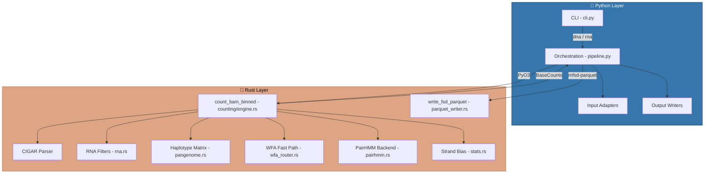
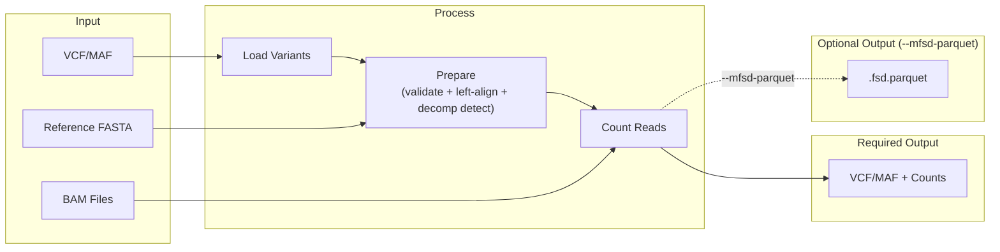
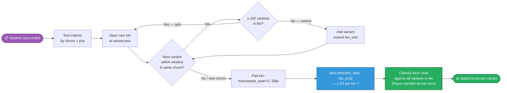
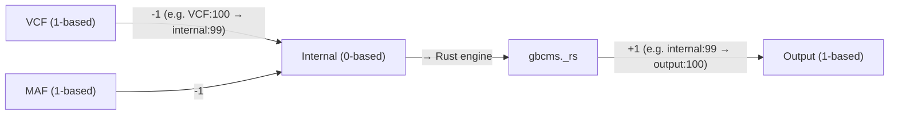
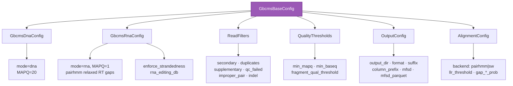
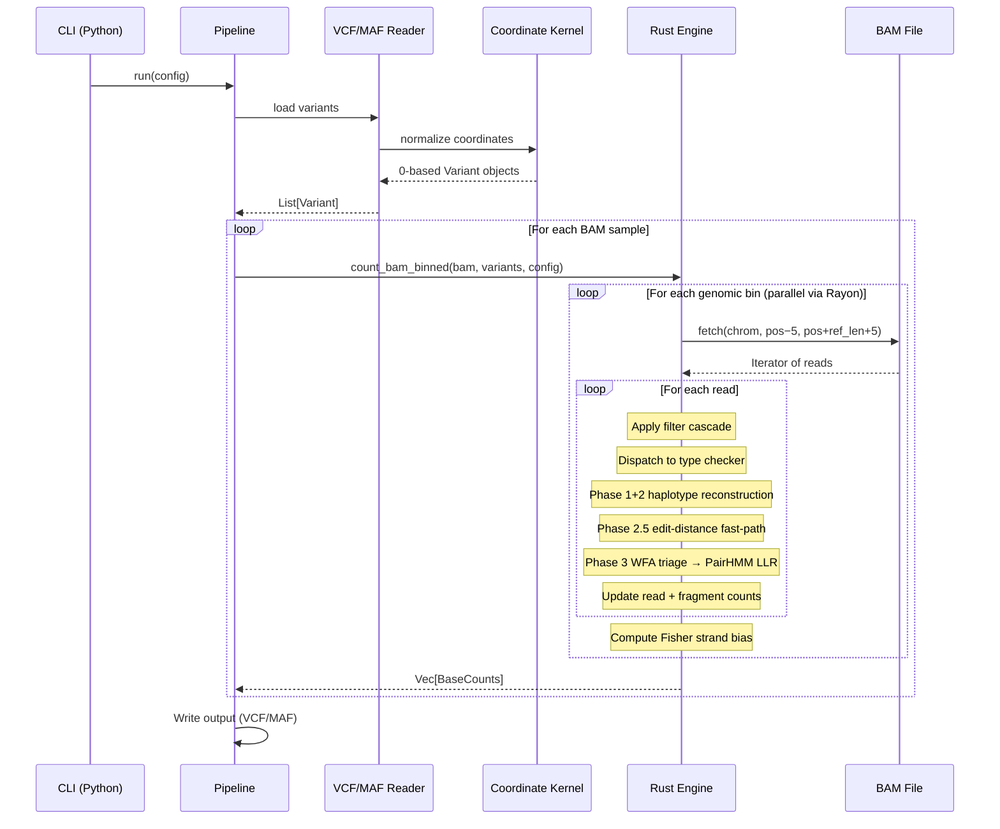

# Architecture

gbcms uses a hybrid Python/Rust architecture for maximum performance.

## System Overview



---

## Data Flow



---

## Genomic Binning

To minimise BAM I/O, the Rust engine groups co-located variants into **genomic bins** before counting. A single `bam.fetch()` is issued per bin, and reads fetched for that region are classified against **all variants in the bin** in one pass. For clustered inputs (e.g. a MAF with hundreds of variants on the same gene) this reduces BAM seeks from O(N) per-variant to O(B) per-bin — typically 5-20× fewer I/O operations.

This design mirrors the original C++ GBCMS `--max_block_size` / `--max_block_dist` architecture, re-implemented as a pure Rust streaming algorithm.



### Binning Parameters

| Parameter | Value | Notes |
|:----------|:------|:-------|
| `BIN_WINDOW` | **10,000 bp** | Maximum span of a single bin. Variants beyond this distance start a new bin. |
| `BIN_MAX_VARIANTS` | **200** | Maximum variants per bin. Split enforced to prevent O(V × R) blowup in the shared-read classification loop. |
| Bin padding | `max(repeat_span + 2, 5)` bp | Ensures reads overlapping bin edges are captured. Uses each variant's detected tandem-repeat span. |
| Parallelism | Rayon `par_iter()` over bins | Each thread owns its own `BamReader` handle; no locking required across bins. |
| Output order | Preserved | Variants are sorted by index internally; results are written back in original input order. |

!!! tip "Performance Implication"
    For a MAF with 500 variants on *TP53* (a 19kb gene), the engine produces ~2-3 bins instead of 500 individual `bam.fetch()` calls. On high-depth targeted panels this can reduce wall-clock counting time by 5-20×.

!!! info "Not a CLI flag"
    `BIN_WINDOW` and `BIN_MAX_VARIANTS` are internal performance constants — they do not affect output values. Parity testing (`D1` regression suite) validates that binned and per-variant paths produce identical `BaseCounts`.

---

## Coordinate System

All coordinates normalized to **0-based, half-open** internally:



| Format | System | Example |
|:-------|:-------|:--------|
| VCF input | 1-based | chr1:100 |
| Internal | 0-based | chr1:99 |
| Output | 1-based | chr1:100 |

---

## Formulas

### Variant Allele Frequency (VAF)

```
VAF = AD / (RD + AD)
```

Where:
- **AD** = Alternate allele read count
- **RD** = Reference allele read count

### Strand Bias (Fisher's Exact Test)

```
         |  Forward  Reverse  |
    -----+--------------------+
    Ref  |    a        b      |
    Alt  |    c        d      |
    -----+--------------------+
    
    p-value = Fisher's exact test on 2×2 contingency table
```

Low p-value (< 0.05) indicates potential strand bias artifact.

### Structural Invariants

The Rust counting engine (`BaseCounts`) maintains these invariants at all times:

| Invariant | Formula | Purpose |
|:----------|:--------|:--------|
| ALT decomposition | `any_alt = AD + partial_alt` | any_alt decomposes into full ALT matches and partial-only matches |
| ALT monotonicity | `any_alt >= AD` | Reads with any ALT evidence ≥ reads with full ALT match |
| Depth decomposition | `DP >= RD + AD + partial_alt + n_count` | DP includes all read categories; gap = reads classified as neither |

### Diagnostic Output Fields

Three diagnostic fields are always present in VCF (FORMAT tags) and MAF output:

| Field | VCF Tag | Description |
|:------|:--------|:------------|
| `any_alt` | `AAD` | Reads with ALT evidence at ≥1 discriminating position |
| `partial_alt` | `PAD` | Reads matching ALT at some but not all positions — now populated for all variant types including INDELs (via structural evidence propagation) |
| `n_count` | `NAD` | Reads with N base at ≥1 discriminating position (duplex masking QC) |

N bases are **strictly uninformative** — they increment `n_count` for QC monitoring but are excluded from RD, AD, any_alt, and partial_alt. See [Counting Metrics](counting-metrics.md) for full details.

---

## Module Structure

```
src/gbcms/
├── cli.py           # Typer CLI (dna, rna, normalize, run commands)
├── pipeline.py      # Orchestration (~450 LOC)
├── normalize.py     # Standalone normalization workflow
├── core/
│   └── kernel.py    # Coordinate normalization
├── io/
│   ├── input.py     # VcfReader, MafReader
│   └── output.py    # VcfWriter, MafWriter (mode-aware: DNA/RNA columns)
├── models/
│   └── core.py      # Pydantic configs (GbcmsDnaConfig, GbcmsRnaConfig, AlignmentConfig)
└── utils/
    └── logging.py   # Structured logging

rust/src/
├── lib.rs                    # PyO3 module exports
├── counting/
│   ├── mod.rs                # Submodule re-exports
│   ├── engine.rs             # Main loop, genomic binning, BAQ, UMI
│   ├── variant_checks.rs     # check_snp/mnp/ins/del/complex + Phase 3 dispatch
│   ├── alignment.rs          # Smith-Waterman implementation
│   ├── pairhmm.rs            # PairHMM alignment backend (marginalized)
│   ├── pangenome.rs          # Haplotype matrix construction
│   ├── wfa_router.rs         # WFA2 fast-path alignment
│   ├── rna.rs                # RNA validation, splicing, editing site lookup
│   ├── fragment.rs           # Re-export of shared::fragment (backward compat)
│   ├── mfsd.rs               # Mutant Fragment Size Distribution analysis
│   ├── parquet_writer.rs     # write_fsd_parquet() — native Parquet via ZSTD
│   └── utils.rs              # Helpers, reconstruction, soft-clip
├── normalize/
│   ├── mod.rs                # Submodule re-exports
│   ├── engine.rs             # Normalization pipeline
│   ├── left_align.rs         # bcftools-style left-alignment
│   ├── decomp.rs             # Homopolymer decomposition
│   ├── fasta.rs              # Reference sequence fetcher
│   ├── repeat.rs             # Tandem repeat detection
│   └── types.rs              # NormResult enum
├── shared/
│   ├── mod.rs                # Submodule re-exports
│   ├── fragment.rs           # FragmentEvidence, quality consensus, UMI grouping
│   ├── stats.rs              # Fisher's exact test (strand bias)
│   ├── filters.rs            # ReadFilter struct, FilterCounts (BAM flag checks)
│   ├── baq.rs                # BAQ heuristic (Li 2011)
│   └── bam_utils.rs          # median_qual, find_read_pos
└── types.rs                  # Variant, BaseCounts, PyO3 bindings
```

---

## Configuration

All settings via mode-specific Pydantic models:



See [models/core.py](file:///src/gbcms/models/core.py) for definitions.

---

## Full Pipeline: End-to-End Example

Here's how a single variant is processed through the complete pipeline:



---

## Comparison with Original GBCMS

| Feature | Original GBCMS | gbcms |
|:--------|:---------------|:---------|
| Counting algorithm | Region-based chunking, position matching | Per-variant CIGAR traversal |
| Indel detection | Exact position match only | **Windowed scan** (±5bp) with 3-layer safeguards: sequence identity, closest match, reference context validation |
| Complex variants | Optional via `--generic_counting` | Always uses haplotype reconstruction |
| Complex quality handling | Exact match only (no quality awareness) | **Masked comparison** — bases below `--min-baseq` are masked out, ambiguity detection prevents false positives |
| Base quality filtering | No base quality threshold | Default `--min-baseq 20` (Phred Q20) |
| MNP handling | Not explicit | Dedicated `check_mnp` with contiguity check |
| Fragment counting | Optional (`--fragment_count`), majority-rule | Always computed, quality-weighted consensus with discard |
| Positive strand counts | Optional (`--positive_count`) | Always computed |
| Strand bias | Not computed | Fisher's exact test (read + fragment level) |
| Fractional depth | `--fragment_fractional_weight` | Not implemented |
| Parallelism | OpenMP block-based | Rayon per-variant |

---

## Related

- [Allele Classification](allele-classification.md) — How each variant type is counted
- [RNA Splice-Junction Handling](rna-splice-handling.md) — How gbcms handles splice-boundary artifacts vs GATK SplitNCigarReads
- [Variant Normalization](variant-normalization.md) — How variants are prepared before counting
- [Input Formats](input-formats.md) — VCF and MAF specifications
- [Glossary](glossary.md) — Term definitions
