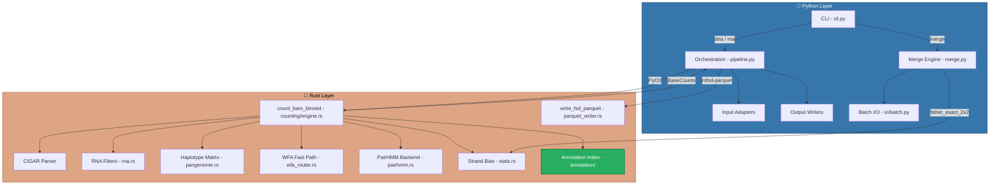
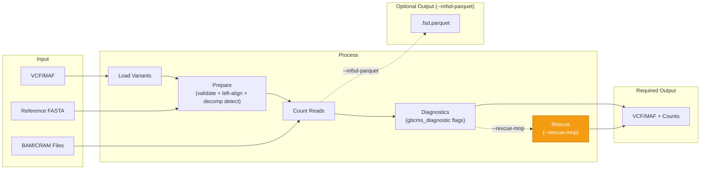
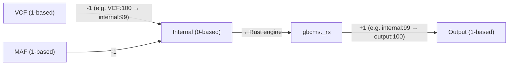
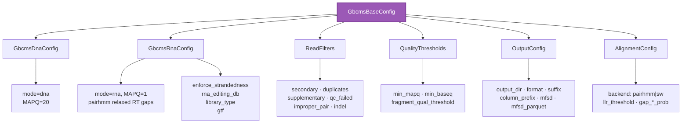
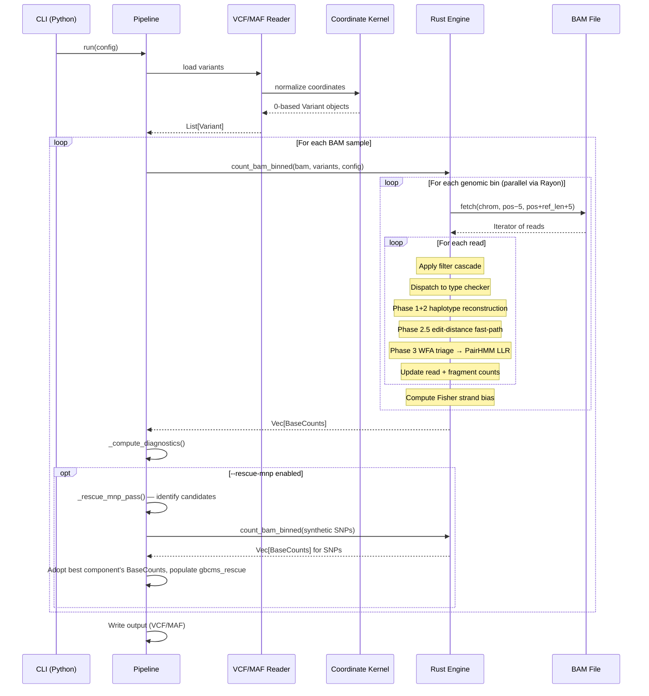
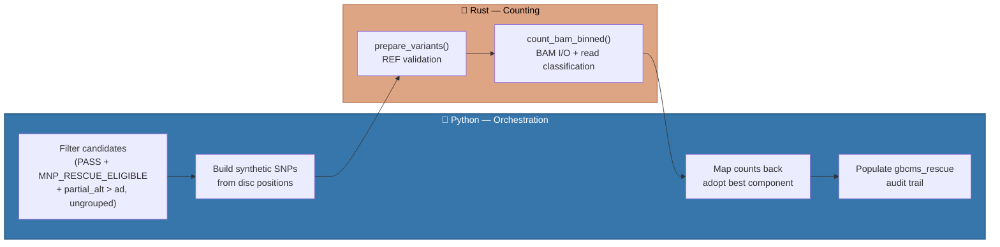

# Architecture

gbcms uses a hybrid Python/Rust architecture for maximum performance.

## System Overview



---

## Data Flow



---

## Genomic Binning

To minimise BAM I/O, the Rust engine groups co-located variants into **genomic bins** before counting. A single `bam.fetch()` is issued per bin, and reads fetched for that region are classified against **all variants in the bin** in one pass. For clustered inputs (e.g. a MAF with hundreds of variants on the same gene) this reduces BAM seeks from O(N) per-variant to O(B) per-bin — typically 5-20× fewer I/O operations.

This design mirrors the original C++ GBCMS `--max_block_size` / `--max_block_dist` architecture, re-implemented as a pure Rust streaming algorithm.


### Binning Parameters

| Parameter | Value | Notes |
|:----------|:------|:-------|
| `BIN_WINDOW` | **10,000 bp** | Maximum span of a single bin. Variants beyond this distance start a new bin. |
| `BIN_MAX_VARIANTS` | **200** | Maximum variants per bin. Split enforced to prevent O(V × R) blowup in the shared-read classification loop. |
| Bin padding | `max(repeat_span + 2, 5)` bp | Ensures reads overlapping bin edges are captured. Uses each variant's detected tandem-repeat span. |
| Parallelism | Rayon `par_iter()` over bins | Each thread owns its own `BamReader` handle; no locking required across bins. |
| Output order | Preserved | Variants are sorted by index internally; results are written back in original input order. |

!!! tip "Performance Implication"
    For a MAF with 500 variants on *TP53* (a 19kb gene), the engine produces ~2-3 bins instead of 500 individual `bam.fetch()` calls. On high-depth targeted panels this can reduce wall-clock counting time by 5-20×.

!!! info "Not a CLI flag"
    `BIN_WINDOW` and `BIN_MAX_VARIANTS` are internal performance constants — they do not affect output values. Parity testing (`D1` regression suite) validates that binned and per-variant paths produce identical `BaseCounts`.

---

## Coordinate System

All coordinates normalized to **0-based, half-open** internally:



| Format | System | Example |
|:-------|:-------|:--------|
| VCF input | 1-based | chr1:100 |
| Internal | 0-based | chr1:99 |
| Output | 1-based | chr1:100 |

---

## Formulas

### Variant Allele Frequency (VAF)

```
VAF = AD / (RD + AD)
```

Where:
- **AD** = Alternate allele read count
- **RD** = Reference allele read count

### Strand Bias (Fisher's Exact Test)

```
         |  Forward  Reverse  |
    -----+--------------------+
    Ref  |    a        b      |
    Alt  |    c        d      |
    -----+--------------------+
    
    p-value = Fisher's exact test on 2×2 contingency table
```

Low p-value (< 0.05) indicates potential strand bias artifact.

### Structural Invariants

The Rust counting engine (`BaseCounts`) maintains these invariants at all times:

| Invariant | Formula | Purpose |
|:----------|:--------|:--------|
| ALT decomposition | `any_alt = AD + partial_alt` | any_alt decomposes into full ALT matches and partial-only matches |
| ALT monotonicity | `any_alt >= AD` | Reads with any ALT evidence ≥ reads with full ALT match |
| Depth decomposition | `DP >= RD + AD + partial_alt + n_count` | DP includes all read categories; gap = reads classified as neither |

### Diagnostic Output Fields

Three diagnostic fields are always present in VCF (FORMAT tags) and MAF output:

| Field | VCF Tag | Description |
|:------|:--------|:------------|
| `any_alt` | `AAD` | Reads with ALT evidence at ≥1 discriminating position |
| `partial_alt` | `PAD` | Reads matching ALT at some but not all positions — now populated for all variant types including INDELs (via structural evidence propagation) |
| `n_count` | `NAD` | Reads with N base at ≥1 discriminating position (duplex masking QC) |

N bases are **strictly uninformative** — they increment `n_count` for QC monitoring but are excluded from RD, AD, any_alt, and partial_alt. See [Counting Metrics](counting-metrics.md) for full details.

---

## Module Structure

```
src/gbcms/
├── cli.py           # Typer CLI (dna, rna, merge, normalize commands)
├── pipeline.py      # Orchestration (~450 LOC)
├── merge.py         # Multi-BAM MAF merge engine (Polars lazy joins)
├── normalize.py     # Standalone normalization workflow
├── core/
│   └── kernel.py    # Coordinate normalization
├── io/
│   ├── input.py     # VcfReader, MafReader (streaming)
│   ├── output.py    # VcfWriter, MafWriter (mode-aware: DNA/RNA columns)
│   └── batch.py     # Polars batch I/O (read/scan/write MAF, read Parquet)
├── models/
│   └── core.py      # Pydantic configs (GbcmsDnaConfig, GbcmsRnaConfig, MergeConfig)
└── utils/
    └── logging.py   # Structured logging

rust/src/
├── lib.rs                    # PyO3 module exports
├── annotation/               # v5.0.0: GTF annotation index (COITree, splice masks)
│   ├── mod.rs                # AnnotationIndex struct, COITree queries
│   ├── gtf.rs                # GTF parser (variant-guided streaming)
│   └── cache.rs              # GTF disk cache (GtfIndexBundle, bincode) — M5a
├── counting/
│   ├── mod.rs                # Submodule re-exports
│   ├── engine.rs             # Main loop, genomic binning, BAQ, UMI
│   ├── variant_checks.rs     # check_snp/mnp/ins/del/complex + Phase 3 dispatch
│   ├── alignment.rs          # Smith-Waterman implementation
│   ├── pairhmm.rs            # PairHMM alignment backend (marginalized)
│   ├── pangenome.rs          # Haplotype matrix construction
│   ├── wfa_router.rs         # WFA2 fast-path alignment
│   ├── rna.rs                # RNA validation, splicing, editing site lookup
│   ├── fragment.rs           # Re-export of shared::fragment (backward compat)
│   ├── mfsd.rs               # Mutant Fragment Size Distribution analysis
│   ├── parquet_writer.rs     # write_fsd_parquet() — native Parquet via ZSTD
│   └── utils.rs              # Helpers, reconstruction, soft-clip
├── normalize/
│   ├── mod.rs                # Submodule re-exports
│   ├── engine.rs             # Normalization pipeline
│   ├── left_align.rs         # bcftools-style left-alignment
│   ├── decomp.rs             # Homopolymer decomposition
│   ├── fasta.rs              # Reference sequence fetcher
│   ├── repeat.rs             # Tandem repeat detection
│   └── types.rs              # NormResult enum
├── shared/
│   ├── mod.rs                # Submodule re-exports
│   ├── fragment.rs           # FragmentEvidence, quality consensus, UMI grouping
│   ├── stats.rs              # Fisher's exact test (strand bias), BH correction
│   ├── filters.rs            # ReadFilter struct, FilterCounts (BAM flag checks)
│   ├── baq.rs                # BAQ heuristic (Li 2011)
│   └── bam_utils.rs          # median_qual, find_read_pos
└── types.rs                  # Variant, BaseCounts, PyO3 bindings
```

---

## Configuration

All settings via mode-specific Pydantic models:



See [models/core.py](file:///src/gbcms/models/core.py) for definitions.

---

## Full Pipeline: End-to-End Example

Here's how a single variant is processed through the complete pipeline:



---

## MNP Rescue Pass (`--rescue-mnp`, v4.3.0)

Rescue is for annotated MNPs whose carriers hold only a **component** of the haplotype —
typically SNVs on different molecules (trans, separate subclones, or a merged-SNV
annotation). The MNP check correctly reports such a haplotype as absent: each carrier
matches ALT at some discriminating positions and REF at others, so it lands in
`partial_alt`. Rescue re-counts every discriminating position as an SNV and reports the
best-supported component.

### Why Python, Not Rust?

The original design spec proposed implementing rescue in Rust. The final implementation
uses **Python orchestration calling the existing Rust counting engine**. This was a
deliberate architectural decision:



| Concern | If implemented in Rust | Actual (Python + Rust) |
|:--------|:----------------------|:-----------------------|
| **BAM I/O** | Rust (fast) | **Rust** via `count_bam_binned()` — same speed |
| **Read classification** | Rust (fast) | **Rust** — unchanged |
| **Candidate filtering** | Would duplicate Python diagnostic logic | **Python** — direct access to `gbcms_diagnostic` |
| **Synthetic variant creation** | New Rust API surface needed | **Python** — uses existing `rs.Variant()` |
| **Config access** | Entire config struct across FFI boundary | **Python** — `self.config.*` already available |
| **Audit trail formatting** | Awkward string manipulation in Rust | **Python** — natural |
| **Unit testing** | Hard to mock BAM interactions | **Python** — `SimpleNamespace` mocks |
| **Performance impact** | Negligible improvement | **< 1 second** added to 30–120s pipeline |

!!! info "Key Insight"
    The rescue engine is an **orchestration layer**, not a counting engine. The expensive
    work (BAM I/O, read classification, allele counting) is still 100% Rust. Python
    decides _what_ to re-count and _what to do_ with the results — typically 5–50
    synthetic SNPs per sample, handled in a single batched `count_bam_binned()` call.

### Rescue Candidate Criteria

A variant is a rescue candidate when **all** conditions are met:

| # | Condition | Rationale |
|:--|:----------|:----------|
| 1 | `gbcms_status` is `PASS` | FAIL variants have unreliable coordinates |
| 2 | `MNP_RESCUE_ELIGIBLE` in `gbcms_diagnostic` | Emitted only for MNPs (`ref_len == alt_len > 1`) with disc/len ≤ `--rescue-mnp-threshold` (default 1.0 = all MNPs; 0.5 = conservative sparse-only mode). |
| 3 | `partial_alt > ad` | The haplotype is dominated by component evidence. Not `ad == 0`: masked per-position evaluation counts a component carrier whose other discriminating base is low-BQ as full ALT, and one such read must not block rescue. |
| 4 | Not in a co-annotated group (`multi_allelic_group` unset) | Grouped reads are exclusively assigned against siblings; a sibling-free component re-count would hand contested reads back. Such rows get `outcome=skipped_grouped`. |

### Rescue Strategy: Adopt the Best Component

```
MNP:  GAGGG → AAGGA  (5bp; discriminating offsets 0 and 4 → 2/5)
MNP evaluation: ref 486, alt 1, partial_alt 88   (carriers hold only the first G>A;
                                                   counts illustrative, TERT-shaped)

Components, counted as SNVs with the sample's own settings:
  5:1295250 G>A  → ad=88
  5:1295254 G>A  → ad=1

Best component beats the MNP's ad (88 > 1) → the row reports the 5:1295250 G>A SNV's
BaseCounts wholesale.
gbcms_rescue: method=decomposed;outcome=rescued;original_ref=486;original_alt=1;
              original_partial=88;adopted=5:1295250(G>A);
              positions=5:1295250(G>A):88,5:1295254(G>A):1
```

Ties go to the leftmost position. Adopting the component's **whole** `BaseCounts` (not
just its `ad`) keeps the row one coherent genotype: every count, fragment, strand,
strand-bias, mFSD and RNA column comes from one counting pass, so all counting invariants
hold, and `gbcms_diagnostic` is recomputed from the adopted counts. Grafting only the ALT
side onto the MNP record would mix two classifications — fragment consensus lets a
neither-read abstain, so one fragment can be MNP-REF and component-ALT at once.

Consequences to keep in mind when reading a rescued row:

- `ref_count` / `total_count` are the component's: reads carrying only *another*
  component count as REF at the adopted position, and reads covering that position
  without spanning the whole block count toward depth.
- A component can be a germline SNP merged into a somatic MNP; its VAF is then the
  germline VAF. `gbcms_rescue` shows the per-position split.
- With `--observations-parquet`, the Parquet records the MNP evaluation; a rescued row's
  counts come from the adopted component (logged per sample).

### Audit Trail (`gbcms_rescue`)

`gbcms_rescue` is empty for non-candidates and is reset for every sample (the prepared
variant list is shared across the BAMs of a run). For candidates:

| Outcome | Meaning | Counts written |
|:--------|:--------|:---------------|
| `rescued` | Best component beats the MNP's `ad` | Adopted component's |
| `skipped_grouped` | MNP is in a co-annotated group | MNP's |
| `no_improvement` | No component beats the MNP's `ad` — unreachable for consistent counts (every partial read matches ALT at an unmasked discriminating position, so the best component holds ≥ (partial_alt + ad)/2 reads); logged as a warning | MNP's |
| `ref_validation_failed` | No component SNV survived preparation; logged as a warning | MNP's |

`original_ref` / `original_alt` / `original_partial` always carry the MNP's own counts.
A position whose synthetic SNV failed preparation is listed as `…:ref_fail`, never `0`.

## Comparison with Original GBCMS

| Feature | Original GBCMS | gbcms |
|:--------|:---------------|:---------|
| Counting algorithm | Region-based chunking, position matching | Per-variant CIGAR traversal |
| Indel detection | Exact position match only | **Windowed scan** (±5bp) with 3-layer safeguards: sequence identity, closest match, reference context validation |
| Complex variants | Optional via `--generic_counting` | Always uses haplotype reconstruction |
| Complex quality handling | Exact match only (no quality awareness) | **Masked comparison** — bases below `--min-baseq` are masked out, ambiguity detection prevents false positives |
| Base quality filtering | No base quality threshold | Default `--min-baseq 20` (Phred Q20) |
| MNP handling | Not explicit | Dedicated `check_mnp` with contiguity check |
| Fragment counting | Optional (`--fragment_count`), majority-rule | Always computed, quality-weighted consensus with INDEL structural priority |
| Positive strand counts | Optional (`--positive_count`) | Always computed |
| Strand bias | Not computed | Fisher's exact test (read + fragment level) |
| Fractional depth | `--fragment_fractional_weight` | Not implemented |
| Parallelism | OpenMP block-based | Rayon per-variant |

---

## Related

- [Allele Classification](allele-classification.md) — How each variant type is counted
- [RNA Annotation](rna-annotation.md) — GTF annotation, per-transcript counting, ASJD detection
- [RNA Splice-Junction Handling](rna-splice-handling.md) — How gbcms handles splice-boundary artifacts vs GATK SplitNCigarReads
- [Variant Normalization](variant-normalization.md) — How variants are prepared before counting
- [Input Formats](input-formats.md) — VCF and MAF specifications
- [Glossary](glossary.md) — Term definitions
