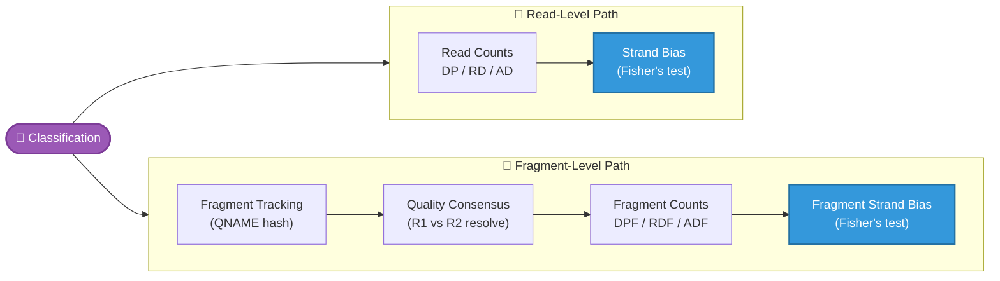
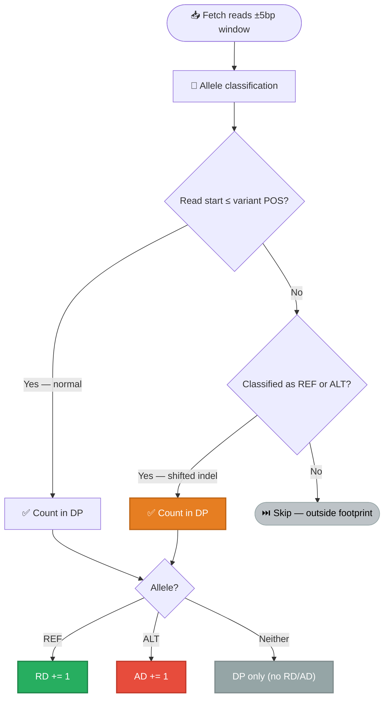
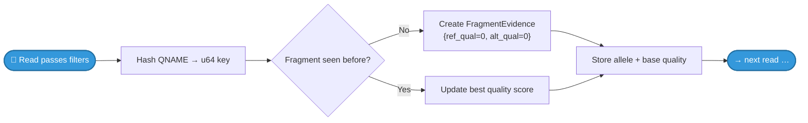
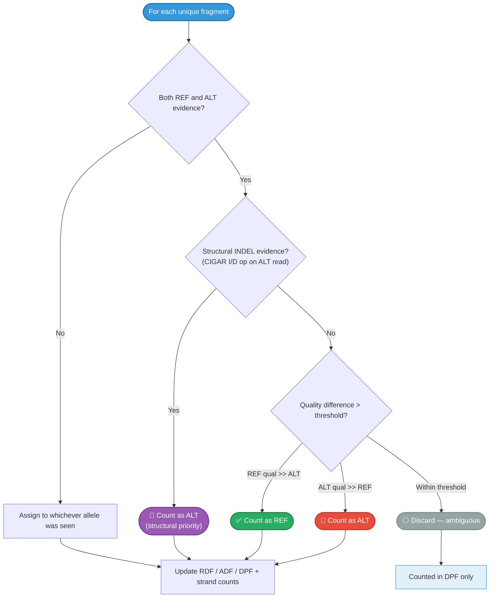
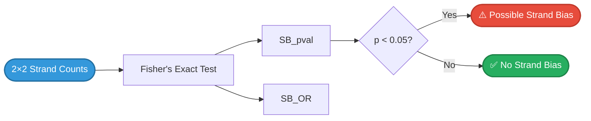

# Counting & Metrics

How allele classifications become counts — read-level metrics, fragment counting, strand bias, and output columns.


## Overview

After each read is [classified](allele-classification.md) as REF, ALT, or neither, gbcms accumulates counts at **two levels**: individual reads and collapsed fragments. It then computes strand bias statistics using Fisher's exact test.



---

## Read-Level Counting

Each read passing filters is counted independently. No deduplication is applied at this level.




!!! info "Anchor Overlap Standard"
    DP gating uses **single-position** anchor overlap: `read_start ≤ variant.pos`. This matches the depth definition used by Mutect2, VarDictJava, and `samtools mpileup` — depth is measured at the variant position, not across the entire REF allele span. Reads fetched from the wider ±5bp window that don't overlap the anchor are excluded from DP unless classified as REF/ALT via shifted indel detection.

!!! info "Carriers in soft-clipped bases (complex variants, DNA)"
    Aligners soft-clip an ALT read whose allele sits near its end, while the REF reads beside it align in full; counting only aligned overlap would drop those carriers and read VAF low. For variants the [exact-carrier rule](allele-classification.md#the-exact-carrier-rule) judges (delins, Del+SNV, and MNP reads with an indel or a clip at the block), a read whose aligned span stops short of POS is counted — in DP, REF/ALT and fragments — when the rule **decides** it from its own bases with an aligned window anchor, and a window it was decided on reads its soft-clipped bases. An unclipped read that misses POS (one starting inside a long deletion) stays out: no ALT read can start there. Every base read must lie inside a well-defined fragment (paired, mate mapped on the same contig in the opposite orientation, TLEN set): past the fragment end a clip is adapter. A clipped read the rule cannot decide stays out, so DP gains only informative reads. DNA only: an RNA read's clip may hold the next exon's bases. Where an RNA exon edge cuts the variant's left flank, the windows are read from the right one, and a read the rule decides there counts in either mode although it starts past POS: a REF and an ALT molecule hold those windows from the same starts. Admitted reads appear in the `--trace` log (`admitted ... by its soft-clipped bases`, or `by windows read from the right flank`) and as a per-variant debug count.

!!! info "Splice-Skip Exclusion (RNA)"
    A read whose CIGAR `N` (RefSkip) spans **every discriminating position** of a variant observes nothing there, so it is excluded from DP and fragment depth entirely, even when its genomic span (which includes the N) crosses the anchor. At skipped positions this matches samtools pileup's zero coverage exactly (an intronic locus in a spliced-out intron gets depth only from pre-mRNA reads). At an **anchor-preserved deletion** it is deliberately *stricter* than pileup depth at POS: a read whose M ends on the anchor base and splices over the deleted span would be counted by pileup at the anchor, but it carries no information about the event, and keeping it in DP would deflate VAF with unobservant reads. Either way the REF/ALT ledger stays independent of the aligner's D-vs-N representation choice. See [RNA Splice-Junction Handling](rna-splice-handling.md) for the full evidence rule. Per-variant exclusion totals appear in the debug-level `Phase stats` log line (`splice_skip_excluded=`), and deletion-type loci where exclusions exceed confirmed ALT are flagged `SPLICE_SKIP_DOMINANT(n)` in `gbcms_diagnostic`.

### Read Metrics

| Metric | Description |
|:-------|:------------|
| **DP** | Total depth — **all** mapped, quality-filtered reads whose alignment start ≤ variant POS, regardless of allele classification. Includes reads that are neither REF nor ALT (e.g., third alleles at multi-allelic sites). `DP ≥ RD + AD`. |
| **RD** / **AD** | Reference / Alternate read counts |
| **DP_fwd** / **DP_rev** | Strand-specific total depth |
| **RD_fwd** / **RD_rev** | Strand-specific reference counts |
| **AD_fwd** / **AD_rev** | Strand-specific alternate counts |

---

## Fragment Counting

Fragment counting collapses read pairs into a single observation per fragment. This is critical for **cfDNA sequencing** (like MSK-ACCESS) where the same DNA fragment is sequenced from both ends — counting reads would double-count each fragment.

### Fragment Tracking

Fragments are tracked using **QNAME hashing** — each read's QNAME is hashed to a `u64` key for memory-efficient lookup. The `FragmentEvidence` struct records the best base quality seen for REF and ALT across both reads in the pair, plus a sticky `has_structural_alt` flag that captures whether any read had a direct CIGAR I/D op matching the target INDEL.

**Phase A — Fragment Tracking** (per-read pass):



**Phase B — Quality-Weighted Consensus** (after all reads loaded):



### Quality-Weighted Consensus

When R1 and R2 of a fragment **disagree** (one supports REF, the other ALT), the engine resolves the conflict:

| Scenario | Condition | Result |
|:---------|:----------|:-------|
| **Structural INDEL** | ALT read has direct CIGAR I/D op match | **Count as ALT** (unconditionally) |
| **REF wins** | `best_ref_qual > best_alt_qual + threshold` | Count as REF |
| **ALT wins** | `best_alt_qual > best_ref_qual + threshold` | Count as ALT |
| **Ambiguous** | Quality difference ≤ threshold | **Discard** (neither REF nor ALT) |

The threshold is configurable via `--fragment-qual-threshold` (default: **10**).

!!! info "INDEL Structural Priority"
    For insertions and deletions, the quality comparison between R1 and R2 is **semantically meaningless** — both reads report the anchor base quality (the base adjacent to the INDEL), not the quality of "was an INDEL detected here." When one read has a CIGAR I/D operator matching the target variant, it wins unconditionally. This priority applies to both insertions (I op) and deletions (D op), and recovers ~2-5% of fragment-level INDEL evidence that was previously discarded as ambiguous. Variants classified through Phase 3 alignment (complex variants, wrong-length INDELs) are not affected — they use quality-weighted consensus as before.

!!! important "Why Discard Instead of Defaulting to REF?"
    Assigning ambiguous fragments to REF would systematically **deflate VAF** by inflating the reference count. In cfDNA sequencing where true variants can be at 0.1–1% VAF, this bias could mask real mutations. Discarding preserves an unbiased VAF estimate at the cost of slightly reduced power.

### Fragment Orientation

Fragment strand is determined by **read 1 orientation** (preferred) or read 2 if read 1 is not available. This is consistent with standard library preparation conventions.

### Fragment Metrics

| Metric | Description |
|:-------|:------------|
| **DPF** | Fragment depth — all unique fragments (including discarded) |
| **RDF** / **ADF** | Reference / Alternate fragment counts (resolved only) |
| **RDF_fwd** / **RDF_rev** | Strand-specific reference fragment counts |
| **ADF_fwd** / **ADF_rev** | Strand-specific alternate fragment counts |

!!! tip "Quality Signal: DPF − (RDF + ADF)"
    Discarded fragments are counted in **DPF** but not in RDF or ADF. The gap `DPF − (RDF + ADF)` reveals how many ambiguous fragments exist — a useful quality metric. A large gap suggests a noisy or error-prone site.

---

## VAF Calculation

```
VAF = AD / (RD + AD)
```

Where **AD** and **RD** are the read-level alternate and reference counts. Fragment-level VAF can be similarly computed as `ADF / (RDF + ADF)`.

---

## Strand Bias (Fisher's Exact Test)

Strand bias is detected by building a **2×2 contingency table** from strand-specific counts and running Fisher's exact test:

| · | Fwd strand | Rev strand |
|:--|:----------:|:----------:|
| **REF** | `RD_fwd` (a) | `RD_rev` (b) |
| **ALT** | `AD_fwd` (c) | `AD_rev` (d) |



Computed at **both** levels:

| Metric | Level | Description |
|:-------|:------|:------------|
| **SB_pval** / **SB_OR** | Read | Strand bias from individual reads |
| **FSB_pval** / **FSB_OR** | Fragment | Strand bias from collapsed fragments |

The p-value is the exact two-sided Fisher test as R's `fisher.test` defines it: the
sum of the probabilities of every table with the observed margins that is no more
likely than the observed table (with R's tie tolerance, 1 + 10⁻⁷). It is computed in
log space, so it is exact at any depth. Before 6.6.0 it was 0 once both strands were
deep (from about 1,030 reads on a strand-balanced table), and strongly biased tables
were floored near 10⁻¹⁰.

!!! note "Depth and effect size"
    The p-value is computed on the raw counts. At deep coverage a small strand
    imbalance is statistically clear, so the p-value can be small while the bias is
    slight. Read the odds ratio (`SB_OR`, `FSB_OR`) for the size of the imbalance.
    GATK's FisherStrand instead scales tables above 400 reads down to 200 before
    testing; gbcms reports the exact p of the observed table.

!!! warning "Paired-End Data: Use FSB, Not SB"
    For paired-end sequencing (e.g., MSK-ACCESS), R1 and R2 from the same fragment are **not** independent observations. Read-level SB (`SB_pval`) artificially doubles the sample size N in the Fisher's test contingency table, producing deflated p-values that can falsely flag true variants as strand bias artifacts. **Clinical filtering pipelines should use `FSB_pval`** (fragment-level), which correctly treats each physical fragment as a single independent observation.

!!! example "Strand Bias Example"
    If a variant has `AD_fwd=15, AD_rev=1`, that's suspicious — almost all ALT-supporting reads are on the forward strand. Fisher's test would yield a low p-value, flagging this as a potential artifact.

---

## Complete Output Column Reference

The core counting fields of the `BaseCounts` struct returned by `count_bam_binned()` — the binned counting entry point that groups variants into ~10kb genomic bins for a single `bam.fetch()` per bin before classifying reads. See [Architecture → Genomic Binning](architecture.md#genomic-binning) for how bins are built. (The gated mFSD, RNA, and ASJD fields — plus QC fields like `mq0_count`, `alt_dist_end_median`/`ref_dist_end_median`, and `non_discriminating_locus` — are documented in their own sections above and in the [output-formats reference](output-formats.md).)

| Column | Type | Description |
|:-------|:-----|:------------|
| `dp` | u32 | Total read depth — reads overlapping the variant anchor position, including 'neither' reads |
| `rd` | u32 | Reference read count |
| `ad` | u32 | Alternate read count |
| `dp_fwd` / `dp_rev` | u32 | Strand-specific total depth |
| `rd_fwd` / `rd_rev` | u32 | Strand-specific reference counts |
| `ad_fwd` / `ad_rev` | u32 | Strand-specific alternate counts |
| `dpf` | u32 | Fragment depth (all fragments) |
| `rdf` | u32 | Reference fragment count |
| `adf` | u32 | Alternate fragment count |
| `rdf_fwd` / `rdf_rev` | u32 | Strand-specific reference fragment counts |
| `adf_fwd` / `adf_rev` | u32 | Strand-specific alternate fragment counts |
| `sb_pval` | f64 | Read-level strand bias p-value |
| `sb_or` | f64 | Read-level strand bias odds ratio |
| `fsb_pval` | f64 | Fragment-level strand bias p-value |
| `fsb_or` | f64 | Fragment-level strand bias odds ratio |
| `used_decomposed` | bool | True if corrected homopolymer allele was used |
| `any_alt` | u32 | Reads with **any** ALT evidence at ≥1 discriminating position (DMP-compatible) |
| `partial_alt` | u32 | Partial/structural ALT evidence short of a full match: MNP/complex reads matching ALT at some but not all discriminating positions, and pure-indel reads carrying a **wrong-length** (or same-length wrong-sequence) indel at the anchor — a distinct allele in the same tract |
| `n_count` | u32 | Reads with N base at ≥1 discriminating position (duplex masking diagnostic) |

### Diagnostic Column Invariants

The diagnostic columns maintain strict structural invariants:

| Invariant | Formula | Rationale |
|:----------|:--------|:----------|
| Decomposed ALT | `any_alt = ad + partial_alt` | Separates full from partial ALT evidence |
| ALT bound | `any_alt >= ad` | `partial_alt` is non-negative |
| Depth bound | `DP >= RD + AD` | `partial_alt` and `n_count` are diagnostic overlays, not depth partitions: a REF-classified read with nearby structural evidence counts in BOTH `rd` and `partial_alt`, and `n_count` increments independently of classification |

### VCF INFO/FORMAT Tags

| Tag | Scope | Type | Description |
|:----|:------|:-----|:------------|
| `AAD` | INFO + FORMAT | Integer | Any ALT depth (`any_alt`) |
| `PAD` | INFO + FORMAT | Integer | Partial ALT depth (`partial_alt`) |
| `NAD` | INFO + FORMAT | Integer | N-base depth (`n_count`) |

### N-Base Handling

N bases arise from:

- **Duplex masking** (fgbio): disagreeing R1/R2 bases → masked to N (BQ ≈ 2)
- **Sequencer failure**: uncalled bases

N bases are **strictly uninformative** — they do NOT contribute to RD, AD, any_alt, or partial_alt. They are tracked separately via `n_count` to enable:

- **QC**: `n_count / DP` ratio flags duplex masking hotspots
- **mFSD**: N-classified fragments form a separate size class for distribution analysis

---

## mFSD — Mutant Fragment Size Distribution {#mfsd}

mFSD compares insert-size distributions for **REF-classified** vs **ALT-classified** fragments at each variant position. Short-fragment enrichment in the ALT class indicates tumor-derived cfDNA.

Enabled with `--mfsd`. All 41 columns (and their VCF INFO equivalents) are absent from output without this flag.

### Fragment Classes

| Class | Definition |
|:------|:-----------|
| `REF` | Fragment supporting the reference allele, valid insert size (50–1000 bp) |
| `ALT` | Fragment supporting the alternate allele, valid insert size |
| `NonREF` | Fragment supporting a third allele, or with no REF/ALT consensus (neither REF nor ALT, not N) |
| `N` | Fragment where the base at the variant position was called `N` |

A fragment whose reads all start or end inside an indel's repeat tract carries no
readable allele ([informative reads](allele-classification.md#informative-reads-for-indels)).
It counts in fragment depth but in none of the four classes.

### MAF Columns (41 total)

#### Raw Counts

| Column | Description |
|:-------|:------------|
| `mfsd_ref_count` | Fragments classified REF with valid insert size |
| `mfsd_alt_count` | Fragments classified ALT with valid insert size |
| `mfsd_nonref_count` | Fragments classified as a third allele |
| `mfsd_n_count` | Fragments with base `N` at the variant position |

#### Log-Likelihood Ratios

| Column | Description |
|:-------|:------------|
| `mfsd_alt_llr` | Fragment-size LLR for ALT fragments, the mean per fragment of log(P_tumor/P_healthy) (n is `mfsd_alt_count`). Positive = tumor-like (short fragments). `NA` when the class is empty. |
| `mfsd_ref_llr` | Fragment-size LLR for REF fragments, mean per fragment. `NA` when the class is empty. |

#### Mean Fragment Sizes

| Column | Description |
|:-------|:------------|
| `mfsd_ref_mean` | Mean insert size (bp) for REF fragments. `NA` when class is empty. |
| `mfsd_alt_mean` | Mean insert size (bp) for ALT fragments. `NA` when class is empty. |
| `mfsd_nonref_mean` | Mean insert size (bp) for NonREF fragments. `NA` when class is empty. |
| `mfsd_n_mean` | Mean insert size (bp) for N fragments. `NA` when class is empty. |

#### Pairwise KS Statistics (6 pairs × 3 values = 18 columns, + 1 FDR q-value)

Each pair yields: `delta` (mean difference in bp), `ks` (KS D-statistic), `pval` (KS p-value).
When either class has fewer than 5 fragments the test does not run
(`mfsd_ks_valid = False`): `ks` is `NA` and `pval` is `1.0000`, a placeholder;
`delta` is still the mean difference when both classes have fragments. Read
`mfsd_ks_valid` before the KS columns.

> The `pval` is the **exact** two-sample KS p-value whenever the two classes span at
> most 10⁷ lattice cells (n·m) — every class pair a targeted panel produces — and
> the asymptotic Kolmogorov series with Stephens' finite-sample correction above.
> Exact matters where cfDNA decides: a few ALT fragments against thousands of REF
> fragments, where the uncorrected series overstates p (about 1.7x at 5 ALT
> fragments near p = 0.05, and up to 45x for a strong shift). Fragment sizes are
> integers, so ties are common; the exact p-value treats sizes as continuous, which
> is conservative with ties. Below a handful of fragments the test has little power
> (about 8% at 5 ALT fragments on real cfDNA), so a non-significant p is not
> evidence of "no shift".

| Pairs |
|:------|
| ALT vs REF: `mfsd_delta_alt_ref`, `mfsd_ks_alt_ref`, `mfsd_pval_alt_ref` |
| ALT vs NonREF: `mfsd_delta_alt_nonref`, `mfsd_ks_alt_nonref`, `mfsd_pval_alt_nonref` |
| REF vs NonREF: `mfsd_delta_ref_nonref`, `mfsd_ks_ref_nonref`, `mfsd_pval_ref_nonref` |
| ALT vs N: `mfsd_delta_alt_n`, `mfsd_ks_alt_n`, `mfsd_pval_alt_n` |
| REF vs N: `mfsd_delta_ref_n`, `mfsd_ks_ref_n`, `mfsd_pval_ref_n` |
| NonREF vs N: `mfsd_delta_nonref_n`, `mfsd_ks_nonref_n`, `mfsd_pval_nonref_n` |

An additional column, `mfsd_qval_alt_ref`, carries the Benjamini-Hochberg FDR
q-value for the ALT-vs-REF KS p-value, corrected across all variants with a valid
ALT-vs-REF test in the sample. The mFSD report's LEANS-SOMATIC class uses this
q-value, not the raw p-value. When the KS test did not run it stays the p-value
placeholder (`1.0000`) and is left out of the correction; a variant on a contig
absent from the BAM is likewise left out.

#### Derived Metrics

| Column | Description |
|:-------|:------------|
| `mfsd_error_rate` | NonREF / total_mFSD fragments. `NA` when total = 0. |
| `mfsd_n_rate` | N / total_mFSD fragments. `NA` when total = 0. |
| `mfsd_size_ratio` | mean(ALT) / mean(REF). `NA` when REF mean = 0 or ALT count = 0. |
| `mfsd_quality_score` | 1 − error_rate − n_rate. `NA` when either rate is `NA`. |
| `mfsd_alt_confidence` | QC flag: [definition](qc-flags.md#qc-columns) |
| `mfsd_ks_valid` | QC flag: [definition](qc-flags.md#qc-columns) |

#### Nucleosomal Fractions

| Column | Description |
|:-------|:------------|
| `mfsd_sub_nuc_ref_frac` | Sub-nucleosomal (<150 bp) fraction of REF fragments |
| `mfsd_sub_nuc_alt_frac` | Sub-nucleosomal (<150 bp) fraction of ALT fragments |
| `mfsd_sub_nuc_enrichment` | Sub-nucleosomal enrichment (ALT frac / REF frac); ctDNA indicator |
| `mfsd_mono_nuc_ref_frac` | Mono-nucleosomal (150–200 bp) fraction of REF fragments |
| `mfsd_mono_nuc_alt_frac` | Mono-nucleosomal (150–200 bp) fraction of ALT fragments |

#### CH Gene Flag

| Column | Description |
|:-------|:------------|
| `mfsd_ch_flag` | QC flag: [definition](qc-flags.md#qc-columns) |

### VCF INFO Fields (13 total)

Added to `##INFO` header and per-variant INFO column when `--mfsd` is set.

| INFO key | Type | Description |
|:---------|:-----|:------------|
| `MFSD_DELTA_ALT_REF` | Float | mean(ALT) − mean(REF) in bp |
| `MFSD_KS_ALT_REF` | Float | KS D-statistic (ALT vs REF) |
| `MFSD_PVAL_ALT_REF` | Float | KS p-value (ALT vs REF) |
| `MFSD_QVAL_ALT_REF` | Float | Benjamini-Hochberg FDR q-value for the ALT-vs-REF KS p-value |
| `MFSD_ALT_LLR` | Float | Fragment-size LLR for ALT fragments, mean per fragment |
| `MFSD_REF_LLR` | Float | Fragment-size LLR for REF fragments, mean per fragment |
| `MFSD_ALT_COUNT` | Integer | ALT-classified fragment count |
| `MFSD_REF_COUNT` | Integer | REF-classified fragment count |
| `MFSD_SUB_NUC_REF_FRAC` | Float | Sub-nucleosomal (<150 bp) fraction of REF fragments |
| `MFSD_SUB_NUC_ALT_FRAC` | Float | Sub-nucleosomal (<150 bp) fraction of ALT fragments |
| `MFSD_SUB_NUC_ENRICHMENT` | Float | Sub-nucleosomal enrichment (ALT frac / REF frac); ctDNA indicator |
| `MFSD_MONO_NUC_REF_FRAC` | Float | Mono-nucleosomal (150–200 bp) fraction of REF fragments |
| `MFSD_MONO_NUC_ALT_FRAC` | Float | Mono-nucleosomal (150–200 bp) fraction of ALT fragments |

### Parquet Output (--mfsd-parquet)

When `--mfsd-parquet` is also set, a companion `<sample>.fsd.parquet` is written with raw arrays:

| Column | Type | Description |
|:-------|:-----|:------------|
| `chrom` | String | Chromosome |
| `pos` | Int64 | 1-based position |
| `ref` | String | Reference allele |
| `alt` | String | Alternate allele |
| `ref_sizes` | List\<Int32\> | Insert sizes (bp) of all REF fragments |
| `alt_sizes` | List\<Int32\> | Insert sizes (bp) of all ALT fragments |

Written natively by the Rust engine (no `pyarrow` dependency).

---

## RNA-Specific Output Columns

When running in RNA mode (`gbcms rna`), additional columns capture transcriptome-specific metrics. These columns are **absent** from DNA mode output.

### Biological Context

RNA-seq reads exhibit orientation biases (dUTP strandedness), splice junctions (CIGAR `N` operations representing intron skips), and post-transcriptional modifications (A-to-I editing by ADAR enzymes). These metrics enable downstream filtering of RNA-specific artifacts and biological characterization of variants.

### MAF Columns (5 additional)

| Column | Type | Description |
|:-------|:-----|:------------|
| `rna_sense_depth` | u32 | REF and ALT reads aligning to the gene **sense** strand |
| `rna_antisense_depth` | u32 | REF and ALT reads aligning to the gene **antisense** strand |
| `rna_alt_sense_count` | u32 | ALT-classified reads on the sense strand |
| `rna_editing_site` | bool | QC flag (`--rna-editing-db`): [definition](qc-flags.md#qc-columns) |
| `rna_splice_spanning` | u32 | ALT-classified reads containing splice junctions (CIGAR `N`) spanning the variant |

### VCF Fields

| Field | Scope | Type | Description |
|:------|:------|:-----|:------------|
| `SEN` | INFO + FORMAT | Integer | Sense strand depth |
| `ANT` | INFO + FORMAT | Integer | Antisense strand depth |
| `ASEN` | INFO + FORMAT | Integer | ALT sense strand count |
| `RED` | INFO only | Flag | Variant overlaps a known A→I RNA editing site (A>G on + strand or T>C on − strand) |
| `SPL` | INFO + FORMAT | Integer | Splice-spanning ALT read count |

!!! tip "Using RNA Columns for Filtering"
    - **Strandedness ratio**: `rna_sense_depth / (rna_sense_depth + rna_antisense_depth)` — values near 0 or 1 indicate strong strand bias, consistent with dUTP libraries
    - **Editing site flag**: Variants at known A→I sites (`rna_editing_site = True`) are likely RNA editing, not somatic mutations
    - **Splice-spanning ALT**: `rna_splice_spanning > 0` indicates the variant is supported by reads crossing exon-exon boundaries

---

## UMI-Aware Fragment Counting

When `--umi-tag` is specified (e.g., `--umi-tag RX`), fragment identity incorporates the UMI barcode in addition to the QNAME:

| Mode | Fragment Key | Use Case |
|:-----|:-------------|:---------|
| Default | QNAME hash | Standard paired-end sequencing |
| UMI-aware | QNAME + UMI hash | UMI-tagged libraries (fgbio, gencore) |

!!! info "Why UMI-Aware Grouping?"
    In UMI-tagged libraries, multiple original molecules can share the same QNAME after consensus calling. Without UMI-aware grouping, reads from different molecules would be incorrectly merged into a single fragment, deflating fragment-level allele counts and distorting VAF.

---

## Comparison with Original GBCMS

| Feature | Original GBCMS | gbcms |
|:--------|:---------------|:---------|
| Counting algorithm | Region-based chunking, position matching | Per-variant CIGAR traversal |
| Indel detection | Exact position match only | **Windowed scan** (±5bp) with 3-layer safeguards |
| Complex variants | Optional via `--generic_counting` | Always uses haplotype reconstruction |
| Complex quality handling | Exact match only | **Masked comparison** — unreliable bases excluded |
| Base quality filtering | No threshold | Default `--min-baseq 20` |
| MNP handling | Not explicit | Dedicated `check_mnp` with contiguity check |
| Fragment counting | Optional (`--fragment_count`), majority-rule | Always computed, quality-weighted consensus with INDEL structural priority |
| Positive strand counts | Optional (`--positive_count`) | Always computed |
| Strand bias | Not computed | Fisher's exact test (read + fragment level) |
| Fractional depth | `--fragment_fractional_weight` | Not implemented |
| Parallelism | OpenMP block-based | [Rayon per-bin](architecture.md#genomic-binning) — variants grouped into ~10kb windows, 1 `bam.fetch()` per bin |
| RNA mode | Not available | Dedicated `gbcms rna` with transcriptome filters |
| UMI support | Not available | `--umi-tag` for molecule-level deduplication |

---

## Related

- [Output Formats](output-formats.md) — Column schemas for VCF and MAF output (DNA and RNA)
- [Allele Classification](allele-classification.md) — How reads are classified
- [Read Filters](read-filters.md) — Which reads reach counting
- [Architecture](architecture.md) — System design
- [Glossary](glossary.md) — Term definitions
