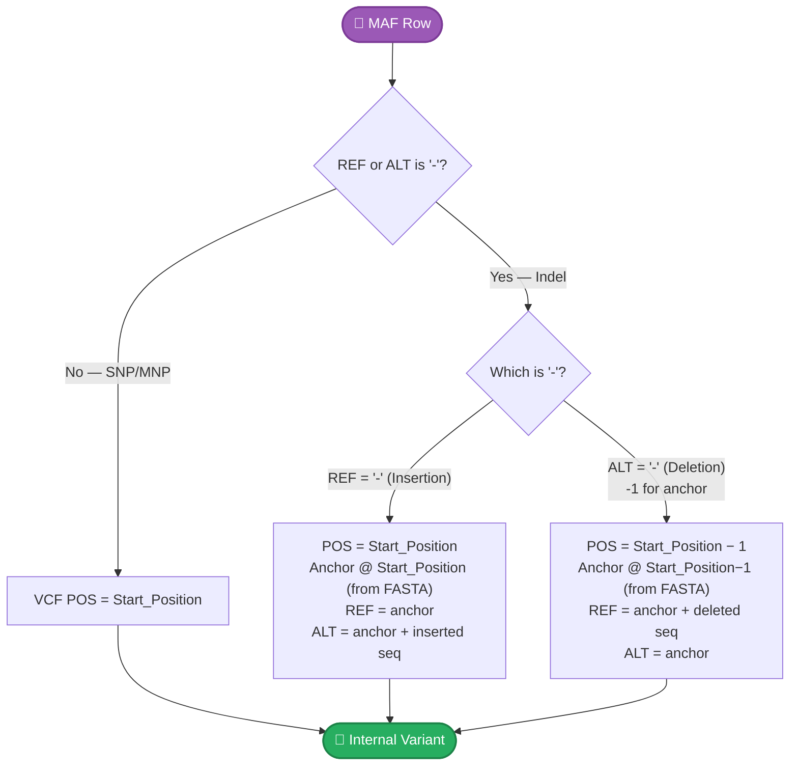

# Input Formats

gbcms accepts VCF and MAF files as variant input.

## VCF (Variant Call Format)

Standard VCF format with required fields:

```
#CHROM  POS     ID      REF     ALT     QUAL    FILTER  INFO
chr1    12345   .       A       T       .       PASS    .
chr2    67890   .       G       C       .       PASS    .
```

### Requirements

- Tab-separated
- `#CHROM`, `POS`, `REF`, `ALT` columns required
- 1-based positions

## MAF (Mutation Annotation Format)

Standard MAF format with required columns:

```
Hugo_Symbol  Chromosome  Start_Position  End_Position  Reference_Allele  Tumor_Seq_Allele2
TP53         chr17       7577120         7577120       C                 T
KRAS         chr12       25398284        25398284      G                 A
```

### Required Columns

| Column | Description |
|:-------|:------------|
| `Chromosome` | Chromosome name |
| `Start_Position` | 1-based start position |
| `Reference_Allele` | Reference allele |
| `Tumor_Seq_Allele2` | Alternate allele |

### MAF Indel Normalization

MAF represents indels using `-` dashes, while gbcms internally uses VCF-style **anchor-based** coordinates. When a MAF file contains insertions (`Reference_Allele = -`) or deletions (`Tumor_Seq_Allele2 = -`), gbcms automatically converts them at input time.

!!! warning "Reference FASTA Required"
    MAF indel conversion requires `--fasta` to fetch the anchor base from the reference genome. Without it, indel variants cannot be normalized and will be skipped.



#### Insertion Example

Insert `TG` after chr1:100 (where the reference base at position 100 is `A`):

| Field | MAF | VCF (internal) |
|:------|:----|:---------------|
| Position | `Start_Position = 100` | `POS = 100` |
| REF | `-` | `A` (fetched from FASTA) |
| ALT | `TG` | `ATG` (anchor + inserted seq) |

#### Deletion Example

Delete `CG` at chr1:101–102 (where the reference base at position 100 is `A`):

| Field | MAF | VCF (internal) |
|:------|:----|:---------------|
| Position | `Start_Position = 101` (first deleted base) | `POS = 100` (anchor) |
| REF | `CG` | `ACG` (anchor + deleted seq) |
| ALT | `-` | `A` (anchor only) |

!!! note "Position Shift for Deletions"
    For insertions, `Start_Position` already points to the anchor base. For deletions, `Start_Position` points to the *first deleted base*, so gbcms shifts back by one position to find the anchor.

## Variant Left-Normalization

gbcms automatically **left-aligns** indels and complex variants during the preparation step. For full details on the normalization algorithm, homopolymer decomposition detection, and REF validation, see [Variant Normalization](variant-normalization.md).

!!! important "Left-Align Your Variants"
    Inconsistently normalized variants reduce the effectiveness of windowed indel detection. While the ±5bp window will catch most aligner-shifted indels, left-alignment ensures the anchor position is consistent with standard conventions.

    ```bash
    # VCF: use bcftools norm
    bcftools norm -f reference.fa -o normalized.vcf input.vcf
    ```

## Reference FASTA

- Must have corresponding `.fai` index
- The reference is looked up by the variant's chromosome name, so the FASTA should use a
  naming convention compatible with your variant file. (The `chr`-prefix and `M`/`MT`
  differences between the **BAM** and the variants are auto-reconciled — see below — but the
  reference anchor is fetched by name, so a variant whose contig is absent from the FASTA is
  rejected with `FAIL_FETCH_FAILED`.)

```bash
# Create index if missing
samtools faidx reference.fa
```

## BAM/CRAM Requirements

- Must have corresponding index (`.bam.bai` or `.bai` for BAM; `.cram.crai` or `.crai` for CRAM)
- Coordinate-sorted
- Chromosome naming is auto-reconciled: `chr`-prefix differences (`chr1` ↔ `1`) and
  mitochondrial aliases (`M` / `chrM` / `chrMT` / `MT`) between the BAM and the variant file
  are normalized automatically. Only a contig with **no** match in the BAM is skipped — and
  gbcms logs a one-time `WARN` for it, rather than silently returning zero counts.

!!! info "CRAM Support (v5.3.0+)"
    Both `--bam` and `--bam-list` accept CRAM files transparently.
    The `--fasta` reference is automatically used for CRAM decoding.
    Index discovery is automatic — see [Samplesheet](../nextflow/samplesheet.md#index-auto-discovery).

## Related

- [DNA CLI Reference](../cli/dna.md) — Usage examples
- [Variant Normalization](variant-normalization.md) — How variants are prepared
- [Allele Classification](allele-classification.md) — How counting works
- [Glossary](glossary.md) — Term definitions
