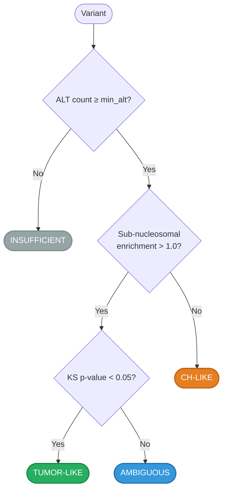

# mFSD Report

Interactive HTML report for per-variant Mutant Fragment Size Distribution analysis.

## Overview

The `--mfsd-report` flag generates a self-contained HTML file alongside standard VCF/MAF output. The report provides an interactive visual diagnostic for evaluating fragment size distributions at each variant position, helping distinguish **tumor-derived cfDNA** from **clonal hematopoiesis (CH)** artifacts.

!!! tip "Quick Start"
    ```bash
    gbcms dna --mfsd --mfsd-parquet --mfsd-report \
      -v variants.maf -b sample.bam -f ref.fa -o output/
    ```
    This produces three outputs: a MAF with 34 mFSD columns, a `.fsd.parquet` with raw fragment arrays, and a `.mfsd_report.html` for interactive visualization.

---

## CLI Options

| Flag | Default | Description |
|:-----|:--------|:------------|
| `--mfsd-report` | `false` | Generate an interactive HTML report. Implies `--mfsd` and `--mfsd-parquet` (both are auto-enabled). |
| `--mfsd-report-min-alt` | `3` | Minimum ALT fragment count to include a variant in the report. Variants below this threshold are excluded. |
| `--mfsd-report-max-variants` | `20` | Maximum number of variants to include. Variants are selected by highest ALT count. Use `-1` for no limit. |

!!! info "Auto-Enabled Dependencies"
    Using `--mfsd-report` automatically enables `--mfsd` and `--mfsd-parquet` if they are not already set. There is no need to specify all three flags explicitly.

---

## Report Sections

### 1. Header & Sample Info

The report title displays the sample name (from `--bam sample_id:path` or derived from the BAM filename). A theme toggle (☀/🌙) switches between light and dark modes.

### 2. Summary Dashboard

Four metric cards provide an at-a-glance overview of fragment origin signal classification:

| Card | Description |
|:-----|:------------|
| **TUMOR-LIKE** | Variants with strong evidence of tumor-derived short fragments |
| **CH-LIKE** | Variants consistent with clonal hematopoiesis (no short-fragment enrichment) |
| **AMBIGUOUS** | Variants with inconclusive fragment size profiles |
| **INSUFFICIENT** | Variants with too few ALT fragments for reliable classification |

### 3. Caveat Banner

A clinical disclaimer noting that fragment origin signal is an experimental diagnostic tool and should not be used as the sole basis for clinical decisions.

### 4. Per-Variant Analysis Cards

Each qualifying variant gets a dedicated card containing:

- **Variant identity**: Gene symbol, genomic coordinates, allele change
- **Fragment Origin Signal**: Classification badge (TUMOR-LIKE / CH-LIKE / AMBIGUOUS / INSUFFICIENT) with confidence explanation
- **Key statistics table**: Subnucleosomal enrichment, KS p-value, mean fragment sizes (REF vs ALT), delta, log-likelihood ratio
- **Dual-axis histogram**: Interactive Plotly chart showing:
    - **Bar chart** (left y-axis): Fragment count per size bin (REF in blue, ALT in red)
    - **KDE curve** (right y-axis): Smoothed density estimate overlaid for both alleles

---

## Fragment Origin Signal Classification

The report classifies each variant into one of four categories based on subnucleosomal enrichment and the KS test:



| Signal | Enrichment | KS p-value | Interpretation |
|:-------|:-----------|:-----------|:---------------|
| **TUMOR-LIKE** | > 1.0 | < 0.05 | ALT fragments are significantly shorter than REF → consistent with tumor cfDNA |
| **CH-LIKE** | ≤ 1.0 | — | No short-fragment enrichment → consistent with clonal hematopoiesis |
| **AMBIGUOUS** | > 1.0 | ≥ 0.05 | Enrichment present but not statistically significant |
| **INSUFFICIENT** | — | — | Too few ALT fragments for reliable analysis |

### Sub-nucleosomal Enrichment

Defined as:

```
enrichment = fraction_subnucleosomal_ALT / fraction_subnucleosomal_REF
```

Where subnucleosomal fragments are those with insert size < 150 bp (below the ~167 bp nucleosome-protected length). Tumor-derived cfDNA tends to be shorter due to increased nuclease accessibility at mutation sites.

---

## Interactive Features

### Variant Navigator

For reports with **≥ 2 variants**, a sticky navigation bar appears below the header:

| Control | Action |
|:--------|:-------|
| **Dropdown** | Jump to any variant by gene symbol and signal classification |
| **← Prev / Next →** | Cycle through variants sequentially (wraps around) |
| **Counter** | Shows current position ("2 of 8") |
| **Focus / Show All** | Toggle between viewing all cards or focusing on one at a time |
| **Keyboard** | `←` and `→` arrow keys for navigation |

!!! note "Single-Variant Reports"
    The navigator is automatically hidden when only one variant qualifies for the report.

### Theme Toggle

Click the ☀/🌙 button in the toolbar to switch between **dark mode** (default) and **light mode**. The preference is not persisted across page loads.

### Interactive Charts

Each Plotly chart supports:

- **Hover**: View exact count/density values at each fragment size
- **Zoom**: Click and drag to zoom into a region
- **Pan**: Hold shift and drag to pan
- **Reset**: Double-click to reset the view
- **Download**: Use the Plotly toolbar to save as PNG

---

## Print & PDF Export

The report is designed for **audit-compliant printing**:

- All interactive controls (navigator, theme toggle, buttons) are hidden via `@media print` CSS
- All variant cards are shown at full opacity (Focus mode dimming is removed)
- Charts are rendered at full width
- The branded footer is included

To export: use your browser's **Print → Save as PDF** function.

---

## mFSD Output Columns

For the complete reference of all 34 MAF columns and 7 VCF INFO fields added by `--mfsd`, see [Counting & Metrics → mFSD](counting-metrics.md#mfsd).

### Additional Columns (Physical Sizing)

These columns are added by the physical sizing engine (new in v4.1):

| Column | Description |
|:-------|:------------|
| `mfsd_sub_nuc_ref_frac` | Fraction of REF fragments that are sub-nucleosomal (< 150 bp) |
| `mfsd_sub_nuc_alt_frac` | Fraction of ALT fragments that are sub-nucleosomal |
| `mfsd_sub_nuc_enrichment` | Ratio of ALT to REF sub-nucleosomal fractions |
| `mfsd_mono_nuc_ref_frac` | Fraction of REF fragments in the mono-nucleosomal range (150–250 bp) |
| `mfsd_mono_nuc_alt_frac` | Fraction of ALT fragments in the mono-nucleosomal range |
| `mfsd_ch_flag` | Boolean flag indicating CH-like fragment size profile |

---

## Related

- [Counting & Metrics → mFSD](counting-metrics.md#mfsd) — Complete column schema
- [Output Formats](output-formats.md) — VCF and MAF output structure
- [DNA Command](../cli/dna.md) — CLI flag reference
