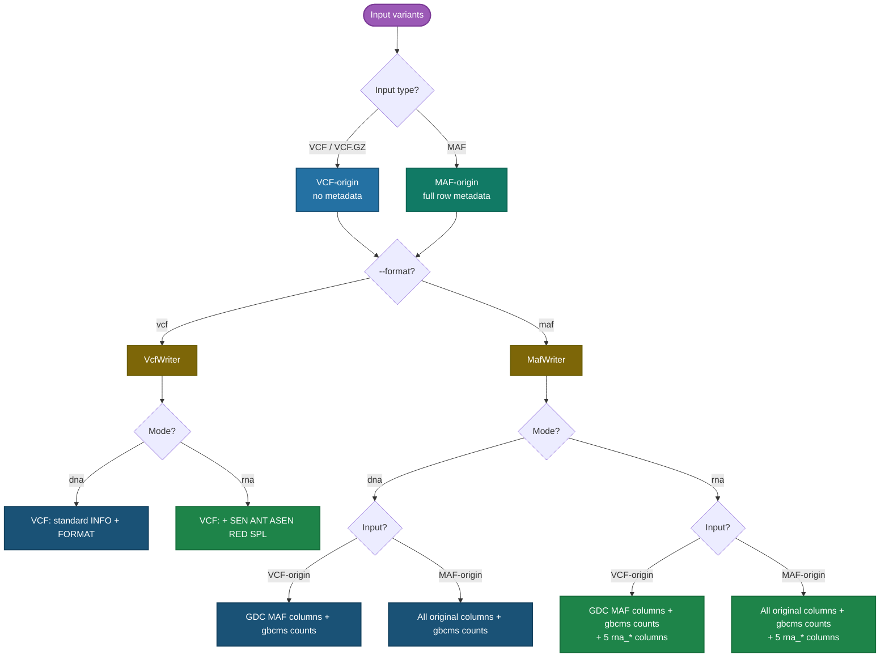

# Output Formats

gbcms writes one output file per BAM sample. The output format, column
composition, and sample-naming strategy all depend on the CLI flags used.

!!! info "Quick Reference"
    Output file path: `{--output-dir}/{sample_name}{--suffix}.{vcf|maf}`

    `sample_name` is set by the `name:` prefix on `--bam` (e.g. `--bam tumor:tumor.bam`)
    or falls back to the BAM filename stem.

---

## How the Output Path Is Decided

The diagram below shows every decision point from CLI flags to the final
output column set. Follow your input type and desired output format to see
exactly what you get.



---

## VCF Output (`--format vcf`)

A standards-compliant VCFv4.2 file with one row per variant per sample.

### File Header

The `##fileformat`, `##source`, and `##INFO`/`##FORMAT` meta-lines are
written once. RNA-specific meta-lines are only included when running
`gbcms rna` — the header is self-describing.

=== "DNA mode"

    ```
    ##fileformat=VCFv4.2
    ##source=gbcms
    ##INFO=<ID=DP,Number=1,Type=Integer,Description="Total Depth">
    ##INFO=<ID=VS,Number=1,Type=String,Description="Validation status from prepare_variants">
    ##INFO=<ID=SB_PVAL,Number=1,Type=Float,Description="Fisher strand bias p-value">
    ##INFO=<ID=SB_OR,Number=1,Type=Float,Description="Fisher strand bias odds ratio">
    ##INFO=<ID=FSB_PVAL,Number=1,Type=Float,Description="Fisher fragment strand bias p-value">
    ##INFO=<ID=FSB_OR,Number=1,Type=Float,Description="Fisher fragment strand bias odds ratio">
    ##FORMAT=<ID=GT,Number=1,Type=String,Description="Genotype">
    ##FORMAT=<ID=AD,Number=2,Type=Integer,Description="Allelic depths for the ref and alt alleles (fwd,rev)">
    ##FORMAT=<ID=DP,Number=2,Type=Integer,Description="Approximate read depth (ref_total,alt_total)">
    ##FORMAT=<ID=RD,Number=2,Type=Integer,Description="Reference read depth (fwd,rev)">
    ##FORMAT=<ID=RDF,Number=2,Type=Integer,Description="Ref Fragment Count (fwd,rev)">
    ##FORMAT=<ID=ADF,Number=2,Type=Integer,Description="Alt Fragment Count (fwd,rev)">
    ##FORMAT=<ID=VAF,Number=1,Type=Float,Description="Variant Allele Fraction (read level)">
    ##FORMAT=<ID=FAF,Number=1,Type=Float,Description="Variant Allele Fraction (fragment level)">
    #CHROM  POS  ID  REF  ALT  QUAL  FILTER  INFO  FORMAT  <sample_name>
    ```

=== "RNA mode"

    ```
    ##fileformat=VCFv4.2
    ##source=gbcms
    ##INFO=<ID=DP,...>
    ##INFO=<ID=VS,...>
    ##INFO=<ID=SB_PVAL,...>
    ##INFO=<ID=SB_OR,...>
    ##INFO=<ID=FSB_PVAL,...>
    ##INFO=<ID=FSB_OR,...>
    ##INFO=<ID=SEN,Number=1,Type=Integer,Description="Reads on the transcript sense strand">
    ##INFO=<ID=ANT,Number=1,Type=Integer,Description="Reads on the antisense strand">
    ##INFO=<ID=ASEN,Number=1,Type=Integer,Description="ALT reads on the transcript sense strand">
    ##INFO=<ID=RED,Number=0,Type=Flag,Description="Locus is a candidate A-to-I RNA editing site">
    ##INFO=<ID=SPL,Number=1,Type=Integer,Description="ALT reads spanning a splice junction (CIGAR N)">
    ##FORMAT=<ID=GT,...>
    ##FORMAT=<ID=AD,...>
    ##FORMAT=<ID=DP,...>
    ##FORMAT=<ID=RD,...>
    ##FORMAT=<ID=RDF,...>
    ##FORMAT=<ID=ADF,...>
    ##FORMAT=<ID=VAF,...>
    ##FORMAT=<ID=FAF,...>
    ##FORMAT=<ID=SEN,Number=1,Type=Integer,Description="Sense strand depth">
    ##FORMAT=<ID=ANT,Number=1,Type=Integer,Description="Antisense strand depth">
    ##FORMAT=<ID=ASEN,Number=1,Type=Integer,Description="ALT sense strand count">
    ##FORMAT=<ID=SPL,Number=1,Type=Integer,Description="Splice-spanning ALT count">
    #CHROM  POS  ID  REF  ALT  QUAL  FILTER  INFO  FORMAT  <sample_name>
    ```

---

### Fixed Fields

| Column | Source | Notes |
|:-------|:-------|:------|
| `CHROM` | Variant chromosome | Preserved from input |
| `POS` | Variant position | 1-based (VCF convention) |
| `ID` | Original VCF `ID` field | `.` when input is MAF (no `ID` column) |
| `REF` | Reference allele | From input; validated against FASTA |
| `ALT` | Alternate allele | From input |
| `QUAL` | `.` | Always missing — gbcms does not perform variant calling |
| `FILTER` | `.` | Not set |

---

### INFO Fields

The `INFO` column is a semicolon-separated list of `KEY=VALUE` pairs.

=== "Always present (DNA + RNA)"

    | Field | Type | Description |
    |:------|:-----|:------------|
    | `DP` | Integer | Total read depth at position |
    | `VS` | String | Validation status (`PASS`, `PASS_WARN_HOMOPOLYMER_DECOMP`, `PASS_WARN_REF_CORRECTED`, `REF_MISMATCH`, `FETCH_FAILED`) |
    | `SB_PVAL` | Float | Fisher's exact test p-value for read-level strand bias |
    | `SB_OR` | Float | Fisher's exact test odds ratio for read-level strand bias |
    | `FSB_PVAL` | Float | Fragment-level strand bias p-value |
    | `FSB_OR` | Float | Fragment-level strand bias odds ratio |

=== "RNA mode only"

    | Field | Type | Description |
    |:------|:-----|:------------|
    | `SEN` | Integer | Total reads on the transcript **sense** strand |
    | `ANT` | Integer | Total reads on the **antisense** strand |
    | `ASEN` | Integer | ALT reads on the sense strand |
    | `SPL` | Integer | ALT reads spanning a splice junction (reads with `N` CIGAR op) |
    | `RED` | Flag | Present when the locus overlaps a known A-to-I RNA editing site (requires `--rna-editing-db`) |

=== "--mfsd only"

    | Field | Type | Description |
    |:------|:-----|:------------|
    | `MFSD_DELTA_ALT_REF` | Float | mean(ALT) − mean(REF) fragment size delta (bp) |
    | `MFSD_KS_ALT_REF` | Float | 2-sample KS D-statistic (ALT vs REF fragments) |
    | `MFSD_PVAL_ALT_REF` | Float | KS test p-value (ALT vs REF) |
    | `MFSD_ALT_LLR` | Float | Log-likelihood ratio for ALT fragments vs healthy/tumor Gaussian model |
    | `MFSD_REF_LLR` | Float | Log-likelihood ratio for REF fragments |
    | `MFSD_ALT_COUNT` | Integer | ALT-classified fragments in 50–1000 bp size window |
    | `MFSD_REF_COUNT` | Integer | REF-classified fragments in 50–1000 bp size window |

=== "--show-normalization only"

    | Field | Type | Description |
    |:------|:-----|:------------|
    | `NORM_POS` | Integer | Left-aligned VCF position (1-based) after normalization |
    | `NORM_REF` | String | Left-aligned REF allele |
    | `NORM_ALT` | String | Left-aligned ALT allele |

---

### FORMAT Fields

=== "DNA mode"

    `FORMAT` column: `GT:DP:RD:AD:RDF:ADF:VAF:FAF`

    | Tag | Values | Description |
    |:----|:-------|:------------|
    | `GT` | `0/0` or `0/1` | Diploid genotype — `0/1` when any ALT reads present |
    | `DP` | `rd,ad` | Total read depth split as ref_total,alt_total |
    | `RD` | `fwd,rev` | REF read depth by strand |
    | `AD` | `fwd,rev` | ALT read depth by strand |
    | `RDF` | `fwd,rev` | REF fragment count by strand |
    | `ADF` | `fwd,rev` | ALT fragment count by strand |
    | `VAF` | float | Variant allele fraction at read level |
    | `FAF` | float | Variant allele fraction at fragment level |

=== "RNA mode"

    `FORMAT` column: `GT:DP:RD:AD:RDF:ADF:VAF:FAF:SEN:ANT:ASEN:SPL`

    All DNA fields above, plus:

    | Tag | Values | Description |
    |:----|:-------|:------------|
    | `SEN` | integer | Sense-strand read depth |
    | `ANT` | integer | Antisense-strand read depth |
    | `ASEN` | integer | ALT count on sense strand |
    | `SPL` | integer | Splice-junction-spanning ALT count |

---

### Annotated Example

```vcf
#CHROM  POS     ID      REF  ALT  QUAL  FILTER  INFO                                              FORMAT           sample1
chr7    55174772  rs121913527  T    A    .     .     DP=312;VS=PASS;SB_PVAL=2.4000e-01;SB_OR=1.3000;FSB_PVAL=3.1000e-01;FSB_OR=1.1000  GT:DP:RD:AD:RDF:ADF:VAF:FAF  0/1:290,22:145,145:10,12:72,73:5,6:0.0705:0.0735 # (1)!
```

1. `DP=312` total reads; `VS=PASS` REF validated; `SB_PVAL=0.24` no significant strand bias. FORMAT `DP=290,22` → 290 REF + 22 ALT reads. `VAF=0.0705` (read level), `FAF=0.0735` (fragment level).

---

## MAF Output (`--format maf`)

A tab-separated file following GDC MAF conventions. One row per variant per sample.

### Two Output Paths

The set of columns in the first row of the header depends on whether the
**input** was a VCF or a MAF.

=== "VCF → MAF"

    gbcms generates a GDC-compatible MAF from scratch, since VCF records
    have no MAF metadata. The following **fixed** headers are always present:

    | Column | Description |
    |:-------|:------------|
    | `Hugo_Symbol` | Empty — not populated from VCF input |
    | `Chromosome` | Chromosome name |
    | `Start_Position` | 1-based MAF start position |
    | `End_Position` | 1-based MAF end position |
    | `Strand` | `+` |
    | `Variant_Classification` | Derived from variant type |
    | `Variant_Type` | `SNP`, `INS`, `DEL`, or `ONP` |
    | `Reference_Allele` | MAF-style REF (`-` for pure insertions) |
    | `Tumor_Seq_Allele1` | Reference allele (same as `Reference_Allele`) |
    | `Tumor_Seq_Allele2` | MAF-style ALT (`-` for pure deletions) |
    | `Tumor_Sample_Barcode` | BAM sample name (from `--bam name:path`) |
    | `Matched_Norm_Sample_Barcode` | Empty |
    | `vcf_id` | Original VCF `ID` field (rsID or `.`) |
    | `vcf_pos` | Original VCF 1-based `POS` |
    | `vcf_region` | `chr:pos` tracking field |

    Then all [gbcms count columns](#gbcms-count-columns) are appended.

=== "MAF → MAF"

    All original input MAF columns are preserved **exactly** (values never
    overwritten, column order never changed). gbcms count columns are
    appended after the last original column.

    !!! important "Column Pass-Through Guarantee"
        Every column in your input MAF — including custom lab-specific columns
        like `patient_id`, `assay_version`, pipeline provenance fields, etc. —
        appears unchanged in the output. Only new gbcms columns are added.

---

### `Tumor_Sample_Barcode` Behaviour

!!! caution "rsIDs in Tumor_Sample_Barcode?"
    If you see rsIDs (e.g. `rs121913527`) in `Tumor_Sample_Barcode`, the
    likely cause is that your **input MAF** already has rsIDs in that column
    **and you ran with `--preserve-barcode`**. The fix is either to not use
    `--preserve-barcode`, or to pre-clean the input MAF.

| Input | `--preserve-barcode` | `Tumor_Sample_Barcode` value |
|:------|:--------------------:|:-----------------------------|
| VCF → MAF | any | BAM `sample_name` (always — VCF has no barcode) |
| MAF → MAF | `false` (default) | BAM `sample_name` overwrites original |
| MAF → MAF | `true` | **Original value** from input MAF row |

---

### gbcms Count Columns

These columns are **always** appended regardless of input format.

=== "Default (no prefix)"

    | Column | Type | Description |
    |:-------|:-----|:------------|
    | `validation_status` | String | REF validation result (`PASS`, `REF_MISMATCH`, etc.) |
    | `ref_count` | Integer | REF read depth |
    | `alt_count` | Integer | ALT read depth |
    | `total_count` | Integer | Total read depth (DP) |
    | `vaf` | Float | Read-level variant allele fraction |
    | `ref_count_fragment` | Integer | REF fragment count |
    | `alt_count_fragment` | Integer | ALT fragment count |
    | `total_count_fragment` | Integer | Total fragment count |
    | `vaf_fragment` | Float | Fragment-level variant allele fraction |
    | `strand_bias_p_value` | Float | Fisher's exact test p-value (read-level) |
    | `strand_bias_odds_ratio` | Float | Fisher's exact test odds ratio (read-level) |
    | `fragment_strand_bias_p_value` | Float | Fragment-level strand bias p-value |
    | `fragment_strand_bias_odds_ratio` | Float | Fragment-level strand bias odds ratio |
    | `ref_count_forward` | Integer | REF reads on forward strand |
    | `ref_count_reverse` | Integer | REF reads on reverse strand |
    | `alt_count_forward` | Integer | ALT reads on forward strand |
    | `alt_count_reverse` | Integer | ALT reads on reverse strand |
    | `ref_count_fragment_forward` | Integer | REF fragments on forward strand |
    | `ref_count_fragment_reverse` | Integer | REF fragments on reverse strand |
    | `alt_count_fragment_forward` | Integer | ALT fragments on forward strand |
    | `alt_count_fragment_reverse` | Integer | ALT fragments on reverse strand |

=== "With `--column-prefix t_`"

    All count columns above (except `validation_status` and strand bias) are
    prefixed with `t_`:

    | Column | Example |
    |:-------|:--------|
    | `t_ref_count` | `80` |
    | `t_alt_count` | `20` |
    | `t_total_count` | `100` |
    | `t_vaf` | `0.2000` |
    | `t_ref_count_fragment` | `45` |
    | ... | ... |

    Use `--column-prefix t_` for downstream tools that expect the legacy
    `t_ref_count` / `t_alt_count` column naming.

=== "With custom prefix"

    Any prefix matching `[A-Za-z0-9_]` is accepted:

    ```bash
    gbcms dna --column-prefix plasma_ ...
    # → plasma_ref_count, plasma_alt_count, plasma_total_count, ...
    ```

    !!! note
        `validation_status` and the four `strand_bias_*` columns are **never
        prefixed** — they are always unique even when count columns share a prefix.

---

### RNA-Specific MAF Columns

!!! info "RNA mode only"
    These 5 columns are appended **only** when using `gbcms rna`. They do not
    appear at all in DNA mode output.

| Column | Type | Description |
|:-------|:-----|:------------|
| `rna_sense_depth` | Integer | Total reads on the transcript sense strand at this position |
| `rna_antisense_depth` | Integer | Total reads on the antisense strand |
| `rna_alt_sense_count` | Integer | ALT reads on the sense strand |
| `rna_editing_site` | Boolean | `True` if the locus overlaps a known A-to-I editing site (requires `--rna-editing-db`) |
| `rna_splice_spanning` | Integer | ALT reads whose alignment spans a splice junction (`N` CIGAR operation) |

---

??? note "mFSD MAF Columns (`--mfsd` only)"

    34 columns are appended when `--mfsd` is set. They are completely absent
    without the flag (not NA-filled):

    | Column | Type | Description |
    |:-------|:-----|:------------|
    | `mfsd_ref_count` | Integer | REF-classified fragments in 50–1000 bp window |
    | `mfsd_alt_count` | Integer | ALT-classified fragments |
    | `mfsd_nonref_count` | Integer | Non-REF, non-ALT fragments |
    | `mfsd_n_count` | Integer | Fragments with no valid insert size |
    | `mfsd_alt_llr` | Float | Log-likelihood ratio (ALT fragments; positive = tumor-like) |
    | `mfsd_ref_llr` | Float | Log-likelihood ratio (REF fragments) |
    | `mfsd_ref_mean` | Float | Mean fragment size for REF class (bp) |
    | `mfsd_alt_mean` | Float | Mean fragment size for ALT class (bp) |
    | `mfsd_nonref_mean` | Float | Mean fragment size for non-REF class (bp) |
    | `mfsd_n_mean` | Float | Mean fragment size for N class (bp) |
    | `mfsd_delta_alt_ref` | Float | mean(ALT) − mean(REF) delta (bp) |
    | `mfsd_ks_alt_ref` | Float | KS D-stat (ALT vs REF) |
    | `mfsd_pval_alt_ref` | Float | KS p-value (ALT vs REF) |
    | `mfsd_delta_alt_nonref` | Float | mean(ALT) − mean(non-REF) delta |
    | `mfsd_ks_alt_nonref` | Float | KS D-stat (ALT vs non-REF) |
    | `mfsd_pval_alt_nonref` | Float | KS p-value |
    | `mfsd_delta_ref_nonref` | Float | mean(REF) − mean(non-REF) delta |
    | `mfsd_ks_ref_nonref` | Float | KS D-stat |
    | `mfsd_pval_ref_nonref` | Float | KS p-value |
    | `mfsd_delta_alt_n` | Float | mean(ALT) − mean(N) delta |
    | `mfsd_ks_alt_n` | Float | KS D-stat |
    | `mfsd_pval_alt_n` | Float | KS p-value |
    | `mfsd_delta_ref_n` | Float | mean(REF) − mean(N) delta |
    | `mfsd_ks_ref_n` | Float | KS D-stat |
    | `mfsd_pval_ref_n` | Float | KS p-value |
    | `mfsd_delta_nonref_n` | Float | mean(non-REF) − mean(N) delta |
    | `mfsd_ks_nonref_n` | Float | KS D-stat |
    | `mfsd_pval_nonref_n` | Float | KS p-value |
    | `mfsd_error_rate` | Float | non-REF fraction of valid mFSD fragments |
    | `mfsd_n_rate` | Float | N-class fraction |
    | `mfsd_size_ratio` | Float | mean(ALT) / mean(REF) |
    | `mfsd_quality_score` | Float | 1 − error_rate − n_rate |
    | `mfsd_alt_confidence` | String | `HIGH` (≥5 ALT fragments), `LOW` (1–4), or `NONE` |
    | `mfsd_ks_valid` | Boolean | `True` when both ALT and REF have ≥5 fragments for reliable KS test |

??? note "Normalization MAF Columns (`--show-normalization` only)"

    | Column | Type | Description |
    |:-------|:-----|:------------|
    | `{prefix}norm_Start_Position` | Integer | Left-aligned MAF start position |
    | `{prefix}norm_End_Position` | Integer | Left-aligned MAF end position |
    | `{prefix}norm_Reference_Allele` | String | Left-aligned REF allele |
    | `{prefix}norm_Tumor_Seq_Allele2` | String | Left-aligned ALT allele |

    The `{prefix}` matches `--column-prefix` (default: no prefix).

---

## Per-Sample File Naming

```
{--output-dir}/{sample_name}{--suffix}.{vcf|maf}
```

| Component | Source |
|:----------|:-------|
| `sample_name` | `name` from `--bam name:path`; falls back to BAM filename stem |
| `--suffix` | Literal string appended before the extension (e.g. `.genotyped`) |
| Extension | `vcf` or `maf` depending on `--format` |

**Examples:**

```bash
--bam tumor:tumor.bam --suffix .fillout --format maf
# → tumor.fillout.maf

--bam tumor.bam --format vcf
# → tumor.vcf  (stem = "tumor")
```

??? note "Companion Parquet file (`--mfsd-parquet`)"
    When `--mfsd-parquet` is also set (alongside `--mfsd`), a second file is
    written alongside the main output:

    ```
    {--output-dir}/{sample_name}{--suffix}.fsd.parquet
    ```

    It contains per-variant raw fragment size arrays (`ref_sizes`, `alt_sizes`)
    for downstream mFSD visualisations (density plots, empirical CDF comparisons).
    Written natively by Rust — no pyarrow dependency required.

---

## Missing Values

| Format | Missing value sentinel |
|:-------|:----------------------|
| MAF columns | `NA` |
| VCF INFO numeric fields | `.` (VCF spec) |

A value is `NA`/`.` when the count supporting it is zero (e.g. `mfsd_alt_mean`
when no ALT fragments were observed) or when the input variant was rejected
during preparation (all counts are zero-filled in that case).

---

## Related

- [Input Formats](input-formats.md) — VCF and MAF input requirements
- [Counting & Metrics](counting-metrics.md) — How counts are computed from reads
- [gbcms dna](../cli/dna.md) — DNA mode CLI reference
- [gbcms rna](../cli/rna.md) — RNA mode CLI reference
- [Variant Normalization](variant-normalization.md) — How variants are prepared before counting
- [Allele Classification](allele-classification.md) — How each read is classified as REF/ALT/neither
