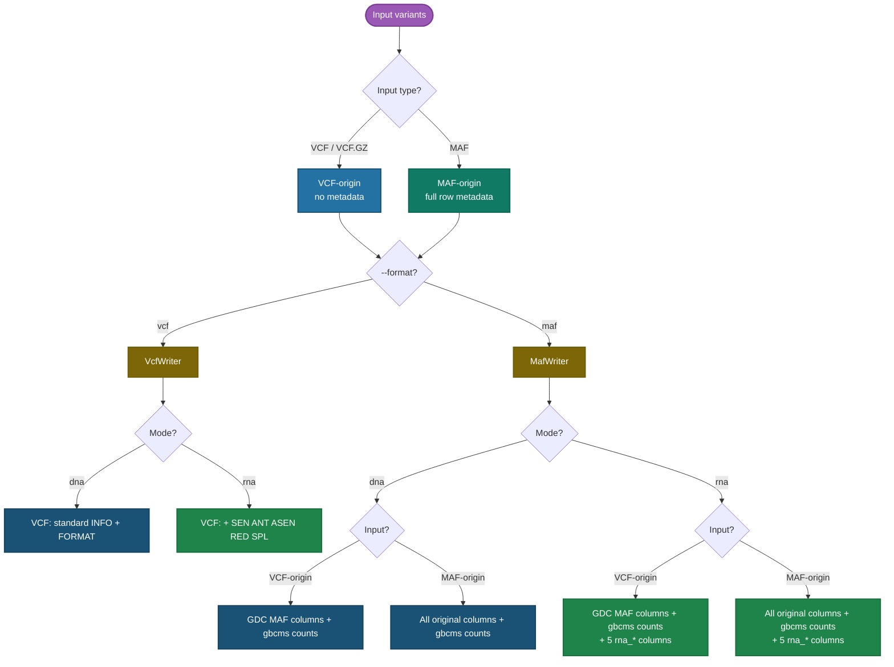

# Output Formats

gbcms writes one output file per BAM sample. The output format, column
composition, and sample-naming strategy all depend on the CLI flags used.

!!! info "Quick Reference"
    Output file path: `{--output-dir}/{sample_name}{--suffix}.{vcf|maf}`

    `sample_name` is set by the `name:` prefix on `--bam` (e.g. `--bam tumor:tumor.bam`)
    or falls back to the BAM filename stem.

---

## How the Output Path Is Decided

Every output (MAF, VCF, the merged MAF, `gbcms convert` and `gbcms normalize`
files, the Parquet files and the mFSD report) is written to a temp file beside
it (`.<name>.partial`) and renamed into place once complete. A run that fails
leaves nothing at the output path and removes its temp file.

The diagram below shows every decision point from CLI flags to the final
output column set. Follow your input type and desired output format to see
exactly what you get.


```mermaid
flowchart TD
    Input(["Input variants"]):::start

    Input --> InputType{"Input type?"}
    InputType -->|"VCF / VCF.GZ"| VCFIn["VCF-origin<br/>no metadata"]:::vcf
    InputType -->|MAF| MAFIn["MAF-origin<br/>full row metadata"]:::maf

    FmtChoice{"--format?"}
    VCFIn --> FmtChoice
    MAFIn --> FmtChoice

    FmtChoice -->|vcf| VCFWriter["VcfWriter"]:::writer
    FmtChoice -->|maf| MAFWriter["MafWriter"]:::writer

    VCFWriter --> ModeVCF{"Mode?"}
    ModeVCF -->|dna| DNAVCF["VCF: standard INFO + FORMAT"]:::dna
    ModeVCF -->|rna| RNAVCF["VCF: + SEN ANT ASEN RED SPL"]:::rna

    MAFWriter --> ModeMAF{"Mode?"}
    ModeMAF -->|dna| DNAMAFPath{"Input?"}
    ModeMAF -->|rna| RNAMAFPath{"Input?"}

    DNAMAFPath -->|"VCF-origin"| DNAVMAF["GDC MAF columns + gbcms counts"]:::dna
    DNAMAFPath -->|"MAF-origin"| DNAMMAF["All original columns + gbcms counts"]:::dna

    RNAMAFPath -->|"VCF-origin"| RNAVMAF["GDC MAF columns + gbcms counts<br/>+ 5 rna_* columns"]:::rna
    RNAMAFPath -->|"MAF-origin"| RNAMMAF["All original columns + gbcms counts<br/>+ 5 rna_* columns"]:::rna

    classDef start fill:#9b59b6,color:#fff,stroke:#7d3c98,stroke-width:2px
    classDef vcf fill:#2471a3,color:#fff,stroke:#1a5276,stroke-width:2px
    classDef maf fill:#117a65,color:#fff,stroke:#0e6655,stroke-width:2px
    classDef writer fill:#7d6608,color:#fff,stroke:#6d5f07,stroke-width:2px
    classDef dna fill:#1a5276,color:#fff,stroke:#154360,stroke-width:2px
    classDef rna fill:#1e8449,color:#fff,stroke:#196f3d,stroke-width:2px
```

---

## VCF Output (`--format vcf`)

A standards-compliant VCFv4.2 file with one row per variant per sample.

### File Header

The `##fileformat`, `##source`, and `##INFO`/`##FORMAT` meta-lines are
written once. Provenance metadata (`##gbcms_command`, `##reference`,
`##contig`, `##FILTER`) is included when available. RNA-specific
meta-lines are only included when running `gbcms rna` — the header is
self-describing.

=== "DNA mode"

    ```
    ##fileformat=VCFv4.2
    ##source=gbcms v5.3.0
    ##gbcms_command=gbcms dna --bam tumor:tumor.bam --fasta ref.fa --threads 4
    ##reference=file:///path/to/ref.fa
    ##contig=<ID=chr1,length=248956422>
    ##contig=<ID=chr2,length=242193529>
    ##FILTER=<ID=PASS,Description="All filters passed">
    ##INFO=<ID=DP,Number=1,Type=Integer,Description="Total Depth">
    ##INFO=<ID=GS,Number=1,Type=String,Description="gbcms verdict: PASS or FAIL">
    ##INFO=<ID=GSR,Number=1,Type=String,Description="gbcms status reason tags, |-separated (. when none)">
    ##INFO=<ID=GD,Number=1,Type=String,Description="gbcms post-counting diagnostic flags">
    ##INFO=<ID=GR,Number=1,Type=String,Description="gbcms rescue audit trail">
    ##INFO=<ID=AAD,Number=1,Type=Integer,Description="Any ALT Depth (any_alt = ad + partial_alt)">
    ##INFO=<ID=PAD,Number=1,Type=Integer,Description="Partial ALT Depth">
    ##INFO=<ID=NAD,Number=1,Type=Integer,Description="N-base Depth (duplex masking QC)">
    ##INFO=<ID=SB_PVAL,Number=1,Type=Float,Description="Fisher strand bias p-value">
    ##INFO=<ID=SB_OR,Number=1,Type=Float,Description="Fisher strand bias odds ratio">
    ##INFO=<ID=FSB_PVAL,Number=1,Type=Float,Description="Fisher fragment strand bias p-value">
    ##INFO=<ID=FSB_OR,Number=1,Type=Float,Description="Fisher fragment strand bias odds ratio">
    ##FORMAT=<ID=GT,Number=1,Type=String,Description="Genotype">
    ##FORMAT=<ID=DP,Number=1,Type=Integer,Description="Total read depth">
    ##FORMAT=<ID=AD,Number=R,Type=Integer,Description="Allelic depths (ref,alt)">
    ##FORMAT=<ID=ADF,Number=R,Type=Integer,Description="Allelic depths on forward strand (ref_fwd,alt_fwd)">
    ##FORMAT=<ID=ADR,Number=R,Type=Integer,Description="Allelic depths on reverse strand (ref_rev,alt_rev)">
    ##FORMAT=<ID=VAF,Number=1,Type=Float,Description="Variant allele fraction (read level)">
    ##FORMAT=<ID=FAD,Number=R,Type=Integer,Description="Fragment allelic depths (ref_frag,alt_frag)">
    ##FORMAT=<ID=FADF,Number=R,Type=Integer,Description="Fragment depths on forward strand">
    ##FORMAT=<ID=FADR,Number=R,Type=Integer,Description="Fragment depths on reverse strand">
    ##FORMAT=<ID=FAF,Number=1,Type=Float,Description="Variant allele fraction (fragment level)">
    ##FORMAT=<ID=AAD,Number=1,Type=Integer,Description="Any ALT depth (alt + partial_alt)">
    ##FORMAT=<ID=PAD,Number=1,Type=Integer,Description="Partial ALT depth">
    ##FORMAT=<ID=NAD,Number=1,Type=Integer,Description="N-base depth">
    #CHROM  POS  ID  REF  ALT  QUAL  FILTER  INFO  FORMAT  <sample_name>
    ```

    !!! note "Provenance headers (v5.3.0)"
        `##gbcms_command`, `##reference`, `##contig`, and `##FILTER` lines
        are new in v5.3.0. `##contig` lines are auto-populated from the
        `.fai` index of the reference FASTA when available, written under the
        variant file's naming (e.g. the reference's `1` is declared as `chr1`
        when the input says `chr1`, keeping the reference length) so every
        record's `CHROM` is declared; a contig the reference lacks is declared
        without a length.

=== "RNA mode"

    ```
    ##fileformat=VCFv4.2
    ##source=gbcms v5.3.0
    ##gbcms_command=gbcms rna --bam rna_sample.bam --fasta ref.fa
    ##reference=file:///path/to/ref.fa
    ##contig=<ID=chr1,length=248956422>
    ##FILTER=<ID=PASS,Description="All filters passed">
    ##INFO=<ID=DP,...>
    ##INFO=<ID=GS,...>
    ##INFO=<ID=GD,...>
    ##INFO=<ID=GR,...>
    ##INFO=<ID=AAD,...>
    ##INFO=<ID=PAD,...>
    ##INFO=<ID=NAD,...>
    ##INFO=<ID=SB_PVAL,...>
    ##INFO=<ID=SB_OR,...>
    ##INFO=<ID=FSB_PVAL,...>
    ##INFO=<ID=FSB_OR,...>
    ##INFO=<ID=SEN,Number=1,Type=Integer,Description="Reads on the transcript sense strand">
    ##INFO=<ID=ANT,Number=1,Type=Integer,Description="REF and ALT reads on the antisense strand, tallied even where strandedness enforcement keeps them out of every count">
    ##INFO=<ID=ASEN,Number=1,Type=Integer,Description="ALT reads on the transcript sense strand">
    ##INFO=<ID=RED,Number=0,Type=Flag,Description="Locus is a candidate A-to-I RNA editing site">
    ##INFO=<ID=SPL,Number=1,Type=Integer,Description="ALT reads spanning a splice junction (CIGAR N)">
    ##FORMAT=<ID=GT,...>
    ##FORMAT=<ID=DP,...>
    ##FORMAT=<ID=AD,...>
    ##FORMAT=<ID=ADF,...>
    ##FORMAT=<ID=ADR,...>
    ##FORMAT=<ID=VAF,...>
    ##FORMAT=<ID=FAD,...>
    ##FORMAT=<ID=FADF,...>
    ##FORMAT=<ID=FADR,...>
    ##FORMAT=<ID=FAF,...>
    ##FORMAT=<ID=AAD,...>
    ##FORMAT=<ID=PAD,...>
    ##FORMAT=<ID=NAD,...>
    ##FORMAT=<ID=SEN,Number=1,Type=Integer,Description="Sense strand depth">
    ##FORMAT=<ID=ANT,Number=1,Type=Integer,Description="REF and ALT reads on the antisense strand, tallied even where strandedness enforcement keeps them out of every count">
    ##FORMAT=<ID=ASEN,Number=1,Type=Integer,Description="ALT sense strand count">
    ##FORMAT=<ID=SPL,Number=1,Type=Integer,Description="Splice-spanning ALT count">
    #CHROM  POS  ID  REF  ALT  QUAL  FILTER  INFO  FORMAT  <sample_name>
    ```

---

### Fixed Fields

| Column | Source | Notes |
|:-------|:-------|:------|
| `CHROM` | Variant chromosome | The input's own naming (e.g. `chr1` stays `chr1` against a `1`-named reference or BAM) |
| `POS` | Variant position | 1-based (VCF convention) |
| `ID` | Original VCF `ID` field | `.` when input is MAF (no `ID` column) |
| `REF` | Reference allele | VCF input: as written. MAF input: as maf2vcf writes it (below) |
| `ALT` | Alternate allele | VCF input: as written. MAF input: as maf2vcf writes it (below) |
| `QUAL` | `.` | Always missing — gbcms does not perform variant calling |
| `FILTER` | `.` | Not set |

!!! info "MAF input written as VCF follows maf2vcf"
    A MAF row is written as the record [maf2vcf](https://github.com/mskcc/vcf2maf)
    writes: when an allele is `-`, or the two alleles differ in length **and** in
    their first base, the reference base before them is prepended (the base **at**
    `Start_Position` for a `-` insertion, whose Start is the base before the
    insertion) and `POS` moves to it. Anything else is written as-is at
    `Start_Position`. An event at position 1 has no base before it, so the base
    after it is appended instead (VCF spec; maf2vcf skips such rows). The anchor
    base comes from `--fasta`; one the reference cannot supply is written as `N`
    and counted in a WARNING. The MAF alleles are read as maf2vcf reads them
    (see [Input Formats](input-formats.md#maf-alleles)); unlike maf2vcf, a
    differing `Tumor_Seq_Allele1` is not written as a second ALT. A row whose
    allele is not a base sequence (FAIL `NON_SEQUENCE_ALLELE`, or an empty
    allele, FAIL `EMPTY_ALLELE`), or a deletion spanning its whole contig (no base
    before or after it to anchor a record; FAIL `FETCH_FAILED`), is written as the
    symbolic record `<NON_SEQUENCE>` at `Start_Position`, REF the reference base
    there (declared in a `##ALT` header line), so the VCF stays valid. A MAF
    deletion at `Start_Position` 1 is otherwise counted in the base-after form.

    | MAF `Start` `Ref` > `Alt` | VCF `POS` `REF` > `ALT` |
    |:--------------------------|:------------------------|
    | `462 AA > -` | `461 TAA > T` |
    | `581 - > GT` | `581 T > TGT` |
    | `701 TTAC > A` | `700 TTTAC > TA` |
    | `942 AAA > T` | `941 GAAA > GT` |
    | `1183 T > G` | `1183 T > G` |

    Counting is unaffected. Before counting, the engine anchors `-` alleles to
    this same record; other MAF alleles (e.g. `701 TTAC > A`) it counts as
    written, an equivalent description of the same change. `gbcms convert`
    writes these records without counting.

---

### INFO Fields

The `INFO` column is a semicolon-separated list of `KEY=VALUE` pairs.

=== "Always present (DNA + RNA)"

    | Field | Type | Description |
    |:------|:-----|:------------|
    | `DP` | Integer | Total read depth at position |
    | `GS` | String | gbcms verdict: `PASS` or `FAIL`. |
    | `GSR` | String | Status reason tags, `\|`-separated (the `gbcms_status_reason` value); `.` when none. Each reason: [QC Flags → Verdict and status reasons](qc-flags.md#verdict-and-status-reasons). |
    | `GD` | String | Diagnostic flags (the `gbcms_diagnostic` value), `\|`-separated; `.` when none. Each flag: [QC Flags → Diagnostics](qc-flags.md#diagnostics). |
    | `GR` | String | Rescue audit trail (the `gbcms_rescue` value with `;` written as `\|`); `.` for non-candidates. Outcomes: [QC Flags → MNP rescue](qc-flags.md#mnp-rescue). |
    | `AAD` | Integer | Any ALT Depth — reads with ALT evidence at ≥1 discriminating position. Invariant: `AAD = AD + PAD` |
    | `PAD` | Integer | Partial ALT Depth — reads matching ALT at some but not all discriminating positions. Populated for all variant types including INDELs (via Phase 3 structural evidence propagation). |
    | `NAD` | Integer | N-base Depth — reads with N base at ≥1 discriminating position (duplex masking QC metric) |
    | `SB_PVAL` | Float | Fisher's exact test p-value for read-level strand bias |
    | `SB_OR` | Float | Fisher's exact test odds ratio for read-level strand bias |
    | `FSB_PVAL` | Float | Fragment-level strand bias p-value |
    | `FSB_OR` | Float | Fragment-level strand bias odds ratio |

=== "RNA mode only"

    | Field | Type | Description |
    |:------|:-----|:------------|
    | `SEN` | Integer | Total reads on the transcript **sense** strand |
    | `ANT` | Integer | REF and ALT reads on the **antisense** strand (tallied even when strandedness enforcement excludes them from counts) |
    | `ASEN` | Integer | ALT reads on the sense strand |
    | `SPL` | Integer | ALT reads spanning a splice junction (reads with `N` CIGAR op) |
    | `RED` | Flag | Present when the locus overlaps a known A-to-I RNA editing site (requires `--rna-editing-db`) |

=== "--mfsd only"

    | Field | Type | Description |
    |:------|:-----|:------------|
    | `MFSD_DELTA_ALT_REF` | Float | mean(ALT) − mean(REF) fragment size delta (bp) |
    | `MFSD_KS_ALT_REF` | Float | 2-sample KS D-statistic (ALT vs REF fragments) |
    | `MFSD_PVAL_ALT_REF` | Float | KS test p-value (ALT vs REF) |
    | `MFSD_ALT_LLR` | Float | Log-likelihood ratio for ALT fragments vs healthy/tumor Gaussian model |
    | `MFSD_REF_LLR` | Float | Log-likelihood ratio for REF fragments |
    | `MFSD_ALT_COUNT` | Integer | ALT-classified fragments in 50–1000 bp size window |
    | `MFSD_REF_COUNT` | Integer | REF-classified fragments in 50–1000 bp size window |
    | `MFSD_SUB_NUC_REF_FRAC` | Float | Sub-nucleosomal (<150 bp) fraction of REF fragments |
    | `MFSD_SUB_NUC_ALT_FRAC` | Float | Sub-nucleosomal (<150 bp) fraction of ALT fragments |
    | `MFSD_SUB_NUC_ENRICHMENT` | Float | Sub-nucleosomal enrichment (ALT frac / REF frac); ctDNA indicator |
    | `MFSD_MONO_NUC_REF_FRAC` | Float | Mono-nucleosomal (150–200 bp) fraction of REF fragments |
    | `MFSD_MONO_NUC_ALT_FRAC` | Float | Mono-nucleosomal (150–200 bp) fraction of ALT fragments |

=== "--gtf only (RNA mode)"

    These fields are emitted **only** when `gbcms rna --gtf <file>` is provided.

    | Field | Type | Description |
    |:------|:-----|:------------|
    | `EBD` | Integer | Distance from the REF span to the nearest annotated exon boundary, `0` when a boundary lies inside it (`.` when no GTF) |
    | `TXRC` | String | Per-transcript read counts. Format: `ENST:AD,RD,DP\|ENST:AD,RD,DP` |
    | `TXFC` | String | Per-transcript fragment counts. Format: `ENST:ADF,RDF,DPF\|ENST:ADF,RDF,DPF` |
    | `ASJD` | Flag | Allele-Specific Junction Divergence detected |
    | `ASJDP` | Float | ASJD raw Fisher exact p-value |
    | `ASJDQ` | Float | ASJD BH-corrected q-value |
    | `ASJDRJ` | String | REF dominant junction (`start-end`) |
    | `ASJDAJ` | String | ALT dominant junction (`start-end`) |
    | `ASJDRM` | String | REF splice motif (GT-AG/GC-AG/AT-AC/OTHER/UNKNOWN) |
    | `ASJDAM` | String | ALT splice motif |
    | `ASJDRK` | Integer | REF junction in GTF (1/0) |
    | `ASJDAK` | Integer | ALT junction in GTF (1/0) |
    | `ASJDNR` | Integer | REF reads on dominant junction |
    | `ASJDNA` | Integer | ALT reads on dominant junction |
    | `ASJDD` | String | ASJD diagnostic flags (pipe-separated) |

=== "--show-normalization only"

    | Field | Type | Description |
    |:------|:-----|:------------|
    | `NORM_POS` | Integer | Left-aligned VCF position (1-based) after normalization |
    | `NORM_REF` | String | Left-aligned REF allele |
    | `NORM_ALT` | String | Left-aligned ALT allele |

=== "MAF input"

    Each record of MAF input names the MAF row it came from, so a result can be
    looked up by its input (VCF input's MAF output carries `vcf_pos`, `vcf_ref`
    and `vcf_alt` the same way). Values are percent-encoded where an INFO value
    cannot hold a character as written (`;`, `=`, `,`, `%`, `:`, whitespace).
    The alleles are the row's as written, a placeholder such as `0` or `--`
    included (preparation reads it as `-`); an empty one is `.`, the VCF missing
    value, and a literal `.` is written `%2E`.

    | Field | Type | Description |
    |:------|:-----|:------------|
    | `MAF_START` | Integer | `Start_Position` of the MAF row |
    | `MAF_REF` | String | `Reference_Allele` of the MAF row |
    | `MAF_ALT` | String | The MAF row's variant allele (`Tumor_Seq_Allele2`, or `Tumor_Seq_Allele1` when Allele2 is empty or the reference) |

---

### FORMAT Fields

=== "DNA mode"

    `FORMAT` column: `GT:DP:AD:ADF:ADR:VAF:FAD:FADF:FADR:FAF:AAD:PAD:NAD`

    | Tag | Values | Description |
    |:----|:-------|:------------|
    | `GT` | `0/0` or `0/1` | Diploid genotype — `0/1` when any ALT reads present |
    | `DP` | integer | Total read depth (single integer, VCF spec) |
    | `AD` | `ref,alt` | Allelic depths — ref_total,alt_total (Number=R) |
    | `ADF` | `ref_fwd,alt_fwd` | Forward strand per allele (bcftools convention) |
    | `ADR` | `ref_rev,alt_rev` | Reverse strand per allele |
    | `VAF` | float | Variant allele fraction at read level |
    | `FAD` | `ref_frag,alt_frag` | Fragment allelic depths (Number=R) |
    | `FADF` | `ref_frag_fwd,alt_frag_fwd` | Fragment forward strand per allele |
    | `FADR` | `ref_frag_rev,alt_frag_rev` | Fragment reverse strand per allele |
    | `FAF` | float | Variant allele fraction at fragment level |
    | `AAD` | integer | Any ALT Depth (reads with any ALT evidence) |
    | `PAD` | integer | Partial ALT Depth (partial ALT match only) |
    | `NAD` | integer | N-base Depth (reads with N at discriminating position) |

=== "RNA mode"

    `FORMAT` column: `GT:DP:AD:ADF:ADR:VAF:FAD:FADF:FADR:FAF:AAD:PAD:NAD:SEN:ANT:ASEN:SPL`

    All DNA fields above (including `AAD`, `PAD`, `NAD`), plus:

    | Tag | Values | Description |
    |:----|:-------|:------------|
    | `SEN` | integer | Sense-strand read depth |
    | `ANT` | integer | REF and ALT reads on the antisense strand (tallied under strandedness enforcement too) |
    | `ASEN` | integer | ALT count on sense strand |
    | `SPL` | integer | Splice-junction-spanning ALT count |

---

### Annotated Example

```vcf
#CHROM  POS     ID      REF  ALT  QUAL  FILTER  INFO                                              FORMAT           sample1
chr7    55174772  rs121913527  T    A    .     .     DP=312;GS=PASS;GD=.;AAD=22;PAD=0;NAD=3;SB_PVAL=2.4000e-01;SB_OR=1.3000;FSB_PVAL=3.1000e-01;FSB_OR=1.1000  GT:DP:AD:ADF:ADR:VAF:FAD:FADF:FADR:FAF:AAD:PAD:NAD  0/1:312:290,22:145,10:145,12:0.0705:145,5:72,5:73,6:0.0735:22:0:3 # (1)!
```

1. `DP=312` total reads; `GS=PASS` normalization status; `GD=.` no diagnostic flags; `AAD=22` reads with any ALT evidence; `PAD=0` no partial matches (SNP — always 0); `NAD=3` reads with N at variant position. FORMAT `DP=312` total depth (single int). `AD=290,22` → 290 REF + 22 ALT reads. `ADF=145,10` → forward strand. `ADR=145,12` → reverse strand. `VAF=0.0705` (read level). `FAD=145,5` → fragment counts. `FAF=0.0735` (fragment level).

---

## MAF Output (`--format maf`)

A tab-separated file following GDC MAF conventions. One row per variant per sample.

### Provenance Comment Lines (v5.3.0)

Starting in v5.3.0, **both DNA and RNA** MAF output includes `#`-prefixed
comment lines **before** the TSV header row. These lines provide provenance
metadata for reproducibility:

=== "DNA mode"

    ```
    #gbcms v6.6.0 (9c371263)
    #command gbcms dna --bam tumor:tumor.bam --fasta ref.fa --threads 4
    Hugo_Symbol	Chromosome	Start_Position	...
    ```

=== "RNA mode"

    ```
    #gbcms v6.6.0 (9c371263)
    #command gbcms rna --bam rna_sample:star.bam --fasta ref.fa --gtf genes.gtf
    Hugo_Symbol	Chromosome	Start_Position	...
    ```

| Line | Content |
|:-----|:--------|
| `#gbcms vX.Y.Z (commit)` | gbcms version and the commit of the build that produced this file (the commit is absent when the build had neither git nor `GBCMS_BUILD_COMMIT`). Development builds carry a `.devN` version, so two builds of one version are told apart. VCF output's `##source` carries the same. |
| `#command ...` | Full CLI command used (only when available) |

!!! tip "Reading MAF files with provenance headers"
    When parsing gbcms MAF output, skip lines starting with `#` before
    reading the TSV header. In Python: `lines = [l for l in f if not l.startswith('#')]`.
    Most R `read.table`/`read_tsv` functions handle `#` comments natively
    via the `comment` parameter. The `gbcms merge` command handles these
    comment lines automatically.

### Two Output Paths

The set of columns in the first row of the header depends on whether the
**input** was a VCF or a MAF.

=== "VCF → MAF"

    gbcms generates a GDC-compatible MAF from scratch, since VCF records
    have no MAF metadata. The following **fixed** headers are always present:

    | Column | Description |
    |:-------|:------------|
    | `Hugo_Symbol` | Empty — not populated from VCF input |
    | `Chromosome` | Chromosome name, in the input VCF's own naming (`vcf_region` likewise) |
    | `Start_Position` | 1-based MAF start position (vcf2maf's, below) |
    | `End_Position` | 1-based MAF end position (vcf2maf's, below) |
    | `Strand` | Empty |
    | `Variant_Classification` | Empty — gbcms does not annotate effects |
    | `Variant_Type` | `SNP`, `DNP`, `TNP`, `ONP`, `INS` or `DEL`, from the trimmed alleles |
    | `Reference_Allele` | MAF REF: shared leading bases trimmed, `-` when nothing is left |
    | `Tumor_Seq_Allele1` | The MAF reference allele (as `Reference_Allele`): the heterozygous convention MSK's sign-out uses on every row, and maf2vcf's reading of an empty Allele1; gbcms genotypes no sample GT |
    | `Tumor_Seq_Allele2` | MAF ALT: shared leading bases trimmed, `-` when nothing is left |
    | `Tumor_Sample_Barcode` | BAM sample name (from `--bam name:path`) |
    | `Matched_Norm_Sample_Barcode` | Empty |
    | `vcf_id` | Original VCF `ID` field (empty when the VCF has `.`) |
    | `vcf_pos` | Original VCF 1-based `POS` |
    | `vcf_region` | `chr:pos` tracking field |
    | `vcf_ref` | Original VCF `REF` |
    | `vcf_alt` | Original VCF `ALT` — this row's allele (a multi-allelic record gives one row per ALT) |

    Then all [gbcms count columns](#gbcms-count-columns) are appended.

    !!! info "Coordinates follow vcf2maf"
        Each record is converted exactly as [vcf2maf](https://github.com/mskcc/vcf2maf)
        converts it: leading bases REF and ALT share are trimmed (trailing ones
        never are), moving `Start_Position` right; an allele trimmed to nothing
        becomes `-`. Equal lengths after the trim are `SNP`/`DNP`/`TNP`/`ONP` by
        length. Otherwise it is `INS` (ALT longer) or `DEL`: the row spans its REF
        bases, and an insertion whose REF trimmed to `-` spans the two bases around
        the insertion point. A delins with no shared first base keeps every base.
        Bases are compared case-insensitively (the VCF spec's view); vcf2maf
        compares them as written, so only mixed-case alleles can differ.

        | VCF `POS` `REF` > `ALT` | MAF `Start`–`End` `Ref` > `Alt` | `Variant_Type` |
        |:------------------------|:-------------------------------|:---------------|
        | `461 TAA > T` | `462–463 AA > -` | `DEL` |
        | `581 T > TGT` | `581–582 - > GT` | `INS` |
        | `701 TTAC > A` | `701–704 TTAC > A` | `DEL` |
        | `821 C > TA` | `821–821 C > TA` | `INS` |
        | `1181 TCT > TCG` | `1183–1183 T > G` | `SNP` |
        | `2021 TC > TCGG` | `2022–2023 - > GG` | `INS` |

        The `norm_*` columns of `--show-normalization` are written the same way
        from the left-aligned variant. `gbcms convert` writes these columns
        without counting.

=== "MAF → MAF"

    All original input MAF columns are preserved **exactly** (values never
    overwritten, column order never changed). gbcms count columns are
    appended after the last original column.

    !!! important "Column Pass-Through Guarantee"
        Every column in your input MAF — including custom lab-specific columns
        like `patient_id`, `assay_version`, pipeline provenance fields, etc. —
        appears unchanged in the output. Only new gbcms columns are added.

---

### `Tumor_Sample_Barcode` Behaviour

!!! caution "rsIDs in Tumor_Sample_Barcode?"
    If you see rsIDs (e.g. `rs121913527`) in `Tumor_Sample_Barcode`, the
    likely cause is that your **input MAF** already has rsIDs in that column
    **and you ran with `--preserve-barcode`**. The fix is either to not use
    `--preserve-barcode`, or to pre-clean the input MAF.

| Input | `--preserve-barcode` | `Tumor_Sample_Barcode` value |
|:------|:--------------------:|:-----------------------------|
| VCF → MAF | any | BAM `sample_name` (always — VCF has no barcode) |
| MAF → MAF | `false` (default) | BAM `sample_name` overwrites original |
| MAF → MAF | `true` | **Original value** from input MAF row |

---

### gbcms Count Columns

Every flag these columns can carry, with what to do about it, is on one page: [QC Flags](qc-flags.md).

These columns are **always** appended regardless of input format.

=== "Default (no prefix)"

    | Column | Type | Description |
    |:-------|:-----|:------------|
    | `gbcms_status` | String | Verdict: exactly `PASS` or `FAIL`. |
    | `gbcms_status_reason` | String | Reason tag(s), `\|`-separated; empty for a clean PASS; reasons stack. Identical string in the VCF `GSR` INFO. Each reason: [QC Flags → Verdict and status reasons](qc-flags.md#verdict-and-status-reasons). |
    | `gbcms_diagnostic` | String | Diagnostic flags, semicolon-separated; empty when none. Set after counting on a PASS row; on a FAIL row only `REF_AT_OFFSET`. Each flag: [QC Flags → Diagnostics](qc-flags.md#diagnostics). |
    | `gbcms_rescue` | String | **Conditional** — only present when `--rescue-mnp` is enabled. MNP rescue audit trail, empty for non-candidates. Format: `method=decomposed;outcome=<o>;original_ref=R;original_alt=A;original_partial=P;original_confirmed=C[;adopted=chr:pos(R>A)][;positions=chr:pos(R>A):<ad\|ref_fail>+...]` (positions joined with `+` so the VCF `GR` value parses as one string). `original_*` are always the MNP's own counts; `original_confirmed` counts reads that showed the whole haplotype. Outcomes: [QC Flags → MNP rescue](qc-flags.md#mnp-rescue); the pass: [Architecture → MNP Rescue Pass](architecture.md#mnp-rescue-pass-rescue-mnp-v430). |
    | `ref_count` | Integer | REF read depth. For an indel, only reads that can tell the alleles apart count ([informative reads](allele-classification.md#informative-reads-for-indels)); reads ending inside its repeat tract count in `total_count` only |
    | `alt_count` | Integer | ALT read depth |
    | `any_alt` | Integer | Any ALT Depth — reads with ALT evidence at ≥1 discriminating position. Invariant: `any_alt = alt_count + partial_alt` |
    | `partial_alt` | Integer | Partial ALT Depth — partial or structural ALT evidence that is not a full match. For MNP/complex: reads matching ALT at some but not all discriminating positions. For pure indels: reads whose CIGAR proves an indel of a **different length** (or a same-length insert with different bases) at the anchor — a distinct allele in the same tract — plus Phase-3 structural-evidence propagation. `PARTIAL_DOMINANT` in `gbcms_diagnostic` marks loci where this exceeds `alt_count`. |
    | `n_count` | Integer | N-base Depth — reads with N base at ≥1 discriminating position (duplex masking QC metric) |
    | `total_count` | Integer | Total read depth (DP) |
    | `vaf` | Float | Read-level variant allele fraction |
    | `ref_count_forward` | Integer | REF reads on forward strand |
    | `ref_count_reverse` | Integer | REF reads on reverse strand |
    | `alt_count_forward` | Integer | ALT reads on forward strand |
    | `alt_count_reverse` | Integer | ALT reads on reverse strand |
    | `strand_bias_p_value` | Float | Fisher's exact test p-value (read-level) |
    | `strand_bias_odds_ratio` | Float | Fisher's exact test odds ratio (read-level) |
    | `ref_count_fragment` | Integer | REF fragment count |
    | `alt_count_fragment` | Integer | ALT fragment count |
    | `total_count_fragment` | Integer | Total fragment count |
    | `vaf_fragment` | Float | Fragment-level variant allele fraction |
    | `ref_count_fragment_forward` | Integer | REF fragments on forward strand |
    | `ref_count_fragment_reverse` | Integer | REF fragments on reverse strand |
    | `alt_count_fragment_forward` | Integer | ALT fragments on forward strand |
    | `alt_count_fragment_reverse` | Integer | ALT fragments on reverse strand |
    | `fragment_strand_bias_p_value` | Float | Fragment-level strand bias p-value |
    | `fragment_strand_bias_odds_ratio` | Float | Fragment-level strand bias odds ratio |

=== "With `--column-prefix t_`"

    All count columns above (except `gbcms_status`, `gbcms_diagnostic`, `gbcms_rescue`, and strand bias) are
    prefixed with `t_`:

    | Column | Example |
    |:-------|:--------|
    | `t_ref_count` | `80` |
    | `t_alt_count` | `20` |
    | `t_total_count` | `100` |
    | `t_vaf` | `0.2000` |
    | `t_ref_count_fragment` | `45` |
    | ... | ... |

    Use `--column-prefix t_` for downstream tools that expect the legacy
    `t_ref_count` / `t_alt_count` column naming.

=== "With custom prefix"

    Any prefix matching `[A-Za-z0-9_]` is accepted:

    ```bash
    gbcms dna --column-prefix plasma_ ...
    # → plasma_ref_count, plasma_alt_count, plasma_total_count, ...
    ```

    !!! note
        `gbcms_status`, `gbcms_diagnostic`, `gbcms_rescue`, and the four `strand_bias_*` columns are **never
        prefixed** — they are always unique even when count columns share a prefix.

---

### RNA-Specific MAF Columns

!!! info "RNA mode only"
    These 5 columns are appended **only** when using `gbcms rna`. They do not
    appear at all in DNA mode output.

| Column | Type | Description |
|:-------|:-----|:------------|
| `rna_sense_depth` | Integer | REF and ALT reads on the transcript sense strand at this position |
| `rna_antisense_depth` | Integer | REF and ALT reads on the antisense strand (first-class, over the anchor). Under `--enforce-strandedness` (the RNA default) these reads are kept out of REF, ALT, depth, fragments and the other counts, but are still classified and tallied here, so the column is the same with `--no-strandedness`. Exceptions: `--rescue-homopolymer` and `--rescue-mnp` choose between counts by ALT depth, so the adopted form (and this column) can differ between the modes; loci without a gene strand (intergenic, or genes of both strands over the locus) report 0, as every read there counts as sense. |
| `rna_alt_sense_count` | Integer | ALT reads on the sense strand |
| `rna_editing_site` | Boolean | QC flag (requires `--rna-editing-db`): [definition](qc-flags.md#qc-columns) |
| `rna_splice_spanning` | Integer | ALT reads whose alignment spans a splice junction (`N` CIGAR operation) |

---

### GTF-Aware MAF Columns (v5.0.0)

!!! info "RNA mode + `--gtf` only"
    These columns are appended **only** when using `gbcms rna --gtf <file>`. They are
    completely absent without the `--gtf` flag — no empty/NA placeholders.

#### Exon Boundary Distance

| Column | Type | Description |
|:-------|:-----|:------------|
| `exon_boundary_dist` | Integer | Distance (bp) from the variant's REF span to the nearest annotated exon boundary, exonic and intronic alike (unsigned): the least distance from any REF base. `0` = a boundary lies inside the REF span. The span is the normalized (left-aligned, VCF-style) REF: one base for an SNV or insertion, and from the VCF anchor base for a pure deletion. A rescued MNP row (`--rescue-mnp`) reports the MNP's distance. Empty when the variant's contig has no annotation in the GTF. |

#### Per-Transcript Counts

| Column | Type | Description |
|:-------|:-----|:------------|
| `transcript_read_counts` | String | Pipe-separated per-transcript read-level count triplets. Format: `ENST...:AD,RD,DP\|ENST...:AD,RD,DP`. Example: `ENST00000269305:11,140,162\|ENST00000445888:7,95,108`. Empty when no GTF or no overlapping transcripts. |
| `transcript_fragment_counts` | String | Same format as `transcript_read_counts` but with fragment-level counts: `ENST...:ADF,RDF,DPF`. Fragment counts ≤ read counts for each transcript. |

#### Aberrant Splice Junction Detection (ASJD)

| Column | Type | Description |
|:-------|:-----|:------------|
| `asjd_flag` | Boolean | QC flag: [definition](qc-flags.md#qc-columns) |
| `asjd_pval` | Float | Raw Fisher exact test p-value comparing REF vs ALT junction usage |
| `asjd_qval` | Float | Benjamini-Hochberg corrected q-value (FDR control across all variants) |
| `asjd_ref_junction` | String | Dominant REF junction coordinates (`start-end`: 0-based, half-open intron — `start` is the first intron base, `end` the first base of the downstream exon), empty if no junction |
| `asjd_alt_junction` | String | Dominant ALT junction coordinates (`start-end`: 0-based, half-open intron — `start` is the first intron base, `end` the first base of the downstream exon), empty if no junction |
| `asjd_ref_motif` | String | Splice motif at REF junction: `GT-AG`, `GC-AG`, `AT-AC`, `OTHER`, or `UNKNOWN` |
| `asjd_alt_motif` | String | Splice motif at ALT junction (same categories) |
| `asjd_ref_known` | Boolean | `True` if the REF dominant junction matches a GTF-annotated intron |
| `asjd_alt_known` | Boolean | `True` if the ALT dominant junction matches a GTF-annotated intron |
| `asjd_n_ref_junc` | Integer | REF fragments on the dominant junction (deduped per QNAME) |
| `asjd_n_alt_junc` | Integer | ALT fragments on the dominant junction (deduped per QNAME) |
| `asjd_n_ref_total` | Integer | Total REF fragments with any splice junction (deduped per QNAME) |
| `asjd_n_alt_total` | Integer | Total ALT fragments with any splice junction (deduped per QNAME) |
| `asjd_diagnostic` | String | Semicolon-separated QC flags (see [ASJD Diagnostic Flags](#asjd-diagnostic-flags)) |

##### ASJD Diagnostic Flags

All counts below are **per fragment** (a molecule's R1 and R2 are deduped to one vote).

<!-- Defined once, in QC Flags; this includes that table. -->
--8<-- "reference/qc-flags.md:asjd"

---

### Library Type Behavioral Note (v5.0.0)

!!! warning "Amplicon Mode"
    When `--library-type amplicon` is used, fragment counts (`dpf`, `rdf`, `adf`,
    `ref_count_fragment`, `alt_count_fragment`) will approximate read counts (`dp`, `rd`, `ad`,
    `ref_count`, `alt_count`). This is expected — amplicon mode bypasses R1/R2 fragment
    consensus merging, treating each read as an independent observation.

    This does **not** affect DNA mode output — `library_type` is an RNA-only parameter.

??? note "mFSD MAF Columns (`--mfsd` only)"

    41 columns are appended when `--mfsd` is set. They are completely absent
    without the flag (not NA-filled):

    | Column | Type | Description |
    |:-------|:-----|:------------|
    | `mfsd_ref_count` | Integer | REF-classified fragments in 50–1000 bp window |
    | `mfsd_alt_count` | Integer | ALT-classified fragments |
    | `mfsd_nonref_count` | Integer | Non-REF, non-ALT fragments |
    | `mfsd_n_count` | Integer | Fragments with no valid insert size |
    | `mfsd_alt_llr` | Float | Log-likelihood ratio (ALT fragments; positive = tumor-like) |
    | `mfsd_ref_llr` | Float | Log-likelihood ratio (REF fragments) |
    | `mfsd_ref_mean` | Float | Mean fragment size for REF class (bp) |
    | `mfsd_alt_mean` | Float | Mean fragment size for ALT class (bp) |
    | `mfsd_nonref_mean` | Float | Mean fragment size for non-REF class (bp) |
    | `mfsd_n_mean` | Float | Mean fragment size for N class (bp) |
    | `mfsd_delta_alt_ref` | Float | mean(ALT) − mean(REF) delta (bp) |
    | `mfsd_ks_alt_ref` | Float | KS D-stat (ALT vs REF) |
    | `mfsd_pval_alt_ref` | Float | KS p-value (ALT vs REF) |
    | `mfsd_qval_alt_ref` | Float | Benjamini-Hochberg FDR q-value for the ALT-vs-REF KS p-value (sample-wide correction) |
    | `mfsd_delta_alt_nonref` | Float | mean(ALT) − mean(non-REF) delta |
    | `mfsd_ks_alt_nonref` | Float | KS D-stat (ALT vs non-REF) |
    | `mfsd_pval_alt_nonref` | Float | KS p-value |
    | `mfsd_delta_ref_nonref` | Float | mean(REF) − mean(non-REF) delta |
    | `mfsd_ks_ref_nonref` | Float | KS D-stat |
    | `mfsd_pval_ref_nonref` | Float | KS p-value |
    | `mfsd_delta_alt_n` | Float | mean(ALT) − mean(N) delta |
    | `mfsd_ks_alt_n` | Float | KS D-stat |
    | `mfsd_pval_alt_n` | Float | KS p-value |
    | `mfsd_delta_ref_n` | Float | mean(REF) − mean(N) delta |
    | `mfsd_ks_ref_n` | Float | KS D-stat |
    | `mfsd_pval_ref_n` | Float | KS p-value |
    | `mfsd_delta_nonref_n` | Float | mean(non-REF) − mean(N) delta |
    | `mfsd_ks_nonref_n` | Float | KS D-stat |
    | `mfsd_pval_nonref_n` | Float | KS p-value |
    | `mfsd_error_rate` | Float | non-REF fraction of valid mFSD fragments |
    | `mfsd_n_rate` | Float | N-class fraction |
    | `mfsd_size_ratio` | Float | mean(ALT) / mean(REF) |
    | `mfsd_quality_score` | Float | 1 − error_rate − n_rate |
    | `mfsd_alt_confidence` | String | QC flag: [definition](qc-flags.md#qc-columns) |
    | `mfsd_ks_valid` | Boolean | QC flag: [definition](qc-flags.md#qc-columns) |
    | `mfsd_sub_nuc_ref_frac` | Float | Sub-nucleosomal (<150 bp) fraction of REF fragments |
    | `mfsd_sub_nuc_alt_frac` | Float | Sub-nucleosomal (<150 bp) fraction of ALT fragments |
    | `mfsd_sub_nuc_enrichment` | Float | Sub-nucleosomal enrichment (ALT frac / REF frac); ctDNA indicator |
    | `mfsd_mono_nuc_ref_frac` | Float | Mono-nucleosomal (150–200 bp) fraction of REF fragments |
    | `mfsd_mono_nuc_alt_frac` | Float | Mono-nucleosomal (150–200 bp) fraction of ALT fragments |
    | `mfsd_ch_flag` | Boolean | QC flag: [definition](qc-flags.md#qc-columns) |

??? note "Normalization MAF Columns (`--show-normalization` only)"

    | Column | Type | Description |
    |:-------|:-----|:------------|
    | `{prefix}norm_Start_Position` | Integer | Left-aligned MAF start position |
    | `{prefix}norm_End_Position` | Integer | Left-aligned MAF end position |
    | `{prefix}norm_Reference_Allele` | String | Left-aligned REF allele |
    | `{prefix}norm_Tumor_Seq_Allele2` | String | Left-aligned ALT allele |

    The `{prefix}` matches `--column-prefix` (default: no prefix).

---

## Merged MAF Output (`gbcms merge`)

When multiple BAM types (e.g., duplex, simplex) are genotyped separately and merged
via `gbcms merge`, the output MAF contains type-prefixed columns plus optional
combined metrics.

### Type-Prefixed Columns

Each input MAF's gbcms columns are prefixed with the BAM type label. That is
every column gbcms writes, in any mode: counts, status, diagnostics, and the
mFSD and RNA columns (`duplex_mfsd_ref_mean`); merge takes the set from the
writer itself:

| Input Label | Example Columns |
|:------------|:---------------|
| `duplex` | `duplex_ref_count`, `duplex_alt_count`, `duplex_vaf`, ... |
| `simplex` | `simplex_ref_count`, `simplex_alt_count`, `simplex_vaf`, ... |

Annotation columns (e.g., `Hugo_Symbol`, `Chromosome`) are taken from the first
input and **not** duplicated. A row only a later input has takes them from the
earliest later input that has the row (the column set stays the first input's;
a row the first input has keeps its own values). For an input that lacks a row,
the row's read and fragment counts are 0, its status columns empty, and its
other per-input columns (mFSD, RNA) empty; the log counts the rows each input
lacks; a row whose flavors' MNP rescue outcomes differ has NA combined cells
(they would add different alleles). An input written with `--column-prefix` (`duplex_` as the pipeline runs
it, or `t_`) has its counts under that name and its status, strand-bias, mFSD and
RNA columns unprefixed: merge finds each and keeps it per input. Rows are joined on `Chromosome` (in any naming),
`Start_Position`, `Reference_Allele` and `Tumor_Seq_Allele2`, and VCF-input MAFs
also on the VCF record. `End_Position` follows from Start and REF and is not
joined on: a row keeps the first input's, or that of the earliest input that has
the row, and an input that writes it differently is logged. When an input lists
one variant twice with different `End_Position`, it joins on `End_Position` too.
The output's columns are the first input's, so without `End_Position` in the
first input there is none in the output.

### Combined `simplex_duplex_*` Columns

When both `simplex` and `duplex` inputs are present (and `--no-combined` is not
set), 20 combined columns are appended. Duplex and simplex consensus molecules
are distinct — counts are **additive** across BAM types with no double-counting.

| Phase | Columns | Count | Method |
|:------|:--------|:------|:-------|
| **Additive sums** | Read counts, strand counts, fragment counts, fragment strand counts | 12 | `simplex_{x} + duplex_{x}` |
| **Derived totals** | `total_count`, `total_count_fragment` | 2 | `ref + alt` |
| **Derived VAFs** | `vaf`, `vaf_fragment` | 2 | `alt / total` (0/0 → 0.0), four decimals as the writers write them |
| **Strand bias** | `strand_bias_p_value`, `strand_bias_odds_ratio`, `fragment_strand_bias_p_value`, `fragment_strand_bias_odds_ratio` | 4 | Rust Fisher exact 2×2 test |

A missing count is not a zero: when either flavor's cell is missing or not a
finite number (empty, `NA`, `nan`, `inf`, text) in a row it has, the combined
cell is `NA`, as are the totals, VAFs and strand bias built from it, and merge
warns once per column with the number of rows. (A row an input lacks counts 0
for it.)

!!! note "Schema-Aware"
    If strand-level columns are absent from the input MAFs (e.g., older gbcms versions),
    only the available metrics are computed. Missing columns are logged and skipped —
    the pipeline does not fail.

### Provenance and versions

The merged MAF starts with its own provenance (`#gbcms v…`, `#command …`) and one
line per input with that input's version line: `#input duplex: gbcms v6.6.0
(9c371263) (/path/to/duplex.maf)`. Merge warns when the inputs come from
different gbcms versions or builds (their counts may follow different rules),
and stops when one input is a VCF-input MAF from before 6.5.0 (`vcf_pos` without
`vcf_ref`/`vcf_alt`) and another is not: 6.5.0 changed the coordinates and
alleles of VCF-input rows, so their rows would not join.

---

## Per-Sample File Naming

```
{--output-dir}/{sample_name}{--suffix}.{vcf|maf}
```

| Component | Source |
|:----------|:-------|
| `sample_name` | `name` from `--bam name:path`; falls back to BAM filename stem |
| `--suffix` | Literal string appended before the extension (e.g. `.genotyped`) |
| Extension | `vcf` or `maf` depending on `--format` |

**Examples:**

```bash
--bam tumor:tumor.bam --suffix .fillout --format maf
# → tumor.fillout.maf

--bam tumor.bam --format vcf
# → tumor.vcf  (stem = "tumor")
```

??? note "Companion Parquet file (`--mfsd-parquet`)"
    When `--mfsd-parquet` is also set (alongside `--mfsd`), a second file is
    written alongside the main output:

    ```
    {--output-dir}/{sample_name}{--suffix}.fsd.parquet
    ```

    It contains per-variant raw fragment size arrays (`ref_sizes`, `alt_sizes`)
    for downstream mFSD visualisations (density plots, empirical CDF comparisons).
    Written natively by Rust — no pyarrow dependency required.

??? note "Companion Parquet file (`--observations-parquet`)"
    When `--observations-parquet` is set, a per-molecule file is written alongside
    the main output:

    ```
    {--output-dir}/{sample_name}.observations.parquet
    ```

    One row per fragment per variant — `variant_index, chrom, pos, ref, alt,
    molecule_hash, allele, best_qual, min_mapq` — recording **which molecule carried
    which allele**, and how confidently its reads were placed. Because a molecule
    seen at two variants shares a `molecule_hash`,
    the rows can be joined across loci for read-backed phasing and allelic
    imbalance. Counts output is unchanged. Written natively by Rust, so memory
    stays flat at panel scale. See
    [Per-Molecule Observations](molecule-observations.md).

---

## Missing Values

| Format | Missing value sentinel |
|:-------|:----------------------|
| MAF columns | `NA` |
| VCF INFO numeric fields | `.` (VCF spec) |

A value is `NA`/`.` when the count supporting it is zero (e.g. `mfsd_alt_mean`
when no ALT fragments were observed) or when the input variant was rejected
during preparation (all counts are zero-filled in that case).

!!! note "Strand bias with ≤1 ALT read (v5.3.0)"
    When a variant has 0 or 1 ALT reads, the Fisher strand bias test lacks
    statistical power. In this case:

    - `SB_OR` / `FSB_OR` → `.` (VCF) or `NA` (MAF) — odds ratio is undefined
    - `SB_PVAL` / `FSB_PVAL` → `1.0` — no evidence of strand bias

    Prior to v5.3.0, these fields could contain `inf` (VCF spec violation)
    or `0.0` (incorrect p-value due to floating-point underflow).

---

## Related

- [Input Formats](input-formats.md) — VCF and MAF input requirements
- [Counting & Metrics](counting-metrics.md) — How counts are computed from reads
- [gbcms dna](../cli/dna.md) — DNA mode CLI reference
- [gbcms rna](../cli/rna.md) — RNA mode CLI reference
- [Variant Normalization](variant-normalization.md) — How variants are prepared before counting
- [Allele Classification](allele-classification.md) — How each read is classified as REF/ALT/neither
