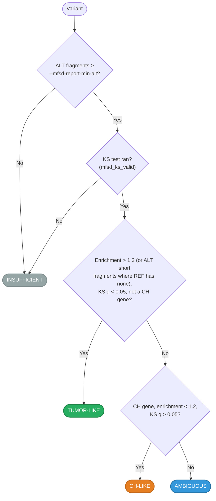

# QC Flags

Every flag, reason and class gbcms writes is defined here, once. Other pages
include these tables (snippet sections of this file) or link to them, so a
definition is written in one place. Two tests keep it that way: one fails when a
flag the code emits is missing from this page, the other when a flag is defined
anywhere else in the docs.

**Where flags appear.** MAF columns are listed first, then the VCF field. In VCF,
`;` inside a value is written `|`.

| Family | MAF column | VCF field | Mode |
|:-------|:-----------|:----------|:-----|
| [Verdict and status reasons](#verdict-and-status-reasons) | `gbcms_status`, `gbcms_status_reason` | INFO `GS`, `GSR` | all |
| [Diagnostics](#diagnostics) | `gbcms_diagnostic` | INFO `GD` | all (some RNA, some PairHMM only) |
| [MNP rescue](#mnp-rescue) | `gbcms_rescue` | INFO `GR` | `--rescue-mnp` |
| [ASJD splice flags](#asjd-splice-flags) | `asjd_diagnostic`, `asjd_*_motif` | not in VCF | RNA with `--gtf` |
| [QC columns](#qc-columns) | `rna_editing_site`, `asjd_flag`, `mfsd_ks_valid`, `mfsd_alt_confidence`, `mfsd_ch_flag` | INFO `RED`; mFSD INFO | RNA; `--mfsd` |
| [mFSD report classes](#mfsd-report-classes) | — (HTML report) | — | `--mfsd-report` |
| [Record shapes in VCF output](#record-shapes-in-vcf-output) | — | ALT `<NON_SEQUENCE>`, INFO `MAF_*`, `NORM_*` | MAF input; `--show-normalization` |

## Verdict and status reasons

`gbcms_status` is the verdict: `PASS` (counted) or `FAIL` (not counted; zero
counts, the row kept). `gbcms_status_reason` lists `|`-separated reasons, empty
for a clean PASS; reasons stack (`WARN_REF_CORRECTED|MULTI_ALLELIC`), and the
same string is in the VCF `GSR` INFO. How each is decided:
[Variant Normalization](variant-normalization.md).

<!-- --8<-- [start:status] -->
| Reason | Verdict | Set when | What to do |
|:-------|:--------|:---------|:-----------|
| *(empty)* | PASS | The variant validated against the reference | — |
| `WARN_REF_CORRECTED` | PASS | The REF matches the reference at ≥90% of its bases; the reference bases are used downstream (the original REF is kept in `original_ref`) | Check the input's REF; counts are for the corrected REF |
| `WARN_HOMOPOLYMER_DECOMP` | PASS | With `--rescue-homopolymer`: the variant spans a homopolymer, was dual-counted with a corrected allele, and the corrected allele won | The row reports that allele's counts, not the given one |
| `MULTI_ALLELIC` | PASS | Another input row is a different ALT at the same locus; sibling-ALT exclusion is active | None; each row counts its own ALT |
| `TRACT_CLUSTER` | PASS | The variant shares a repeat-tract scan window with a co-annotated length-changing variant (spans need not touch); sibling exclusion and exclusive ALT assignment are active | None; read the rows together |
| `REF_MISMATCH` | FAIL | The REF matches the reference at under 90% of its bases | Check the build and coordinates; `REF_AT_OFFSET(k)` in `gbcms_diagnostic` says where the REF sits when it is a few bases off |
| `FETCH_FAILED` | FAIL | The reference region could not be read (contig not in the FASTA, past its end) | Check contig naming and the FASTA |
| `EMPTY_ALLELE` | FAIL | REF or ALT is empty (a malformed indel; a MAF dash allele is `-`) | Fix the input row |
| `NON_SEQUENCE_ALLELE` | FAIL | An allele is not a base sequence (an IUPAC code, a stray character; `-` outside MAF input); kept in MAF output, written as `<NON_SEQUENCE>` in VCF output | Fix the input row |
| `ALT_EQUALS_REF` | FAIL | ALT equals REF (any case; `-` for both in a MAF): no change to count | Fix the input row |
| `ALT_CONTAINS_N` | FAIL | The ALT contains an `N` base | Fix the input row |
<!-- --8<-- [end:status] -->

## Diagnostics

`gbcms_diagnostic` (VCF `GD`) says what the reads, or the reference, show about
a row. Semicolon-separated in MAF, `|` in VCF; empty when none. Set after counting
on a PASS row; on a FAIL row only `REF_AT_OFFSET`. Parametric flags count under
their base name in the run log. Examples: `ZERO_ALT`,
`PARTIAL_DOMINANT;MNP_DISC_RATIO(2/5);MNP_RESCUE_ELIGIBLE`.

<!-- --8<-- [start:diagnostics] -->
| Flag | Mode | Set when | What to do |
|:-----|:-----|:---------|:-----------|
| `ZERO_ALT` | all | No read carries the ALT (no confirmed ALT reads) | None, or check the input allele (see `OBSERVED_ALLELE`) |
| `PARTIAL_DOMINANT` | all | `partial_alt` exceeds `alt_count`. For a pure indel, `partial_alt` includes reads whose CIGAR shows an indel of a different length in the same tract, so this usually means a coexisting allele the annotation does not describe | Inspect (`--trace` shows per-read lengths) |
| `MNP_DISC_RATIO(n/m)` | all | Every MNP row: `n` positions where REF and ALT differ, of its `m` bases | Describes the MNP's shape |
| `MNP_RESCUE_ELIGIBLE` | all | `n/m` is at most `--rescue-mnp-threshold`: the MNP is a rescue candidate | With `--rescue-mnp`, rescue runs on it |
| `HIGH_N_FRACTION(f)` | all | More than 5% of the depth (`f`) has `N` at the locus | A masking hotspot (duplex); counts are thinner |
| `CLIP_CANDIDATES(n)` | all | An insertion with no confirmed ALT where `n` (≥ 2) reads carry a soft clip ≥ 8 bp whose boundary lies within the insert's duplication reach (anchor ± insert length + 10): carriers the aligner may have written as clips rather than insertions | Inspect in IGV |
| `OBSERVED_ALLELE(chrom:pos:REF>ALT:n/0)` | all | No read carries the given allele exactly, and `n` reads carry this allele (canonical VCF form, 1-based POS) | The input is likely mis-described; the counts stay the given allele's |
| `COEXISTING_ALLELE(chrom:pos:REF>ALT:n/m)` | all | The given allele is present (`m` reads carry it exactly), but more reads (`n`) carry another allele in the same stretch, e.g. a germline indel or stutter in a repeat | A caveat for reading the VAF |
| `SW_FALLBACK(n)` | PairHMM backend | `n` depth reads could not be evaluated by the haplotype matrix (the reference context is missing or does not contain them): scored by the Smith-Waterman fallback where it can run, else left NEITHER (one WARN per variant names why) | The row's counts came partly from another scorer, or miss reads |
| `SPLICE_SKIP_DOMINANT(n)` | RNA | A deletion-type locus where more reads splice over the deleted span (CIGAR `N`, no observation) than confirm ALT; RNA aligners write large deletions as splices (STAR: ≥ `alignIntronMin`, default 21 bp) | `alt_count` 0 may hide carriers written as junction reads |
| `NON_DISCRIMINATING_LOCUS` | PairHMM backend | A nearby germline sibling combination reconstructs the reference haplotype (e.g. a homopolymer deletion cancelled by an adjacent insertion of the same base), so REF and ALT are the same sequence and reads tie to NEITHER | Explains zero REF and ALT at a covered locus |
| `RESCUED_COMPONENT(chrom:pos:REF>ALT)` | `--rescue-mnp` | The row's counts are that component SNV's, not the annotated MNP's | Read `gbcms_rescue` |
| `REF_AT_OFFSET(k)` | all (FAIL rows) | A `REF_MISMATCH` row's REF (3+ bases) matches the reference exactly `k` bases from its position (every such offset within 3, nearest first, `/`-separated) | Correct the input's coordinates; the row is not moved or counted |

`OBSERVED_ALLELE` and `COEXISTING_ALLELE` both need `n` ≥ 3, `n` > `m`, `n` ≥ 5%
of the scanned reads, and an allele that is not already an input row. `n` and `m`
are taken over the reads the counts read (first-class reads the mapping rule
admits: in RNA a unique mapper, `NH:i:1`, below `--min-mapq`; under strandedness
enforcement, sense reads only), so they compare with `alt_count` and `ref_count`.
<!-- --8<-- [end:diagnostics] -->

## MNP rescue

`gbcms_rescue` (VCF `GR`), with `--rescue-mnp` only, is an audit trail:
`method=decomposed;outcome=<outcome>;original_ref=R;original_alt=A;original_partial=P;original_confirmed=C[;adopted=chr:pos(R>A)][;positions=…]`.
See [Architecture → MNP Rescue Pass](architecture.md#mnp-rescue-pass-rescue-mnp-v430).

<!-- --8<-- [start:rescue] -->
| Outcome | Meaning | Counts written |
|:--------|:--------|:---------------|
| `rescued` | The best component beats the MNP's `ad`; `gbcms_diagnostic` gains `RESCUED_COMPONENT(chrom:pos:REF>ALT)` and a warning is logged | The adopted component's |
| `skipped_grouped` | The MNP is in a co-annotated group (its reads are assigned against the siblings) | The MNP's |
| `haplotype_confirmed` | At least one read shows the whole haplotype (`mnp_confirmed_alt > 0`): the BAM shows the annotated allele | The MNP's |
| `no_improvement` | No component beats the MNP's `ad`: the partial evidence was not component carriers (e.g. reads with an indel inside the block, which the complex path counts as REF with nearby-indel evidence). Rescue correctly declines | The MNP's |
| `ref_validation_failed` | No component SNV survived preparation (an anomaly: the MNP itself passed REF validation); logged as a warning | The MNP's |
<!-- --8<-- [end:rescue] -->

## ASJD splice flags

RNA with `--gtf`. `asjd_diagnostic` lists QC flags, semicolon-separated; counts
are per fragment (a molecule's R1 and R2 are one vote). Motifs (`asjd_ref_motif`,
`asjd_alt_motif`) are `GT-AG`, `GC-AG`, `AT-AC`, `OTHER` or `UNKNOWN`. The ASJD
columns: [Output Formats](output-formats.md#aberrant-splice-junction-detection-asjd).

<!-- --8<-- [start:asjd] -->
| Flag | Condition | Meaning |
|:-----|:----------|:--------|
| `LOW_ALT_JUNC` | `asjd_n_alt_total < 5` | Insufficient ALT junction evidence |
| `LOW_REF_JUNC` | `asjd_n_ref_total < 10` | Insufficient REF baseline |
| `NOVEL_ALT_JUNC` | ALT dominant junction differs from REF and is unannotated | ALT uses an unannotated junction |
| `NON_CANONICAL_MOTIF` | ALT junction differs from REF and its motif is not GT-AG/GC-AG/AT-AC | Likely mapping artifact |
| `STRAND_DISCORDANT` | ALT junction differs from REF, `asjd_n_alt_junc ≥ 5`, and minority transcript-strand fraction ≥ 0.30 | Mixed transcript-strand support → alignment artifact. A `--no-strandedness` diagnostic: under enforcement (the default) antisense reads never reach the junction tally wherever the gene strand is resolved, intronic loci included. Where both strands' genes cover the locus (no strand), the tally reads every read; a junction belongs to one gene's intron, so a mixed-strand junction stays suspicious there. Disabled for `--strandedness unstranded`. |
| `MULTI_JUNCTION` | ALT fragments use > 2 distinct junctions | Complex splicing event |
| `RETENTION_DOMINANT(n)` | Variant's REF span reaches within 2bp of an annotated intron boundary (a donor/acceptor site of a transcript on the variant's gene strand — transcript termini and antisense genes excluded); `n ≥ 10` fragments splice over the locus (CIGAR `N` spans it — excluded as no-observation) and outnumber the allele-classified fragments, which are mostly junction-free | The reads that genotype this locus are the intron-retaining minority: `vaf` is the VAF *within that population*, not allelic balance. An allele-specific retention shows a very high `vaf` here; a neutral splice-site variant shows roughly the allelic fraction of the unspliced reads. Explains `LOW_REF_JUNC;LOW_ALT_JUNC` at such loci — the junction evidence exists but is on the excluded reads. |
| `NOVEL_JUNC_AT_SPLICE_LOSS(n@start-end)` | Same splice-site gate; the top unannotated junction on the spliced-over fragments is anchored (±5bp) to an annotated intron boundary on the gene strand, is not the deletion itself written as a splice (same length, at the locus), and is carried by `n ≥ 5` fragments — more than confirm ALT | The mutant allele's splicing outcome (an exon skip or alternative-site junction) is visible while `alt_count` is not — typically a splice-destroying variant whose carriers splice around the locus. `start-end` is a 0-based, half-open intron interval (the `asjd_*_junction` convention). |

The floors are ASJD's own junction-evidence minimums (`LOW_REF_JUNC` /
`LOW_ALT_JUNC`). When `RETENTION_DOMINANT` is present, any junction flags
alongside it (`NOVEL_ALT_JUNC`, `MULTI_JUNCTION`, …) describe the
allele-classified reads — by the marker's own condition the junction-bearing
minority of an intron-retaining population — not the spliced majority, which
only the ASJD-2 markers report.
<!-- --8<-- [end:asjd] -->

## QC columns

Columns whose value is itself a flag. Each column's place in the output is in
[Output Formats](output-formats.md); this is its definition.

<!-- --8<-- [start:qc-columns] -->
| Column | Mode | Value | What to do |
|:-------|:-----|:------|:-----------|
| `rna_editing_site` (VCF `RED`) | RNA, `--rna-editing-db` | `True` when the locus overlaps a known A-to-I editing site | An A>G / T>C call there is likely editing, not a somatic mutation |
| `asjd_flag` | RNA, `--gtf` | `True` when REF and ALT junction usage differ (Fisher p < 0.05; `asjd_qval` is BH-corrected across variants) | Candidate allele-specific splicing; read `asjd_diagnostic` |
| `mfsd_ks_valid` | `--mfsd` | `True` when both ALT and REF have ≥ 5 fragments in the size window (50–1000 bp), so the KS test ran; when `False` the KS statistics are NA | Do not read the KS columns when `False` |
| `mfsd_alt_confidence` | `--mfsd` | `HIGH` with ≥ 5 ALT fragments in the size window, `LOW` with 1–4, `NONE` with none | Weigh the mFSD statistics by it |
| `mfsd_ch_flag` | `--mfsd` | `True` when the variant falls in a clonal-hematopoiesis (CH) gene (from `Hugo_Symbol`) | Read with the CH-LIKE class |
<!-- --8<-- [end:qc-columns] -->

## mFSD report classes

The `--mfsd-report` HTML classifies each variant's fragment sizes (see
[mFSD Report](mfsd-report.md)). The KS threshold is on the BH-FDR q-value across
the sample's variants (`mfsd_qval_alt_ref`), not the raw p-value.

<!-- --8<-- [start:mfsd-classes] -->

| Class | Rule | Interpretation |
|:------|:-----|:---------------|
| `TUMOR-LIKE` | Sub-nucleosomal enrichment > 1.3 (or ALT has short fragments while REF has none), KS q < 0.05, and the gene is not in the CH set | ALT fragments significantly shorter than REF: a ctDNA signal |
| `CH-LIKE` | A CH gene, enrichment < 1.2, and KS q > 0.05 | ALT sizes mirror REF: consistent with clonal hematopoiesis |
| `AMBIGUOUS` | Neither | Mixed signals; may need clinical context or paired WBC sequencing |
| `INSUFFICIENT` | ALT fragments below `--mfsd-report-min-alt`, or the KS test did not run (`mfsd_ks_valid` False: a class has fewer than 5 fragments) | Not enough fragments to classify |
<!-- --8<-- [end:mfsd-classes] -->

In VCF, the mFSD summary is in INFO: `MFSD_REF_COUNT`, `MFSD_ALT_COUNT`,
`MFSD_REF_LLR`, `MFSD_ALT_LLR`, `MFSD_DELTA_ALT_REF`, `MFSD_KS_ALT_REF`,
`MFSD_PVAL_ALT_REF`, `MFSD_QVAL_ALT_REF`, `MFSD_SUB_NUC_REF_FRAC`,
`MFSD_SUB_NUC_ALT_FRAC`, `MFSD_SUB_NUC_ENRICHMENT`, `MFSD_MONO_NUC_REF_FRAC` and
`MFSD_MONO_NUC_ALT_FRAC` ([Output Formats → INFO](output-formats.md#info-fields)).

## Record shapes in VCF output

| Field | Set when | Meaning |
|:------|:---------|:--------|
| ALT `<NON_SEQUENCE>` | MAF input, a row whose allele is not a base sequence (or empty) | The row is FAIL (reason in `GSR`); REF is the reference base at POS |
| INFO `MAF_START`, `MAF_REF`, `MAF_ALT` | MAF input | The MAF row the record came from, as written: look a result up by its input |
| INFO `NORM_POS`, `NORM_REF`, `NORM_ALT` | `--show-normalization` | The left-aligned record gbcms counted |
