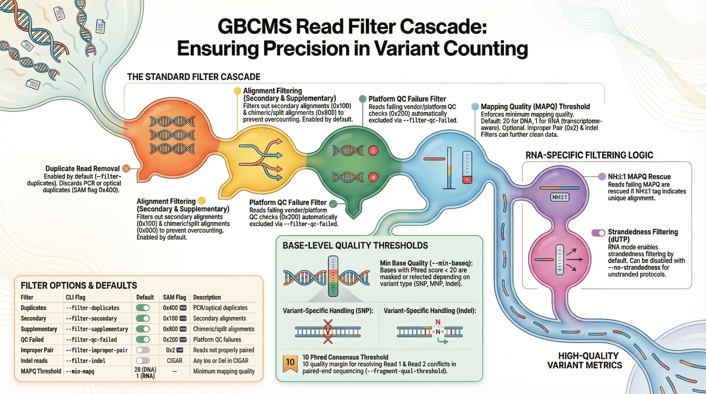
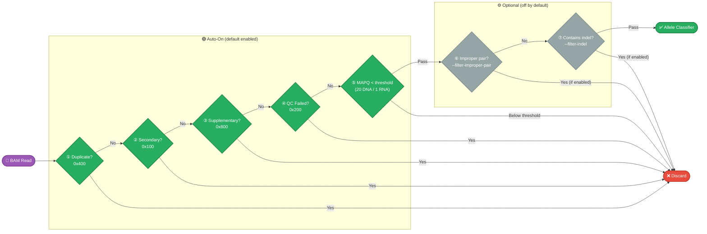
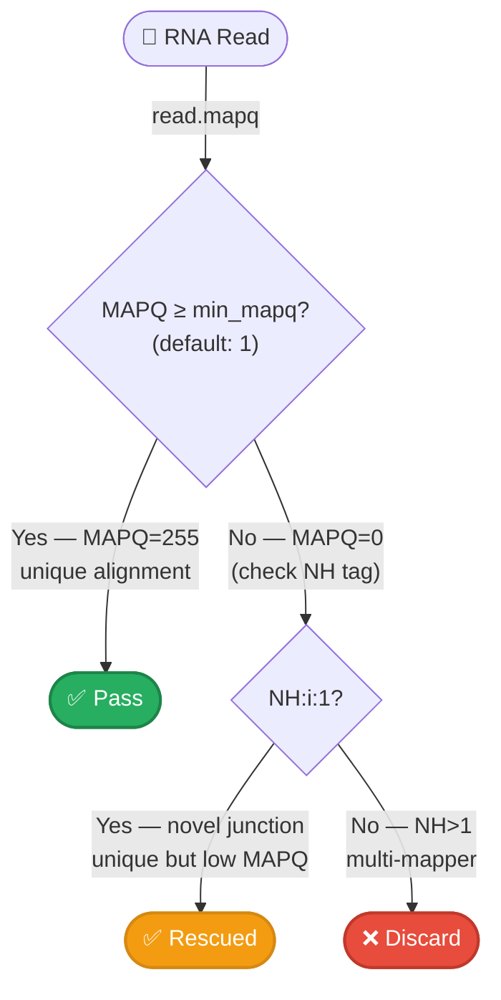

# Read Filters

Which reads are excluded before allele classification — the filter cascade, CLI flags, and defaults.

!!! info "Visual Overview"
    <figure markdown="span">
      { loading=lazy width="100%" }
      <figcaption>The read-filter cascade and counting metrics — click to enlarge</figcaption>
    </figure>

## Filter Cascade

Every read from the BAM passes through a **filter cascade** before being checked for allele support. Reads failing any enabled filter are discarded. The order matches the Rust engine implementation.



---

## Filter Options

| Filter | CLI Flag | Default | SAM Flag | Description |
|:-------|:---------|:--------|:---------|:------------|
| Duplicates | `--filter-duplicates` | **On** | `0x400` | PCR/optical duplicates |
| Secondary | `--filter-secondary` | **On** | `0x100` | Secondary alignments |
| Supplementary | `--filter-supplementary` | **On** | `0x800` | Chimeric/split alignments |
| QC Failed | `--filter-qc-failed` | **On** | `0x200` | Platform QC failures |
| Improper Pair | `--filter-improper-pair` | Off | `0x2` (inverted) | Reads not properly paired |
| Indel reads | `--filter-indel` | Off | CIGAR-based | Any Ins or Del in CIGAR |
| MAPQ threshold | `--min-mapq` | **20** (DNA) / **1** (RNA) | — | Minimum mapping quality |

---

## Quality Thresholds

Beyond the read-level filters above, gbcms also applies **base-level quality thresholds** during allele classification:

| Parameter | CLI Flag | Default | Description |
|:----------|:---------|:--------|:------------|
| Min base quality | `--min-baseq` | **20** | Bases below this are masked or rejected |
| Fragment consensus threshold | `--fragment-qual-threshold` | **10** | Quality margin for R1/R2 conflict resolution |

!!! info "How Base Quality Is Used"
    The effect of `--min-baseq` varies by variant type:
    
    - **SNP**: Read is rejected if the base at the variant position has quality < threshold
    - **MNP**: Read is rejected if **any** base in the MNP region has quality < threshold
    - **Insertion/Deletion (windowed scan)**: Inserted/deleted bases below threshold are **masked** (treated as wildcards) rather than rejecting the entire read
    - **Complex (Phase 2)**: Low-quality bases are masked — they cannot vote for either allele
    - **Complex (Phase 3 SW)**: Low-quality bases are replaced with `N`, which scores 0 against any base

---

## Comparison with Original GBCMS

!!! note "Filter Non-Primary"
    The original GBCMS has a single `--filter_non_primary` flag. gbcms splits this into `--filter-secondary` and `--filter-supplementary` for finer control. Both default to **on** in gbcms (stricter than the original behavior, which was off).

| Feature | Original GBCMS | gbcms |
|:--------|:---------------|:---------|
| Base quality filtering | No threshold | Default `--min-baseq 20` |
| Duplicate filtering | Optional | **On** by default |
| Non-primary filter | Single flag (default off) | Split: secondary + supplementary (**both On**) |
| QC-failed filter | Optional | **On** by default |
| Indel read filter | Optional | Optional (off by default) |

---

## Fetch Window

gbcms fetches reads from a **dynamic window** around each variant position — not just at the exact position. The window defaults to ±5bp but **scales with the variant's repeat span** to capture indels that aligners shift beyond 5bp in long homopolymers and microsatellite regions. The formula is `max(5, repeat_span + 2)`.

```
Variant: chr1:100 A→ATG (insertion, repeat_span=0)
BAM fetch window: [95, 106)    ← ±5bp (default)

Variant: chr1:200 A→AT (insertion in 15bp poly-A, repeat_span=15)
BAM fetch window: [183, 206)   ← ±17bp (repeat_span + 2)
```

!!! important "Anchor Overlap Gate"
    Although reads are fetched from the wider window, **only reads that overlap the variant's anchor position** (or are classified as REF/ALT via shifted indel matching) contribute to the DP count. This prevents DP inflation from reads that were brought in by the window padding but don't actually cover the variant.

    ```
    Read A: [90─────100]        → overlaps anchor at 100 → counted in DP ✅
    Read B: [92──97]            → doesn't overlap 100, not classified → skipped ❌
    Read C: [95──99] + shifted  → doesn't overlap 100, but windowed scan found ALT → counted ✅
    ```

---

## RNA-Specific Filters

RNA mode (`gbcms rna`) extends the standard filter cascade with two additional checks.

### NH:i:1 MAPQ Rescue

STAR assigns MAPQ=255 to uniquely mapped reads and MAPQ=0–3 to multi-mappers. When `--min-mapq 1` (RNA default), reads that fail the MAPQ threshold are checked for the `NH:i:1` tag (Number of Hits = 1). If present, the read is uniquely aligned and rescued.



!!! info "Biological Context"
    Novel splice junctions often receive low MAPQ because STAR hasn't observed the junction in its first-pass database. The NH:i:1 rescue ensures these uniquely mapped reads contribute to allele counts rather than being silently discarded.

### Strandedness Filter

For dUTP-stranded RNA-seq libraries, reads are classified by their orientation relative to the gene strand annotation. Both sense and antisense reads are **counted** (they contribute to `rna_sense_depth` and `rna_antisense_depth` respectively), but only sense-strand reads contribute to the primary DP/RD/AD counts when `--enforce-strandedness` is enabled.

| Read Orientation | Gene Strand | Classification |
|:-----------------|:------------|:---------------|
| Forward (R1) | + | Sense |
| Reverse (R1) | + | Antisense |
| Forward (R1) | − | Antisense |
| Reverse (R1) | − | Sense |

!!! tip
    Disable strandedness filtering with `--no-strandedness` for unstranded RNA-seq libraries.

---

## BAQ Quality Downgrade

When `--apply-baq` is enabled, base qualities near indels are heuristically downgraded to prevent inflated quality scores from causing false-positive allele classifications.

| Option | Default | Description |
|:-------|:--------|:------------|
| `--apply-baq/--no-baq` | off | Enable heuristic BAQ quality downgrade |

!!! info "When to Enable BAQ"
    Most modern pipelines (BQSR, fgbio consensus) already recalibrate base qualities. Enable BAQ only for legacy BAMs lacking quality recalibration, where bases adjacent to indels may retain inflated quality scores from the original base caller.

---

## Related

- [Allele Classification](allele-classification.md) — How reads passing filters are classified
- [Counting & Metrics](counting-metrics.md) — Read-level and fragment-level counts
- [DNA CLI Reference](../cli/dna.md) — DNA parameter options
- [RNA CLI Reference](../cli/rna.md) — RNA-specific parameter options
