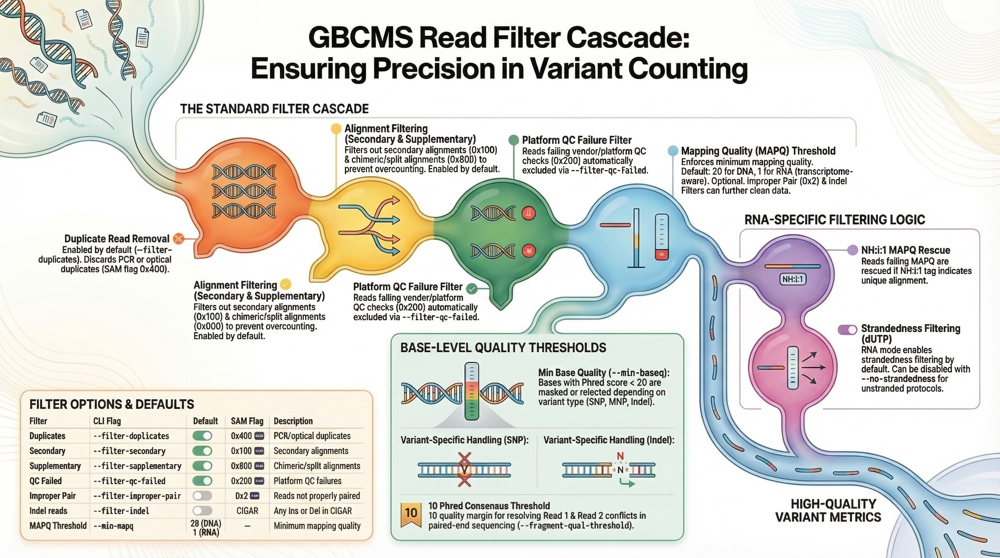
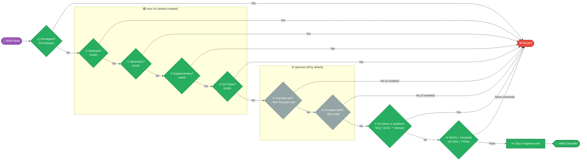
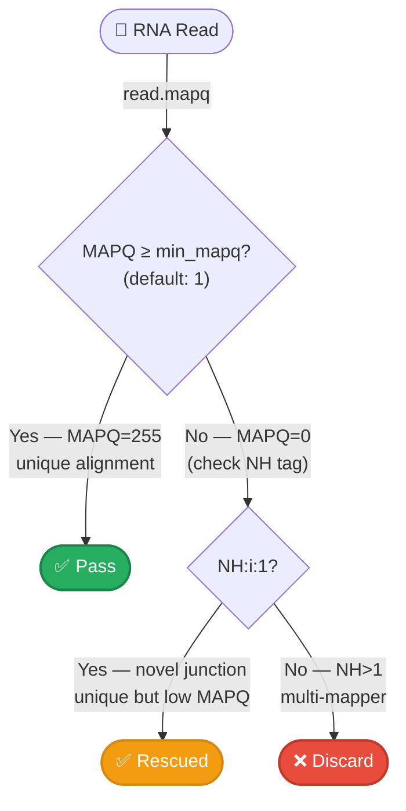

# Read Filters

Which reads are excluded before allele classification — the filter cascade, CLI flags, and defaults.

!!! info "Visual Overview"
    <figure markdown="span">
      { loading=lazy width="100%" }
      <figcaption>The read-filter cascade and counting metrics — click to enlarge</figcaption>
    </figure>

## Filter Cascade

Every read from the BAM passes through a **filter cascade** before being checked for allele support. Reads failing any enabled filter are discarded. The order matches the Rust engine implementation.


```mermaid
flowchart LR
    Start(["📖 BAM Read"]):::start
    U0{"⓪ Unmapped?\n0x4 (always)"}:::on

    subgraph Auto ["🟢 Auto-On (default enabled)"]
        direction LR
        F1{"① Duplicate?\n0x400"}:::on
        F2{"② Secondary?\n0x100"}:::on
        F3{"③ Supplementary?\n0x800"}:::on
        F4{"④ QC Failed?\n0x200"}:::on
        F1 -->|No| F2
        F2 -->|No| F3
        F3 -->|No| F4
    end

    subgraph Opt ["⚙️ Optional (off by default)"]
        direction LR
        O1{"⑤ Improper pair?\n--filter-improper-pair"}:::off
        O2{"⑥ Contains indel?\n--filter-indel"}:::off
        O1 -->|No| O2
    end

    S1{"⑦ No bases or qualities?\nSEQ / QUAL '*' (always)"}:::on
    F5{"⑧ MAPQ < threshold\n(20 DNA / 1 RNA)"}:::on

    Start --> U0
    U0 -->|No| F1
    U0 -->|Yes| Drop
    F4 -->|No| O1
    O2 -->|No| S1
    S1 -->|No| F5
    F5 -->|Pass| Clip["✂️ Clip to fragment end"]:::on
    Clip --> Done(["✅ Allele Classifier"]):::pass

    F1 -->|Yes| Drop(["❌ Discard"]):::drop
    F2 -->|Yes| Drop
    F3 -->|Yes| Drop
    F4 -->|Yes| Drop
    O1 -->|"Yes (if enabled)"| Drop
    O2 -->|"Yes (if enabled)"| Drop
    S1 -->|Yes| Drop
    F5 -->|Below threshold| Drop

    classDef start fill:#9b59b6,color:#fff,stroke:#7d3c98,stroke-width:2px;
    classDef on fill:#27ae60,color:#fff,stroke:#1e8449,stroke-width:2px;
    classDef off fill:#95a5a6,color:#fff,stroke:#7f8c8d,stroke-width:2px;
    classDef pass fill:#27ae60,color:#fff,stroke:#1e8449,stroke-width:2px;
    classDef drop fill:#e74c3c,color:#fff,stroke:#c0392b,stroke-width:2px;
```

**Unmapped records.** A record flagged unmapped (0x4) is not an alignment. An
aligner places it at its mate's position with MAPQ 0, sometimes with a CIGAR, so
it would otherwise reach a variant there: in `mq0_count` by default, and as a read
at `--min-mapq 0`. It is always dropped first (step ⓪), in every mode. Its mapped
mate still counts (one mapped read of a pair is a read), and mapped MAPQ-0
alignments stay countable at `--min-mapq 0`, as pseudogene loci such as PMS2 need.
samtools/bcftools mpileup and GATK (MappedReadFilter) drop unmapped reads too.

**Records without bases or qualities.** A record stored with no sequence
(SEQ `*`) shows no allele. Aligners write some secondary alignments this way, and
a stripped BAM can hold primaries like it. A record with bases but no qualities
(QUAL `*`, stored as 0xFF bytes) gives its bases no error rate, so no rule can
weigh them (GATK's WellformedReadFilter rejects it too). Either is always dropped
right after the flag filters (step ⑦), in every mode and counting path, and
counted in neither depth, fragments nor `mq0_count`. Each counting pass logs one
WARNING for each kind, with the number of bin fetches that skipped one (bin
windows overlap, so a record can count more than once).

**A read ends at its fragment end.** When the insert is shorter than the read,
the read runs on past its mate's 5' end into adapter (read-through). For a pair
whose fragment is well defined (mate mapped on the same contig, the pair facing
inward), the bases past the fragment end are hard-clipped as the read enters the
counting pass, as if the read had been trimmed, so no rule sees them as bases or
as reach, and a reverse read's start moves past any aligned bases it loses. TLEN
is read as BWA-MEM, samtools fixmate and Picard write it, from the forward read's
5' end to the reverse read's, positive on the forward read; an outward-facing
pair (as at a tandem-duplication junction) defines no fragment. Tags are kept. GATK hard-clips adapter at the same
boundary, and fgbio ClipBam's `--clip-bases-past-mate` does it as a separate step.
See [Read Judgment](read-judgment.md) (RJ-10 to RJ-12).

---

## Filter Options

| Filter | CLI Flag | Default | SAM Flag | Description |
|:-------|:---------|:--------|:---------|:------------|
| Duplicates | `--filter-duplicates` | **On** | `0x400` | PCR/optical duplicates |
| Secondary | `--filter-secondary` | **On** | `0x100` | Secondary alignments (see note) |
| Supplementary | `--filter-supplementary` | **On** | `0x800` | Chimeric/split alignments (see note) |
| QC Failed | `--filter-qc-failed` | **On** | `0x200` | Platform QC failures |
| Improper Pair | `--filter-improper-pair` | Off | `0x2` (inverted) | Reads not properly paired |
| Indel reads | `--filter-indel` | Off | CIGAR-based | Any Ins or Del in CIGAR |
| MAPQ threshold | `--min-mapq` | **20** (DNA) / **1** (RNA) | — | Minimum mapping quality |

!!! note "Secondary and supplementary affect fragment counts, never read-level depth"
    These two behave differently from the rest. A secondary or supplementary alignment
    shares a QNAME with its primary, so it is **never** a first-class read-level
    observation: it does not contribute to `dp`, `rd` or `ad` however the flags are set.
    Counting one would report two reads where a single physical read exists.

    Turning the filter **off** admits them to **fragment**-level evidence (`dpf`, `rdf`,
    `adf`) and to the [per-molecule observation export](molecule-observations.md). That
    cannot double-count — fragments are keyed by QNAME hash, so a primary and its
    supplementary collapse into one — and it is what makes a locus reached *only* by a
    supplementary segment visible at all. Such a locus otherwise reports `dpf=0` despite a
    molecule demonstrably covering it, which is why a molecule spanning a large deletion
    was invisible to cross-locus phasing.

    Consequence worth knowing: with the filter off, an admitted supplementary raises `dpf`
    while leaving `dp` unchanged. The two measure different things and stop moving together.

!!! danger "`--filter-improper-pair` can discard everything"
    Some UMI-collapsed pipelines emit reads with **no `PROPER_PAIR` flag at all** — measured
    at 0.0% across every alignment type in one MSK-ACCESS version, despite 100% of reads
    being paired. Enabling this filter there removes **every read**, silently. It defaults
    to off for that reason.

---

## Quality Thresholds

Beyond the read-level filters above, gbcms also applies **base-level quality thresholds** during allele classification:

| Parameter | CLI Flag | Default | Description |
|:----------|:---------|:--------|:------------|
| Min base quality | `--min-baseq` | **20** | Bases below this are masked or rejected |
| Fragment consensus threshold | `--fragment-qual-threshold` | **10** | Quality margin for R1/R2 conflict resolution |

!!! info "How Base Quality Is Used"
    The effect of `--min-baseq` varies by variant type:
    
    - **SNP**: Read is rejected if the base at the variant position has quality < threshold
    - **MNP**: Read is rejected if **any** base in the MNP region has quality < threshold
    - **Insertion/Deletion (windowed scan)**: Inserted/deleted bases below threshold are **masked** (treated as wildcards) rather than rejecting the entire read
    - **Complex (Phase 2)**: Low-quality bases are masked — they cannot vote for either allele
    - **Complex (Phase 3 SW)**: Low-quality bases are replaced with `N`, which scores 0 against any base

---

## Comparison with Original GBCMS

!!! note "Filter Non-Primary"
    The original GBCMS has a single `--filter_non_primary` flag. gbcms splits this into `--filter-secondary` and `--filter-supplementary` for finer control. Both default to **on** in gbcms (stricter than the original behavior, which was off).

| Feature | Original GBCMS | gbcms |
|:--------|:---------------|:---------|
| Base quality filtering | No threshold | Default `--min-baseq 20` |
| Duplicate filtering | Optional | **On** by default |
| Non-primary filter | Single flag (default off) | Split: secondary + supplementary (**both On**) |
| QC-failed filter | Optional | **On** by default |
| Indel read filter | Optional | Optional (off by default) |

---

## Fetch Window

gbcms fetches reads from a **dynamic window** around each variant position — not just at the exact position. The window defaults to ±5bp but **scales with the variant's repeat span** to capture indels that aligners shift beyond 5bp in long homopolymers and microsatellite regions. The formula is `max(5, repeat_span + 2)`.

```
Variant: chr1:100 A→ATG (insertion, repeat_span=0)
BAM fetch window: [95, 106)    ← ±5bp (default)

Variant: chr1:200 A→AT (insertion in 15bp poly-A, repeat_span=15)
BAM fetch window: [183, 206)   ← ±17bp (repeat_span + 2)
```

!!! important "Anchor Overlap Gate"
    Although reads are fetched from the wider window, **only reads that overlap the variant's anchor position** (or are classified as REF/ALT via shifted indel matching) contribute to the DP count. This prevents DP inflation from reads that were brought in by the window padding but don't actually cover the variant.

    ```
    Read A: [90─────100]        → overlaps anchor at 100 → counted in DP ✅
    Read B: [92──97]            → doesn't overlap 100, not classified → skipped ❌
    Read C: [95──99] + shifted  → doesn't overlap 100, but windowed scan found ALT → counted ✅
    ```

---

## RNA-Specific Filters

RNA mode (`gbcms rna`) extends the standard filter cascade with two additional checks.

### NH:i:1 MAPQ Rescue

STAR assigns MAPQ=255 to uniquely mapped reads and MAPQ=0–3 to multi-mappers. When `--min-mapq 1` (RNA default), reads that fail the MAPQ threshold are checked for the `NH:i:1` tag (Number of Hits = 1). If present, the read is uniquely aligned and rescued.


```mermaid
flowchart TD
    Read(["📖 RNA Read"])
    Read -->|"read.mapq"| MAPQ{"MAPQ ≥ min_mapq?\n(default: 1)"}
    MAPQ -->|"Yes — MAPQ=255\nunique alignment"| Pass(["✅ Pass"]):::pass
    MAPQ -->|"No — MAPQ=0\n(check NH tag)"| NH{"NH:i:1?"}
    NH -->|"Yes — novel junction\nunique but low MAPQ"| Rescue(["✅ Rescued"]):::rescue
    NH -->|"No — NH>1\nmulti-mapper"| Drop(["❌ Discard"]):::drop

    classDef pass fill:#27ae60,color:#fff,stroke:#1e8449,stroke-width:2px;
    classDef rescue fill:#f39c12,color:#fff,stroke:#d68910,stroke-width:2px;
    classDef drop fill:#e74c3c,color:#fff,stroke:#c0392b,stroke-width:2px;
```

!!! info "Biological Context"
    Novel splice junctions often receive low MAPQ because STAR hasn't observed the junction in its first-pass database. The NH:i:1 rescue ensures these uniquely mapped reads contribute to allele counts rather than being silently discarded.

### Strandedness Filter

For dUTP-stranded RNA-seq libraries, reads are classified by their orientation relative to the gene strand annotation. Both sense and antisense REF and ALT reads are **counted** (they contribute to `rna_sense_depth` and `rna_antisense_depth` respectively), but only sense-strand reads contribute to the primary DP/RD/AD counts when `--enforce-strandedness` is enabled.

With the default `--strandedness reverse` (dUTP, featureCounts `-s 2`), R1 and
single-end reads come from the opposite strand of the transcript, and R2 from the
same strand (`forward` swaps them):

| Read | Orientation | Gene Strand | Classification |
|:-----|:------------|:------------|:---------------|
| R1 / single-end | Reverse | + | Sense |
| R1 / single-end | Forward | + | Antisense |
| R1 / single-end | Forward | − | Sense |
| R1 / single-end | Reverse | − | Antisense |
| R2 | Forward | + | Sense |
| R2 | Reverse | + | Antisense |

!!! tip
    Disable strandedness filtering with `--no-strandedness` for unstranded RNA-seq libraries.

---

## BAQ Quality Downgrade

When `--apply-baq` is enabled, base qualities near CIGAR indels and splice junctions (CIGAR `N`/RefSkip) are heuristically downgraded to prevent inflated quality scores from causing false-positive allele classifications.

### Parameters (Internal Constants)

These are not configurable via CLI — they are fixed values derived from Li (2011):

| Constant | Value | Description |
|:---------|:------|:------------|
| `BAQ_RADIUS` | 5 bp | Bases within 5 bp of an indel or splice junction boundary are penalized |
| `BAQ_PENALTY` | 20 | Subtracted from BQ (clamped to 0, never negative) |

The effective aggressiveness of BAQ is controlled by `--min-baseq` (default 20): a base with BQ 30 near a splice junction becomes BQ 10 after BAQ, which is below the default `--min-baseq` threshold and is therefore excluded from allele evidence.

**The variant's own indel is spared.** When the variant being counted is not an SNV, a read's insertion or deletion that touches the variant's own event (where its alleles can differ, grown through repeats, plus two flank bases) is that variant's evidence, not an alignment artifact beside it, so the bases around it are not penalized. Otherwise, at Q37 (NovaSeq 6000 bins, unbinned or recalibrated data) every ALT read of a small insertion or delins would fall below `--min-baseq` while REF reads, with no indel, kept full quality. Splice junctions, and indels elsewhere in the read (a germline indel beside an SNV), are penalized as before. At Q40 (Q40 − 20 = 20) the difference does not arise.

### Mode Defaults

| Mode | Default | CLI Override | Rationale |
|:-----|:--------|:-------------|:----------|
| `gbcms dna` | **off** | `--apply-baq` to enable | DNA BAMs typically go through BQSR or consensus calling, which already recalibrates BQ. Enabling BAQ on top may double-penalize. |
| `gbcms rna` | **on** | `--no-baq` to disable | RNA BAMs typically do not go through BQSR or consensus calling. BAQ penalizes bases near splice junctions, mimicking GATK SplitNCigarReads' overhang clipping. |

### When to Enable BAQ for DNA

Enable `--apply-baq` on `gbcms dna` when the upstream pipeline does **not** include:

- **GATK BQSR** (Base Quality Score Recalibration)
- **Consensus-based deduplication** (fgbio, Marianas, Gencore)
- **Any other base quality recalibration step**

In these "raw BQ" scenarios, bases near indels may retain inflated sequencer-assigned quality scores that lead to false-positive allele calls. BAQ applies a -20 penalty within 5 bp of indel boundaries to compensate.

!!! warning "Do Not Enable for Pre-Calibrated BAMs"
    If your DNA pipeline includes BQSR or consensus calling, leave BAQ off (the default). Applying BAQ on already-recalibrated BAMs may over-penalize, causing undercounting of legitimate variant evidence.

### RNA: Splice Junction Penalty

In RNA mode, BAQ additionally penalizes bases near CIGAR `N` (RefSkip) operations — splice junctions. This is a lightweight alternative to running GATK SplitNCigarReads upstream. See [RNA Splice-Junction Handling](rna-splice-handling.md) for details.

---

## Related

- [Allele Classification](allele-classification.md) — How reads passing filters are classified
- [Counting & Metrics](counting-metrics.md) — Read-level and fragment-level counts
- [DNA CLI Reference](../cli/dna.md) — DNA parameter options
- [RNA CLI Reference](../cli/rna.md) — RNA-specific parameter options
