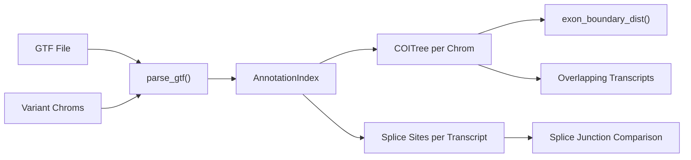
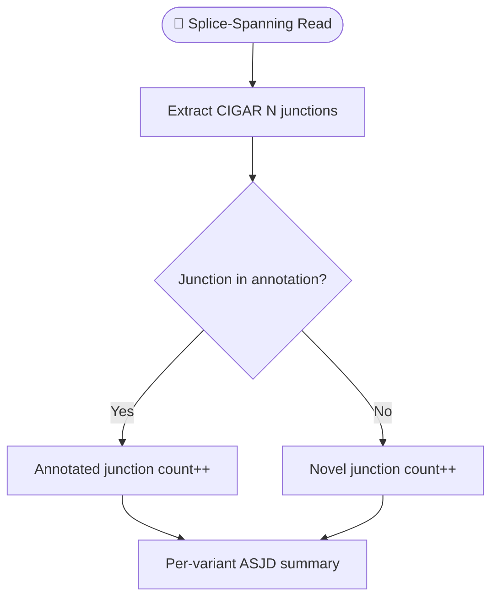

# RNA Annotation

GTF-based transcript annotation for RNA-seq variant counting (v5.0.0).

!!! info "Requires `--gtf`"
    All features described on this page are enabled only when a GTF annotation file
    is provided via `--gtf` on the `gbcms rna` command. Without `--gtf`, RNA mode
    operates identically to v4.2.0 — no annotation columns are added.

---

## GTF Requirements

gbcms supports **Ensembl** and **GENCODE** GTF annotation files.

### Supported Formats

| Source | Format | Example |
|:-------|:-------|:--------|
| Ensembl | `.gtf` or `.gtf.gz` | `Homo_sapiens.GRCh38.112.gtf.gz` |
| GENCODE | `.gtf.gz` | `gencode.v46.annotation.gtf.gz` |

### Download

```bash
# Ensembl (recommended for GRCh38)
wget https://ftp.ensembl.org/pub/release-112/gtf/homo_sapiens/Homo_sapiens.GRCh38.112.gtf.gz

# GENCODE
wget https://ftp.ebi.ac.uk/pub/databases/gencode/Gencode_human/release_46/gencode.v46.annotation.gtf.gz
```

### Parsing Details

The GTF parser (`rust/src/annotation/`) reads **exon** feature rows and extracts:

- `gene_name` attribute → gene symbol
- `transcript_id` attribute → transcript identifier
- `seqname` (column 1) → chromosome (with `chr` prefix normalization)
- `start`, `end` (columns 4-5) → 1-based exon coordinates

!!! tip "Chromosome Normalization"
    Chromosomes are normalized by stripping the `chr` prefix for internal matching
    (e.g., `chr1` → `1`). This ensures compatibility regardless of whether the BAM
    uses UCSC (`chr1`) or Ensembl (`1`) naming.

### Variant-Guided Filtering

To minimize memory usage, the GTF parser **only loads chromosomes that contain
variants**. If your variant file has variants on 3 chromosomes out of 25 in the
GTF, only those 3 are indexed.

---

## Annotation Index Architecture

The annotation index is built once at pipeline startup and shared across all
counting threads via `Arc<AnnotationIndex>`.



| Component | Data Structure | Purpose |
|:----------|:---------------|:--------|
| `COITree` | Interval tree per chromosome | O(log n + k) exon overlap queries |
| `SpliceMask` | `HashSet<(chrom, start, end)>` per transcript | O(1) splice site lookup for ASJD |
| `Arc<AnnotationIndex>` | Thread-safe shared reference | Zero-copy sharing across Rayon threads |

---

## Feature 1: Exon Boundary Distance

For each variant, gbcms computes the signed distance to the **nearest exon boundary**
across all overlapping transcripts.

| Value | Meaning |
|:------|:--------|
| Positive | Variant is exonic, N bases from the nearest exon edge |
| 0 | Variant is exactly at an exon boundary |
| Negative | Variant is intronic, N bases from the nearest exon edge |

**Output column**: `exon_boundary_dist` (MAF)

!!! info "Clinical Relevance"
    Variants near exon-intron boundaries (|distance| ≤ 2-5 bp) may affect
    splicing by disrupting splice donor/acceptor sites. The `exon_boundary_dist`
    column enables downstream filtering for splice-proximal variants.

---

## Feature 2: Per-Transcript Counting

When `--gtf` is provided, the engine counts ALT reads and fragments
**per overlapping transcript**. This resolves ambiguity when a variant
overlaps multiple transcripts with different exon structures.

### Algorithm

1. For each variant, query the `COITree` to find all transcripts whose
   exons overlap the variant position.
2. For each overlapping transcript, extract the splice site mask.
3. During counting, reads are attributed to transcripts based on splice
   junction compatibility:
   - A read's CIGAR `N` operations (splice junctions) are compared
     against the transcript's annotated splice sites.
   - Reads with matching splice junctions are counted toward that transcript.

### Output Columns

| Column | Format | Example |
|:-------|:-------|:--------|
| `transcript_read_counts` | `ENST:AD,RD,DP\|...` | `ENST00000269305:11,140,162\|ENST00000445888:7,95,108` |
| `transcript_fragment_counts` | `ENST:ADF,RDF,DPF\|...` | `ENST00000269305:6,72,83\|ENST00000445888:4,48,55` |

!!! note "Invariant"
    For each transcript: `fragment_count ≤ read_count` (fragments are
    R1/R2 consensus; reads are individual observations).

---

## Feature 3: Aberrant Splice Junction Detection (ASJD)

ASJD compares the splice junctions observed in reads against the
annotated splice sites from the GTF to detect potential aberrant splicing.

### How It Works



For each variant:

1. All reads with CIGAR `N` operations (splice junctions) are collected.
2. Each observed junction `(chrom, start, end)` is looked up in the GTF splice mask.
3. Junctions present in the annotation are **annotated**; absent ones are **novel**.
4. Counts are stratified by allele (REF vs ALT) for differential analysis.
5. Counts are deduped **per fragment** (by QNAME): a molecule whose R1 and R2 both
   span the same junction votes once, so the junction totals and the strand-discordance
   test reflect independent fragments, not mates.

### Output Columns (14)

See [Output Formats → ASJD](output-formats.md#aberrant-splice-junction-detection-asjd) for the complete column reference.

### Diagnostic Flags

The `asjd_diagnostic` column provides semicolon-separated QC flags. All junction
counts are **per fragment** (a molecule's R1 and R2 are deduped to one vote):

| Flag | Condition | Meaning |
|:-----|:----------|:--------|
| `LOW_ALT_JUNC` | `asjd_n_alt_total < 5` | Insufficient ALT junction evidence |
| `LOW_REF_JUNC` | `asjd_n_ref_total < 10` | Insufficient REF baseline |
| `NOVEL_ALT_JUNC` | ALT dominant junction differs from REF and is unannotated | ALT uses an unannotated junction |
| `NON_CANONICAL_MOTIF` | ALT junction differs from REF and its motif is not GT-AG/GC-AG/AT-AC | Likely mapping artifact |
| `STRAND_DISCORDANT` | ALT junction differs from REF, `asjd_n_alt_junc ≥ 5`, and minority transcript-strand fraction ≥ 0.30 | Mixed transcript-strand support → alignment artifact. Disabled for `--strandedness unstranded`. |
| `MULTI_JUNCTION` | ALT fragments use > 2 distinct junctions | Complex splicing event |

---

## Performance and Memory

### Memory

| Input | Approximate Memory |
|:------|:-------------------|
| Ensembl GRCh38 full GTF | ~200 MB for full index |
| With variant-guided filtering (typical) | ~5-20 MB (3/25 chroms) |

### Time

| Operation | Cost |
|:----------|:-----|
| GTF parsing + index build | 5-15 seconds (one-time) |
| Per-variant annotation lookup | O(log n) via COITree |
| Per-read splice junction check | O(1) via HashSet |

!!! tip "The GTF is loaded once"
    The annotation index is built once at pipeline startup and shared
    immutably across all counting threads. There is no per-variant or
    per-BAM parsing overhead.

---

## Related

- [RNA Command](../cli/rna.md) — `--gtf` CLI option
- [Output Formats](output-formats.md) — GTF-aware column reference
- [RNA Splice Handling](rna-splice-handling.md) — BAQ and consensus intron snipping
- [Architecture](architecture.md) — System overview with annotation layer
