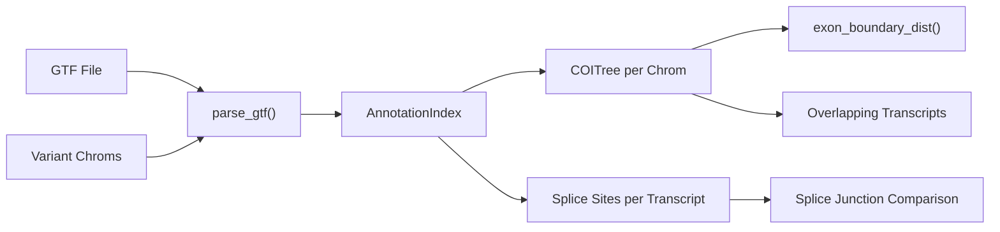
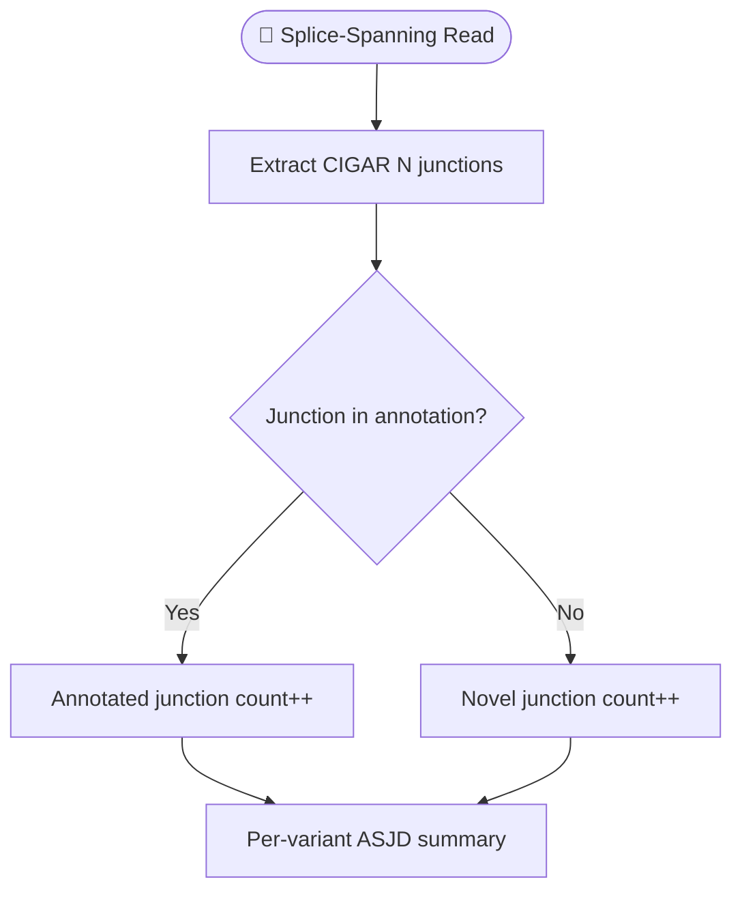

# RNA Annotation

GTF-based transcript annotation for RNA-seq variant counting (v5.0.0).

!!! info "Requires `--gtf`"
    All features described on this page are enabled only when a GTF annotation file
    is provided via `--gtf` on the `gbcms rna` command. Without `--gtf`, RNA mode
    operates identically to v4.2.0 — no annotation columns are added.

With `--gtf`, GTF mode appends **17 columns** total: `exon_boundary_dist` (1),
`transcript_read_counts` + `transcript_fragment_counts` (2), and the 14 ASJD fields
(7 metrics × 2 alleles).

!!! important "`gene_strand` is the keystone"
    Parsing the GTF also back-fills each variant's **`gene_strand`** (the transcript's
    `+`/`-` strand). This is what makes strand-aware features work: without it,
    `--enforce_strandedness` and the ASJD strand-discordance test are silent no-ops
    (every read reads as sense, so `antisense_depth` stays 0). Strand-specific counting
    therefore requires `--gtf`, not just `--strandedness`.

    The strand comes from the exons over the variant's position, all stranded
    exons agreeing. A position no stranded exon covers (intronic, including the
    donor +1/+2 and acceptor −1/−2 splice sites) takes the strand of the
    transcripts spanning it, from first exon start to last exon end, all agreeing.
    Where both strands' genes cover a position (exons, or transcripts at an
    intronic position) there is no strand: both genes' transcripts carry the
    allele, so every read counts. REDItools' annotation mode resolves a site the
    same way and leaves mixed strands undetermined. A run-level WARNING names the
    variants left without a strand (the first ten, then a count).

!!! tip "Loading cost"
    The GTF is loaded per run, plain or gzip/BGZF-compressed. Measured on a whole
    genome: 2.0 s for Ensembl 111 (2.4 s from `.gtf.gz`), 4.0 s for GENCODE v50
    basic and 6.5 s for GENCODE v50 comprehensive; fewer variant chromosomes load
    less. There is no cache to build: `--gtf-cache-dir` and `build-gtf-cache` were
    deprecated in 6.6.0 and removed in 6.7.0.

---

## GTF Requirements

gbcms supports **Ensembl** and **GENCODE** GTF annotation files.

### Supported Formats

| Source | Format | Example |
|:-------|:-------|:--------|
| Ensembl | `.gtf` or `.gtf.gz` | `Homo_sapiens.GRCh38.112.gtf.gz` |
| GENCODE | `.gtf.gz` | `gencode.v46.annotation.gtf.gz` |

### Download

```bash
# Ensembl (recommended for GRCh38)
wget https://ftp.ensembl.org/pub/release-112/gtf/homo_sapiens/Homo_sapiens.GRCh38.112.gtf.gz

# GENCODE
wget https://ftp.ebi.ac.uk/pub/databases/gencode/Gencode_human/release_46/gencode.v46.annotation.gtf.gz
```

### Parsing Details

The GTF loader (`rust/src/annotation/`) reads plain or gzip/BGZF files (detected
from the content, not the extension) and keeps the **exon** rows of the variant
chromosomes, extracting:

- `seqname` (column 1) → chromosome (with `chr` prefix normalization)
- `start`, `end` (columns 4-5) → 1-based exon coordinates, stored 0-based half-open
- `strand` (column 7) → `+`, `-` or unstranded `.`
- `transcript_id` attribute → transcript identifier (a GENCODE `.N` version is stripped)

Each exon row is checked column by column with noodles-gtf's grammar (the parser
used before 6.6.0): positive integer coordinates, a numeric or `.` score, `+`/`-`/`.`
strand, a `.`/0/1/2 frame, and `key value;` attributes (an unquoted value ends at
its `;`). Whitespace runs may separate a key from its value. A row with start after
end, a coordinate past 2,147,483,647, a missing or empty `transcript_id` (after the
version is stripped), or bytes that are not UTF-8 text is not loaded. Rejected rows
are counted in one warning that names the first one's line number and reason.

!!! tip "Chromosome Normalization"
    Chromosomes are normalized by stripping the `chr` prefix for internal matching
    (e.g., `chr1` → `1`). This ensures compatibility regardless of whether the BAM
    uses UCSC (`chr1`) or Ensembl (`1`) naming.

### Variant-Guided Filtering

To minimize memory usage, the GTF parser **only loads chromosomes that contain
variants**. If your variant file has variants on 3 chromosomes out of 25 in the
GTF, only those 3 are indexed.

---

## Annotation Index Architecture

The annotation index is built once at pipeline startup and shared across all
counting threads via `Arc<AnnotationIndex>`.


```mermaid
flowchart LR
    GTF["GTF File"] --> Parse["parse_gtf()"]
    Variants["Variant Chroms"] --> Parse
    Parse --> Index["AnnotationIndex"]
    Index --> COI["COITree per Chrom"]
    Index --> SpliceMask["Splice Sites per Transcript"]
    COI --> ExonDist["exon_boundary_dist()"]
    COI --> TxLookup["Overlapping Transcripts"]
    SpliceMask --> ASJD["Splice Junction Comparison"]
```

| Component | Data Structure | Purpose |
|:----------|:---------------|:--------|
| `COITree` | Interval tree per chromosome | O(log n + k) exon overlap queries |
| `SpliceMask` | `HashSet<(chrom, start, end)>` per transcript | O(1) splice site lookup for ASJD |
| `Arc<AnnotationIndex>` | Thread-safe shared reference | Zero-copy sharing across Rayon threads |

---

## Feature 1: Exon Boundary Distance

For each variant, gbcms computes the distance (bp) from its REF span to the **nearest
annotated exon boundary** on its contig, across all transcripts: the least distance from
any REF base, and 0 when a boundary lies inside the span (as in Ensembl VEP's overlap
test). The span is the REF as gbcms normalizes it, left-aligned and trimmed as in a VCF,
so it can differ from the row's coordinates. For an SNV or an insertion (a one-base
REF) it is the distance from that base. A pure deletion's span starts at its VCF anchor
base, so its distance to a boundary on its left is one less than VEP's, which drops the
anchor. The distance is unsigned: exonic and intronic positions both count up from the
edge. A boundary is an exon's first base or
the first intron base after it, so an exon's last base is at distance 1. The contig is
matched in any naming (`chr1` ~ `1`, `chrM` ~ `MT`).

| Value | Meaning |
|:------|:--------|
| N > 0 | The nearest REF base is N bases from the nearest exon edge (exonic or intronic side) |
| 0 | A REF base is exactly at an exon boundary, or the REF span crosses one |
| empty | The variant's contig has no annotation in the GTF |

Before 6.6.0 the distance was measured from the variant's first base only (#106).

**Output column**: `exon_boundary_dist` (MAF)

!!! info "Clinical Relevance"
    Variants near exon-intron boundaries (|distance| ≤ 2-5 bp) may affect
    splicing by disrupting splice donor/acceptor sites. The `exon_boundary_dist`
    column enables downstream filtering for splice-proximal variants.

---

## Feature 2: Per-Transcript Counting

When `--gtf` is provided, the engine counts ALT reads and fragments
**per overlapping transcript**. This resolves ambiguity when a variant
overlaps multiple transcripts with different exon structures.

### Algorithm

1. For each variant, query the `COITree` to find all transcripts whose
   exons hold the variant position (an exon's first through last base; the
   intron bases beside it are not the exon's).
2. For each overlapping transcript, extract the splice site mask.
3. During counting, reads are attributed to transcripts based on splice
   junction compatibility:
   - A read's CIGAR `N` operations (splice junctions) are compared
     against the transcript's annotated splice sites.
   - Reads with matching splice junctions are counted toward that transcript.
4. Alleles are classified under the same base-quality rules as the main
   counts, including the exon-boundary BAQ exception
   ([RNA Splice-Junction Handling](rna-splice-handling.md)). For the
   transcript every read is compatible with, the per-transcript counts match
   the variant's counts. The exception is when the main counts took a
   decomposed form of the variant or were adjusted for sibling alleles, since
   per-transcript counting classifies the variant as written.

### Output Columns

| Column | Format | Example |
|:-------|:-------|:--------|
| `transcript_read_counts` | `ENST:AD,RD,DP\|...` | `ENST00000269305:11,140,162\|ENST00000445888:7,95,108` |
| `transcript_fragment_counts` | `ENST:ADF,RDF,DPF\|...` | `ENST00000269305:6,72,83\|ENST00000445888:4,48,55` |

!!! note "Invariant"
    For each transcript: `fragment_count ≤ read_count` (fragments are
    R1/R2 consensus; reads are individual observations).

---

## Feature 3: Aberrant Splice Junction Detection (ASJD)

ASJD compares the splice junctions observed in reads against the
annotated splice sites from the GTF to detect potential aberrant splicing.

### How It Works


```mermaid
flowchart TD
    Read(["📖 Splice-Spanning Read"]) --> Extract["Extract CIGAR N junctions"]
    Extract --> Compare{"Junction in annotation?"}
    Compare -->|"Yes"| Annotated["Annotated junction count++"]
    Compare -->|"No"| Novel["Novel junction count++"]
    Annotated --> Summary["Per-variant ASJD summary"]
    Novel --> Summary
```

For each variant:

1. All reads with CIGAR `N` operations (splice junctions) are collected.
2. Each observed junction `(chrom, start, end)` is looked up in the GTF splice mask.
3. Junctions present in the annotation are **annotated**; absent ones are **novel**.
4. Counts are stratified by allele (REF vs ALT) for differential analysis.
5. Counts are deduped **per fragment** (by QNAME): a molecule whose R1 and R2 both
   span the same junction votes once, so the junction totals and the strand-discordance
   test reflect independent fragments, not mates.
6. Each allele's **dominant junction** is the one with the most fragments. A tie
   is not a divergence. When a REF top junction and an ALT top junction are the
   same splice event, each allele reports its own of that pair and no test is
   run. "Same" means both ends within 5bp, the tolerance ASJD uses throughout;
   an exact match is preferred. Otherwise each allele reports, among its tied
   junctions, the one the other allele's fragments use most (the leftmost only
   on a further tie), and Fisher's exact test compares the two. The verdict
   therefore follows the reads, not the coordinates. The choice is
   deterministic: the same input always gives the same junctions and p-value.
7. Alleles are classified under the main counts' base-quality rules, including
   the exon-boundary BAQ exception, so the spliced reads at an exon-edge
   variant are ASJD evidence rather than masked.

### Output Columns (14 ASJD)

The 14 ASJD fields are part of the 17 columns GTF mode adds (alongside
`exon_boundary_dist` and the two per-transcript count columns).
See [Output Formats → ASJD](output-formats.md#aberrant-splice-junction-detection-asjd) for the complete column reference.

### Diagnostic Flags

The `asjd_diagnostic` column provides semicolon-separated QC flags. All junction
counts are **per fragment** (a molecule's R1 and R2 are deduped to one vote):

<!-- Defined once, in QC Flags; this includes that table. -->
--8<-- "reference/qc-flags.md:asjd"

---

## Performance and Memory

### Memory

| Input | Approximate Memory |
|:------|:-------------------|
| Ensembl GRCh38 full GTF | ~200 MB for full index |
| With variant-guided filtering (typical) | ~5-20 MB (3/25 chroms) |

### Time

| Operation | Cost |
|:----------|:-----|
| GTF parsing + index build | 5-15 seconds (one-time) |
| Per-variant annotation lookup | O(log n) via COITree |
| Per-read splice junction check | O(1) via HashSet |

!!! tip "The GTF is loaded once"
    The annotation index is built once at pipeline startup and shared
    immutably across all counting threads. There is no per-variant or
    per-BAM parsing overhead.

---

## Related

- [RNA Command](../cli/rna.md) — `--gtf` CLI option
- [Output Formats](output-formats.md) — GTF-aware column reference
- [RNA Splice Handling](rna-splice-handling.md) — the splice-aware evidence rule and BAQ
- [Architecture](architecture.md) — System overview with annotation layer
