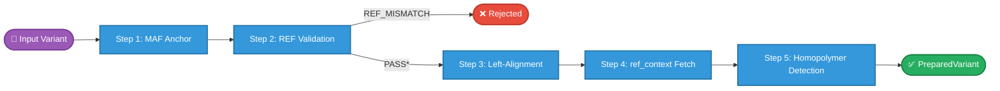
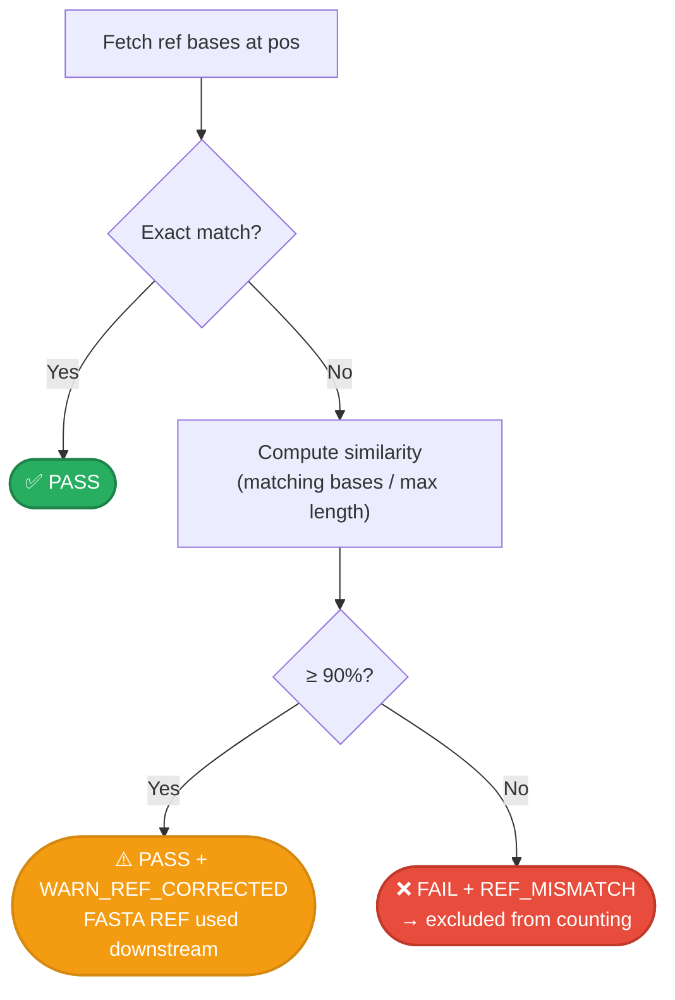
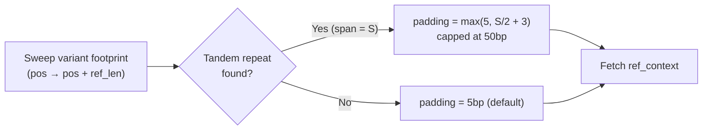
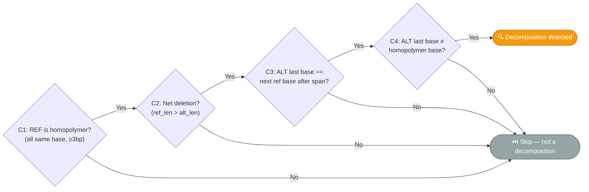
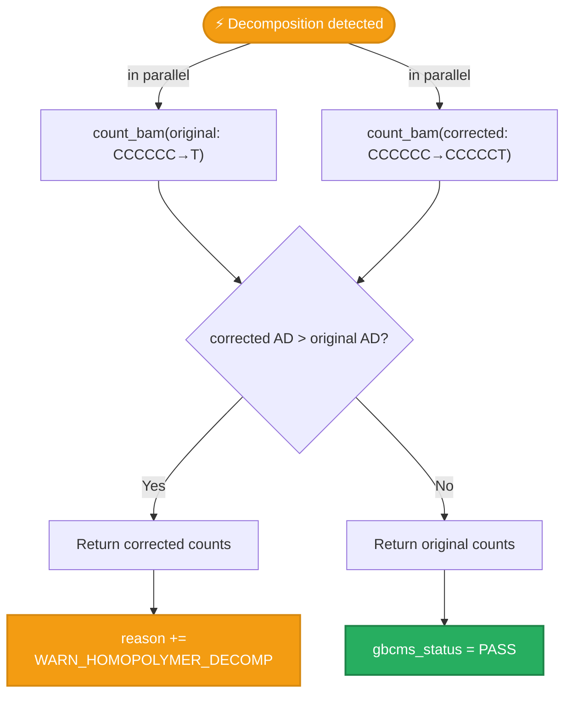

# Variant Normalization

How gbcms prepares variants before counting — validation, left-alignment, and homopolymer decomposition.


## Overview

Before counting any reads, every variant passes through the **preparation pipeline** in `prepare_variants()`. This ensures consistent, biologically correct coordinates regardless of how the input was generated.



Each input variant produces **exactly one** `PreparedVariant`, even if validation fails — this guarantees output row count always matches input.

---

## Step 1: MAF Anchor Resolution

MAF files represent indels using `-` dashes. gbcms converts them to VCF-style **anchor-based** coordinates, which requires fetching the anchor base from the reference FASTA.

| Indel Type | MAF REF | MAF ALT | VCF REF | VCF ALT | Anchor Source |
|:-----------|:--------|:--------|:--------|:--------|:--------------|
| Insertion | `-` | `TG` | `A` | `ATG` | Fetch base at `Start_Position` |
| Deletion | `CG` | `-` | `ACG` | `A` | Fetch base at `Start_Position − 1` |

!!! note "When Is This Step Triggered?"
    Only for MAF input (`is_maf=true`) when REF or ALT is `-`, or when REF and ALT have different lengths (complex indels). VCF input skips this step entirely.

!!! warning "FETCH_FAILED"
    If the anchor base cannot be fetched (e.g., chromosome not in FASTA), the variant's
    `gbcms_status` is set to `FAIL` with reason `FETCH_FAILED`, and it is excluded from counting.

---

## Step 2: REF Validation

The REF allele is compared against the reference genome at the stated position. An exact match passes immediately. If the exact match fails, a **similarity score** is computed — variants with ≥90% base match are corrected to the FASTA REF and proceed to counting.



When a variant gets a `WARN_REF_CORRECTED` reason (verdict stays `PASS`), the MAF's REF allele is **replaced with the FASTA sequence** for all downstream steps (left-alignment, haplotype construction). The original MAF REF is preserved in `original_ref` for auditing.

!!! example "Real-World Example: EGFR Exon 19 Deletion"
    A 27bp complex EGFR deletion had 26/27 bases matching the FASTA (96%), with only the last base differing due to a MAF annotation artifact. Without tolerance, this variant was silently rejected with zero counts. With tolerant validation, it passes with a `WARN_REF_CORRECTED` reason and produces valid counts.

!!! important "Common Causes of REF_MISMATCH"
    - Wrong reference genome version (GRCh37 vs GRCh38)
    - Chromosome naming mismatch (`chr1` vs `1`)
    - Variant was called against a different reference build
    - Upstream normalization changed coordinates incorrectly
    - MAF annotation artifact (trailing base error) — now handled by tolerant validation

---

## Step 3: Left-Alignment

For indels and complex variants, gbcms applies **bcftools-style left-alignment** to ensure consistent positioning in repetitive regions.


| Parameter | Value | Description |
|:----------|:------|:------------|
| `norm_window` | 100bp initial, up to 2500bp | Initial window for leftward search. Doubles on edge-hit (exponential retry). |
| `max_norm_window` | 2500bp | Safety cap for centromeric/telomeric regions |
| Trigger | `ref_len ≠ alt_len` or both >1bp | SNPs are never left-aligned |

!!! tip "Dynamic Window Expansion"
    If a variant shifts all the way to the window edge during left-alignment, it may not have fully converged. The engine automatically **doubles the window** (100 → 200 → 400 → ... → 2500bp) and retries. This ensures correct normalization even for variants in massive tandem repeats (e.g., centromeric regions) without penalizing the common case.

Every variant that reaches REF validation gets a **type label derived from its
final alleles** (after anchor resolution, REF correction and alignment), with the
same rule the readers use. A row rejected before that (`EMPTY_ALLELE`,
`ALT_EQUALS_REF`, a failed MAF anchor fetch) keeps the reader's label.

| Condition | Assigned Type |
|:----------|:-------------|
| `ref_len == 1 && alt_len == 1` | SNP |
| `ref_len == 1 && alt_len > 1` and ALT starts with the REF base | INSERTION |
| `ref_len > 1 && alt_len == 1` and REF starts with the ALT base | DELETION |
| Otherwise (a delins such as `TTAC>A` or `C>TA`, or an MNP) | COMPLEX |

Counting never reads this label — reads are classified by the alleles — so it is
what `gbcms normalize` reports, not an input to counting.

!!! tip "Debugging Normalization"
    Use `gbcms normalize` to see exactly how each variant was transformed. The output TSV shows original and normalized coordinates side by side, plus granular flags: `was_anchor_resolved` (MAF dash-allele conversion), `was_left_aligned` (left-shifting), and `was_normalized` (either one).

---

## Step 4: ref_context Fetch (Adaptive)

For indels and complex variants, a flanking reference sequence is fetched around the (possibly normalized) position. This context serves two purposes:

1. **Windowed indel detection** — Safeguard 3 uses `ref_context` to verify that shifted indels delete/insert the expected reference bases
2. **Phase 3 alignment** — the context is used to build REF and ALT haplotypes for dual-haplotype alignment (WFA triage → PairHMM). See [Phase 3: Alignment Fallback](allele-classification.md#phase-3-alignment-fallback).

### Adaptive Context Padding

By default, gbcms **dynamically adjusts** the context padding based on nearby tandem repeats. This prevents ambiguous SW alignments in repetitive regions where a fixed padding might consist entirely of the repeat motif.

#### Multi-Anchor Footprint Sweep
Historically, scanning only the variant's strict `anchor` base caused miscalculations for left-aligned INDELs, as the trailing INDEL mutations generated by BWA mapping often fell outside the default `5bp` padding window.

The engine now performs a **Multi-Anchor Footprint Sweep**. It scans across the entire variant footprint (`pos` through `pos + ref_len`) looking for tandem repeats, and extracts the maximum necessary padding to clear the repeat entirely.



| Parameter | CLI Flag | Default | Description |
|:----------|:---------|:--------|:------------|
| `context_padding` | `--context-padding` | 5 | Minimum flanking bases on each side (range: 1–50) |
| `adaptive_context` | `--adaptive-context` | ✅ enabled | Dynamically increase padding across the footprint in repeat regions |

#### Example: Poly-A Insertion

```
Variant: chr7:100 A→AAAAAAAAAAAAA (12bp poly-A insertion)
Footprint: chr7:100-101
Flanking: ...AAAAAAAAAA[anchor]AAAAAAAAAA...

Sweep Detected: homopolymer max span=20bp → padding = max(5, 20/2+3) = 13bp

Fixed padding=5:     AAAAA + REF/ALT + AAAAA  (all A's — ambiguous, BWA alignments drop)
Adaptive padding=13: GCTTAAAAA... + REF/ALT + ...AAAAATTGAC  (anchored)
```

#### Supported Repeat Types

| Type | Example | Motif Size | Detection Range |
|:-----|:--------|:----------:|:---------------:|
| Homopolymer | `AAAAAAA` | 1bp | ≥2 copies |
| Dinucleotide | `CACACACA` | 2bp | ≥2 copies |
| Trinucleotide | `CAGCAGCAG` | 3bp | ≥2 copies |
| Up to hexanucleotide | `GGCCCCGGCCCC` | 4–6bp | ≥2 copies |

!!! tip "Disabling Adaptive Context"
    Use `--no-adaptive-context` to fall back to fixed padding. This may be useful for strict reproducibility against older versions.

!!! note "SNPs Don't Need Context"
    SNPs are checked by a simple single-base comparison, so `ref_context` is not fetched for them. This saves unnecessary FASTA lookups.

---

## Step 5: Homopolymer Decomposition Detection

Some variant callers merge nearby events in a homopolymer run into one complex variant with an inflated deletion, e.g. `CCCCCC→T` where the reads show a smaller change at the run's end. With `--rescue-homopolymer`, gbcms also counts a **corrected allele** for such calls and reports whichever of the two more reads support.

!!! info "Off by default: the row counts the given allele"
    gbcms takes the input allele as correct. By default the row reports the given allele's counts. When the reads carry a different allele, `OBSERVED_ALLELE(chrom:pos:REF>ALT:n/m)` in `gbcms_diagnostic` names it: the allele the reads carry exactly, with n of its carriers against m for the given ALT. Prep still builds the corrected allele; it is counted only with `--rescue-homopolymer`.

    The twin became opt-in because its arbitration is not an exact haplotype match. At the case it was built for (SOX2, below), the reads carry `CCCCT`, a 1bp deletion plus C→T, not the twin `CCCCCT`. The twin wins there by tolerance. At other real twin loci it claims most of the called allele's own exact carriers. `OBSERVED_ALLELE` names `CCCCT` exactly.

### Detection Criteria

All four conditions must be met:



### Corrected Allele Construction

When detected, a **corrected ALT allele** is built by keeping every base of the run but the last and replacing that last base with the base that follows the run. The corrected allele has the same length as REF:

```
Example:  REF = CCCCCC, ALT = T, next_ref_base = T

Step 1: homopolymer base = C
Step 2: Confirmed: alt_last (T) == next_ref_base (T), T ≠ C
Step 3: corrected_alt = C × (ref_len - 1) + alt_last = CCCCC + T = CCCCCT
```

### Dual-Counting Flow

The corrected variant is stored in `PreparedVariant.decomposed_variant`. During counting, **both** the original and corrected alleles are counted independently. The result with the higher `alt_count` wins:



The corrected allele is scored as unique sequence (`repeat_span` 0). In RNA with a GTF it takes the original's gene strand, so `--enforce-strandedness` applies to it as to the original. `WARN_HOMOPOLYMER_DECOMP` is set **per sample**: a row carries it only when that sample's corrected allele won.

!!! warning "A heuristic arbitration"
    The flag appears only when the corrected allele got more ALT support than the called one. If the original gets more, it is used as-is with a normal `PASS` status. The comparison is not an exact haplotype match, though. Reads at real loci carry several forms: the called delins, the corrected allele, a 1bp deletion plus the change, or other alleles of the run. Both classifiers can claim reads of forms neither describes exactly. Inspect the reads at flagged loci; a redesign is tracked in the project plan.

!!! example "Real-World: SOX2"
    **SOX2** at chr3:181430901: `CCCCCC→T` (6bp→1bp, net −5bp). The reads carry `CCCCT`.
    - **Default:** the row reports `CCCCCC→T` (alt=3), and `gbcms_diagnostic` names `CCCCT`.
    - **With `--rescue-homopolymer`:** the corrected `CCCCCC→CCCCCT` (alt=79) wins, and the row reports `gbcms_status = PASS`, `gbcms_status_reason = WARN_HOMOPOLYMER_DECOMP`.

---

## Validation Status Reference

Status is carried in **two** fields: a verdict, `gbcms_status` (exactly `PASS` or
`FAIL`), and a `|`-separated reason list, `gbcms_status_reason` (empty for a clean
PASS). Both appear in the MAF (two columns) and the VCF INFO (`GS` = verdict,
`GSR` = reasons). `|` is used (never `;`/`,`, which are VCF-unsafe), so the reason
string is byte-identical in the MAF and the VCF.

| `gbcms_status` | `gbcms_status_reason` | Meaning | Counted? |
|:-------|:--------|:--------|:--------:|
| `PASS` | *(empty)* | REF matches FASTA exactly | ✅ |
| `PASS` | `WARN_REF_CORRECTED` | REF ≥90% match; corrected to FASTA REF | ✅ |
| `PASS` | `WARN_HOMOPOLYMER_DECOMP` | Passed, but the corrected allele was used (`--rescue-homopolymer` only) | ✅ |
| `PASS` | `MULTI_ALLELIC` | Passed; overlaps a sibling variant at the same locus (sibling-ALT exclusion active) | ✅ |
| `PASS` | `TRACT_CLUSTER` | Passed; shares a repeat-tract scan window with a co-annotated length-changing variant (exclusive AD assignment active) | ✅ |
| `FAIL` | `REF_MISMATCH` | REF allele <90% match against reference genome | ❌ |
| `FAIL` | `FETCH_FAILED` | Could not fetch the reference region | ❌ |
| `FAIL` | `EMPTY_ALLELE` | Empty REF or ALT (malformed / non-left-anchored indel) | ❌ |
| `FAIL` | `ALT_EQUALS_REF` | ALT equals REF (any case; `-` for both in a MAF): no change to count | ❌ |
| `FAIL` | `ALT_CONTAINS_N` | ALT allele contains an `N` base | ❌ |

Reasons **stack**: a PASS variant can carry `WARN_REF_CORRECTED|WARN_HOMOPOLYMER_DECOMP`.

!!! note "Filtering Behavior"
    The pipeline filters on `gbcms_status == "PASS"`, so every PASS variant — with or
    without warning reasons — proceeds to counting. `FAIL` variants are excluded from
    counting but still **written to the output** with their `FAIL` verdict and reason
    (and zero counts), so the rejection reason is in the output file, not only the log.

---

## Limitations

1. **Left-alignment only** — gbcms left-aligns but does not right-align. If your input is right-aligned, the windowed scan (±5bp) may still catch it, but left-alignment is recommended.
2. **Dynamic normalization window** — Starting at 100bp, the window automatically doubles (up to 2500bp) when a variant shifts to the window edge. In practice, this covers even variants in centromeric/telomeric repeats. Variants shifted beyond 2500bp won't be corrected.
3. **Homopolymer detection is conservative** — only triggers for homopolymer REF ≥3bp with a clear D(n)+SNV pattern. Other miscollapsed events are not detected.

---

## Related

- [gbcms normalize](../cli/normalize.md) — CLI command for standalone normalization
- [Input Formats](input-formats.md) — VCF/MAF coordinate conventions
- [Allele Classification](allele-classification.md) — How reads are classified after normalization
